# Тема 1. Введение в Python

Отчет по Теме #1 выполнил(а):
- Королев Егор Александрович
- ИВТ-23-2

| Задание | Лаб_раб |
|---------|---------|
| Задание 1 | + |
| Задание 2 | + |
| Задание 3 | + |
| Задание 4 | + |
| Задание 5 | + |
| Задание 6 | + |
| Задание 7 | + |
| Задание 8 | + |
| Задание 9 | + |
| Задание 10 | + |
| Задание 11 | + |
| Задание 12 | + |
| Задание 13 | + |
| Задание 14 | + |
| Задание 15 | + |

знак "+" - задание выполнено; знак "-" - задание не выполнено;

### Работу проверили:
- к.э.н., доцент Панов М.А.

## Лабораторная работа №1
### Установка
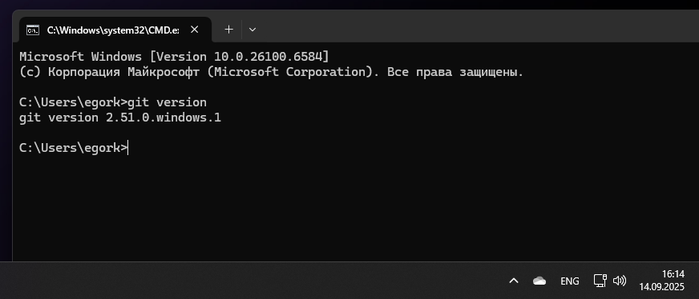

**Микровывод:** Выполнена установка Git на компьютер для дальнейшей работы.

## Лабораторная работа №2  
### Настройка
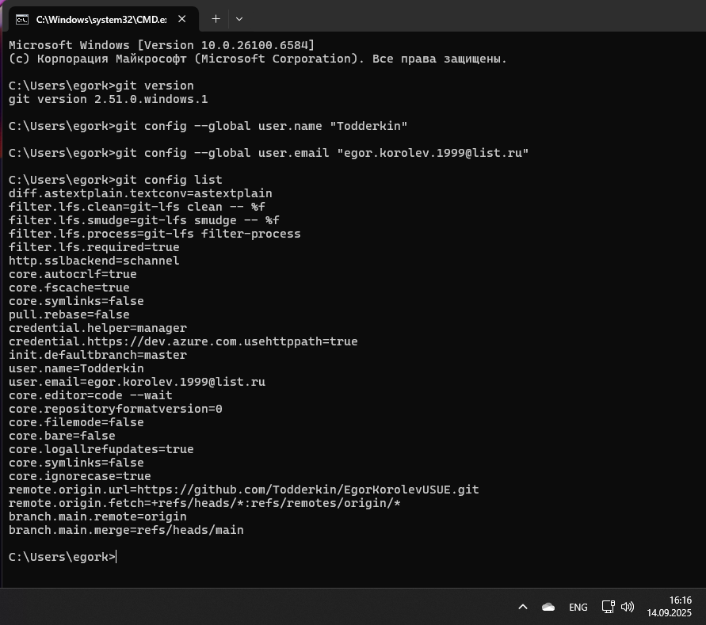

**Микровывод:** Проведена первоначальная конфигурация системы контроля версий, заданы базовые параметры пользователя.

## Лабораторная работа №3
### Создание нового репозитория
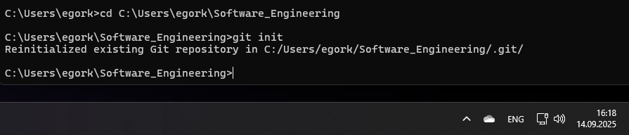

**Микровывод:** Инициализирован новый репозиторий, изучена структура служебных файлов Git.

## Лабораторная работа №4
### Подготовка файлов
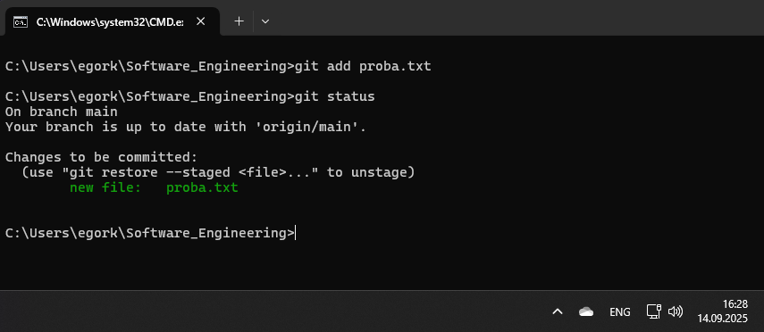

**Микровывод:** Освоен процесс добавления файлов в область подготовленных изменений перед фиксацией.

## Лабораторная работа №5
### Фиксация изменений
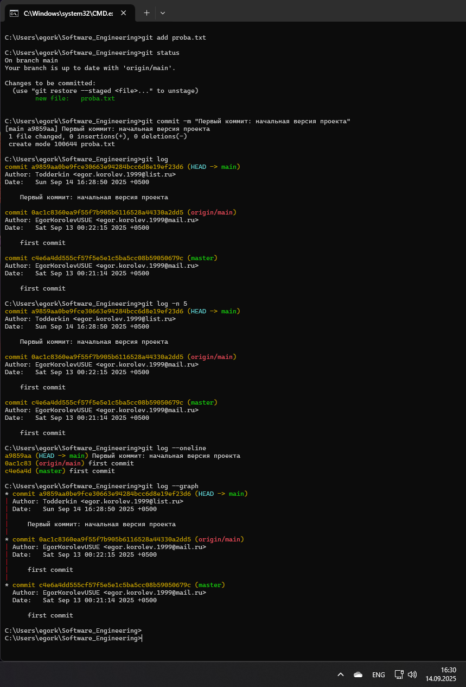

**Микровывод:** Создана первая фиксация изменений с комментарием, изучен синтаксис команды commit.

## Лабораторная работа №6
### Подключение к удаленному репозиторию
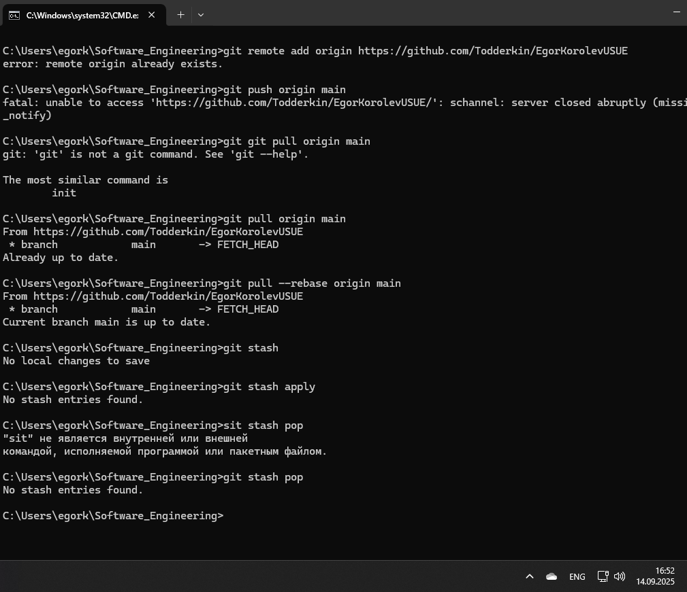

**Микровывод:** Настроена интеграция с облачным репозиторием GitHub, изучены команды для отправки изменений.

## Лабораторная работа №7
### Ветвление
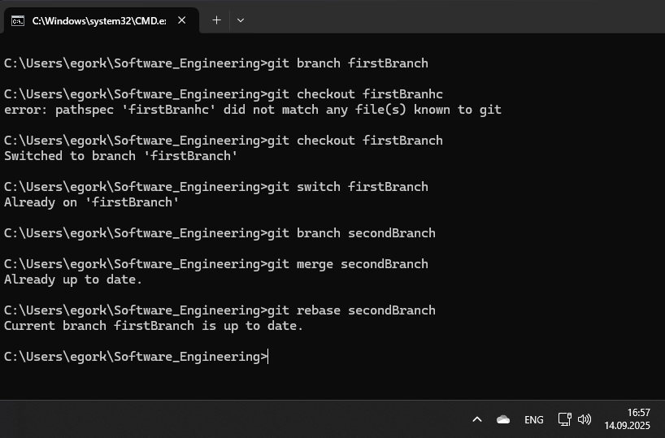

**Микровывод:** Изучен механизм создания и управления ветками для организации параллельной разработки.

## Лабораторная работа №8
### Особенности применения "Фетч"
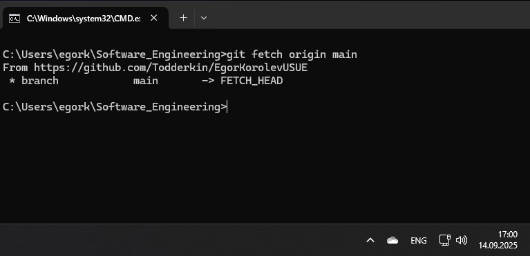

**Микровывод:** Освоено получение обновлений с сервера без автоматического слияния с текущей версией.

## Лабораторная работа №9
### Удаление файлов, веток, локальных и удалённых репозиториев
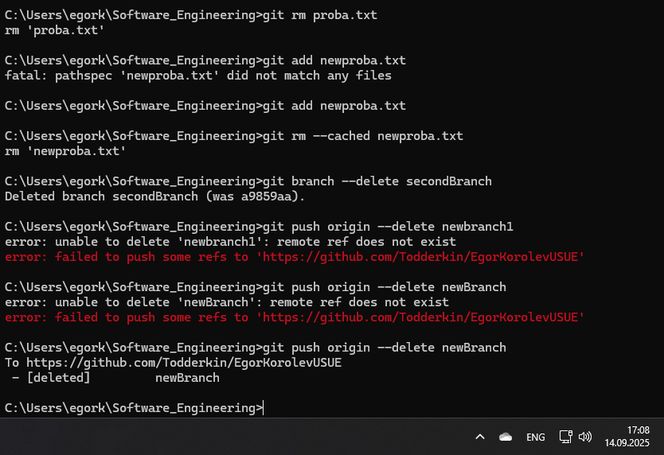

**Микровывод:** Изучены методы корректного удаления различных объектов в системе контроля версий.

## Лабораторная работа №10
### Отслеживание изменений в коммитах
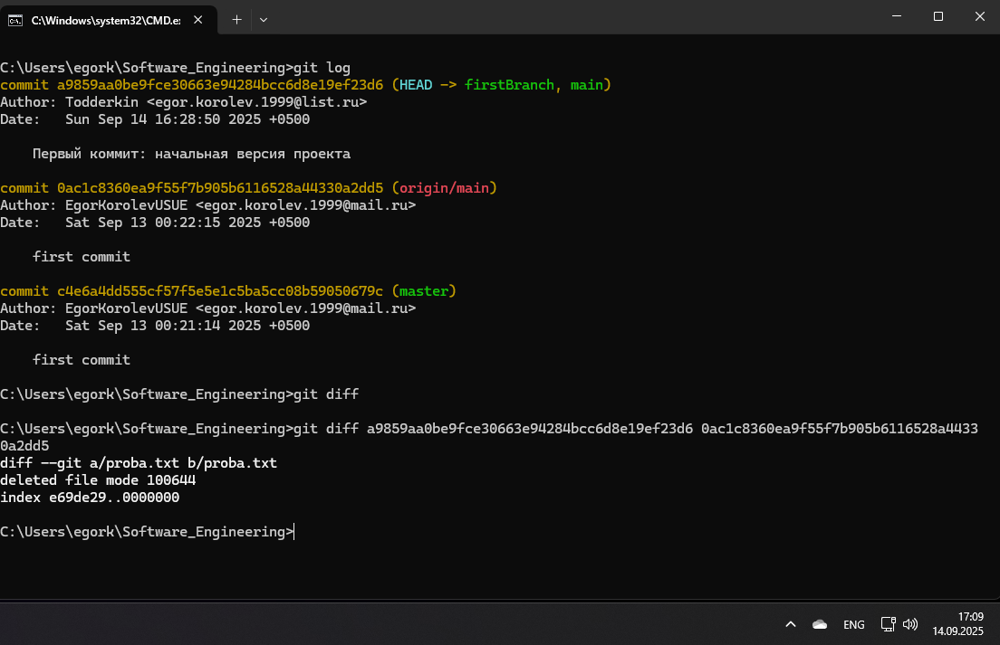

**Микровывод:** Освоен просмотр истории изменений и сравнение различных версий файлов.

## Лабораторная работа №11
### Возвращение файла к предыдущему (определенному) состоянию
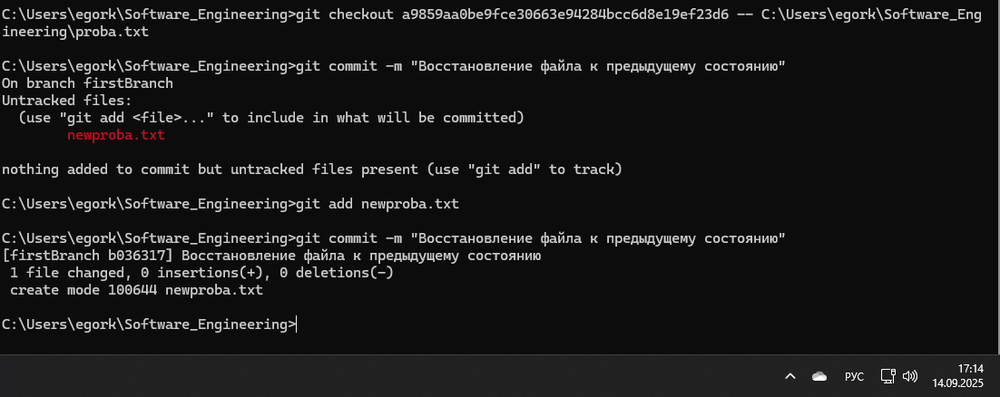

**Микровывод:** Изучено восстановление предыдущих состояний файлов без изменения истории коммитов.

## Лабораторная работа №12
### Возвращение к предыдущему коммиту
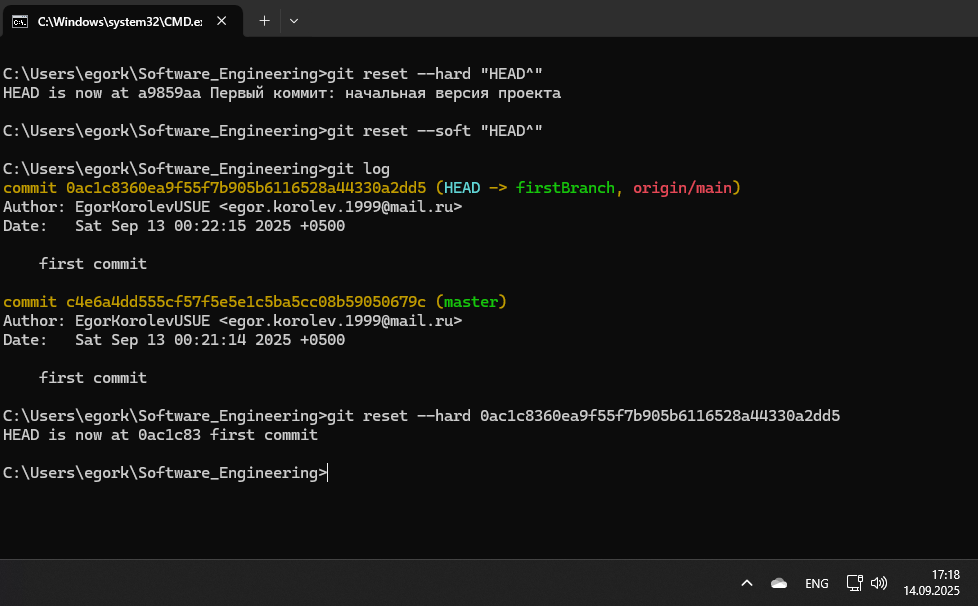

**Микровывод:** Освоены различные стратегии отката изменений к более ранним состояниям проекта.

## Лабораторная работа №13
### Исправление коммита
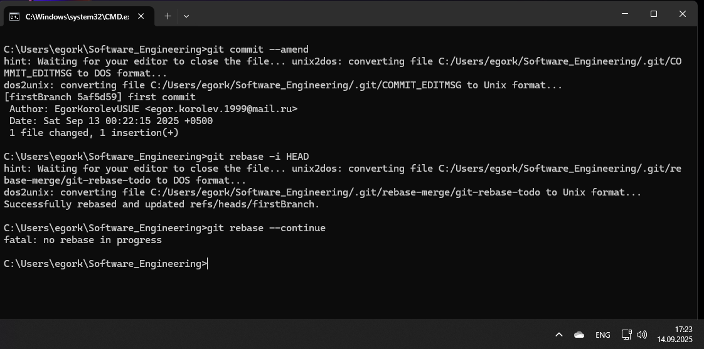

**Микровывод:** Изучены методы редактирования истории фиксаций для поддержания её чистоты и читаемости.

## Лабораторная работа №14
### Разрешение конфликтов при слиянии
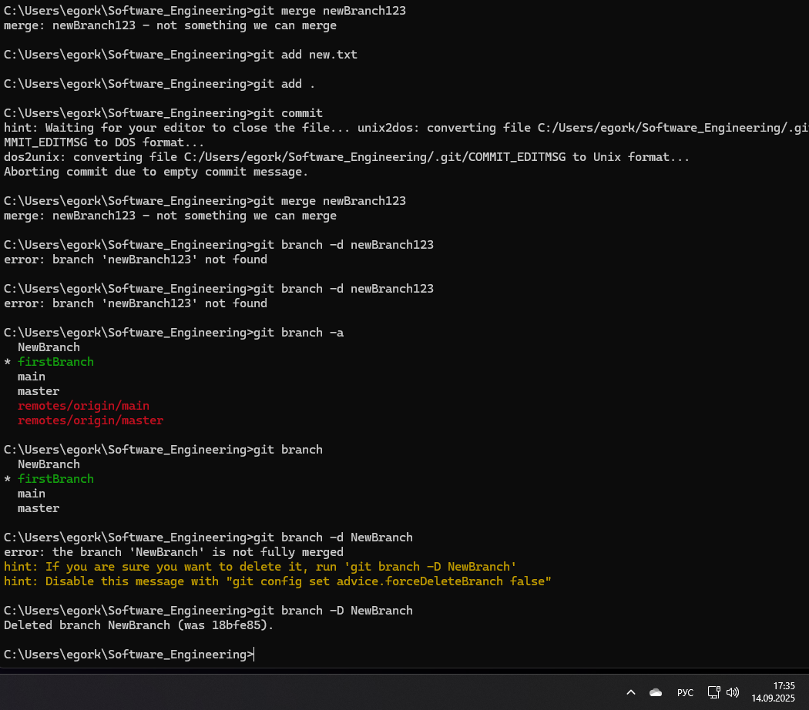

**Микровывод:** Приобретен практический опыт ручного разрешения конфликтующих изменений.

## Лабораторная работа №15
### Настройка .gitignore
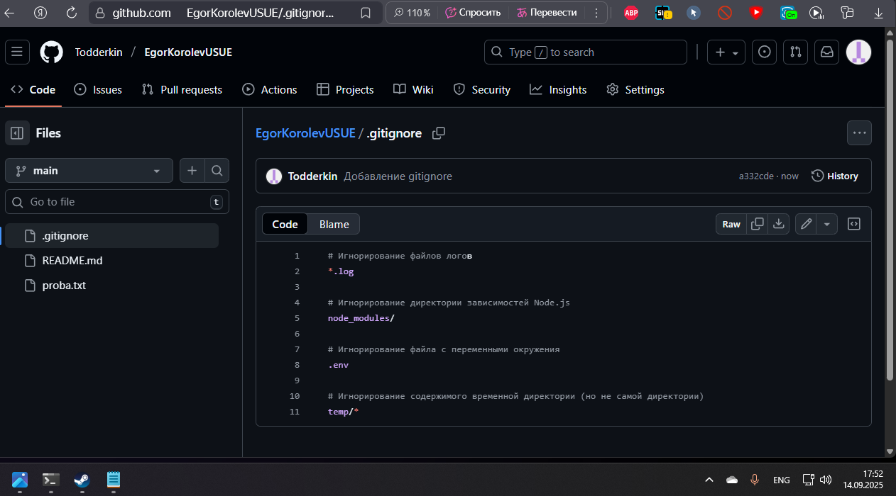

**Микровывод:** Настроена система исключения для автоматического игнорирования временных и служебных файлов.

## Общие выводы по теме

В ходе выполнения практических заданий были освоены ключевые аспекты работы с системой контроля версий Git. Научился фиксировать изменения на разных этапах работы, освоил создание и слияние веток для изолированной разработки, изучил механизмы отката изменений и восстановления файлов, понял принципы совместной работы через удаленные репозитории.

### Практические умения:
- Освоены основные команды: init, add, commit, push, pull, branch, merge
- Получен опыт решения конфликтов при интеграции изменений
- Научился работать с облачными платформами для хранения кода
- Освоил настройку исключений для служебных файлов