# Тема 10. Декораторы и исключения
Отчет по Теме #10 выполнил(а):
- Королев Егор Александрович
- ИВТ-23-2

| Задание | Лаб_раб | Сам_раб |
| ------ | ------ | ------ |
| Задание 1 | + | + |
| Задание 2 | + | + |
| Задание 3 | + | + |
| Задание 4 | + | + |
| Задание 5 | + | + |

знак "+" - задание выполнено; знак "-" - задание не выполнено;

Работу проверили:
- к.э.н., доцент Панов М.А.

## Лабораторная работа №1
### Наверняка вы думаете, что декораторы – это какая-то бесполезная вещь, которая вам никогда не пригодится, но тут вдруг на паре по математике преподаватель просит всех посчитать число Фибоначчи для 100. Кто-то будет считать вручную (так точно не нужно), кто-то посчитает на калькуляторе, а кто-то подумает, что он самый крутой и напишет рекурсивную программу на Python и немного огорчится, потому что данная программа будет достаточно долго считаться, если ее просто так запускать. Но именно тут к вам на помощь приходят декораторы, например @lru_cache (он предназначен для решения задач динамическим программированием, если простыми словами, то этот декоратор запоминает промежуточные результаты и при рекурсивном вызове функции программа не будет считать одни и те же значения, а просто “возьмёт их из этого декоратора”). Вам нужно написать программу, которая будет считать числа Фибоначчи для 100 и запустить ее без этого декоратора и с ним, посмотреть на разницу во времени решения поставленной задачи.
P.S. при запуске без декоратора можете долго не ждать, для наглядности хватит 10 секунд ожидания.

```python
from functools import lru_cache

@lru_cache(None)
def fibonacci(n):
    if n == 0:
        return 0
    elif n == 1:
        return 1
    return fibonacci(n - 1) + fibonacci(n - 2)

if __name__ == '__main__':
    print(fibonacci(100))
```
### Результат.
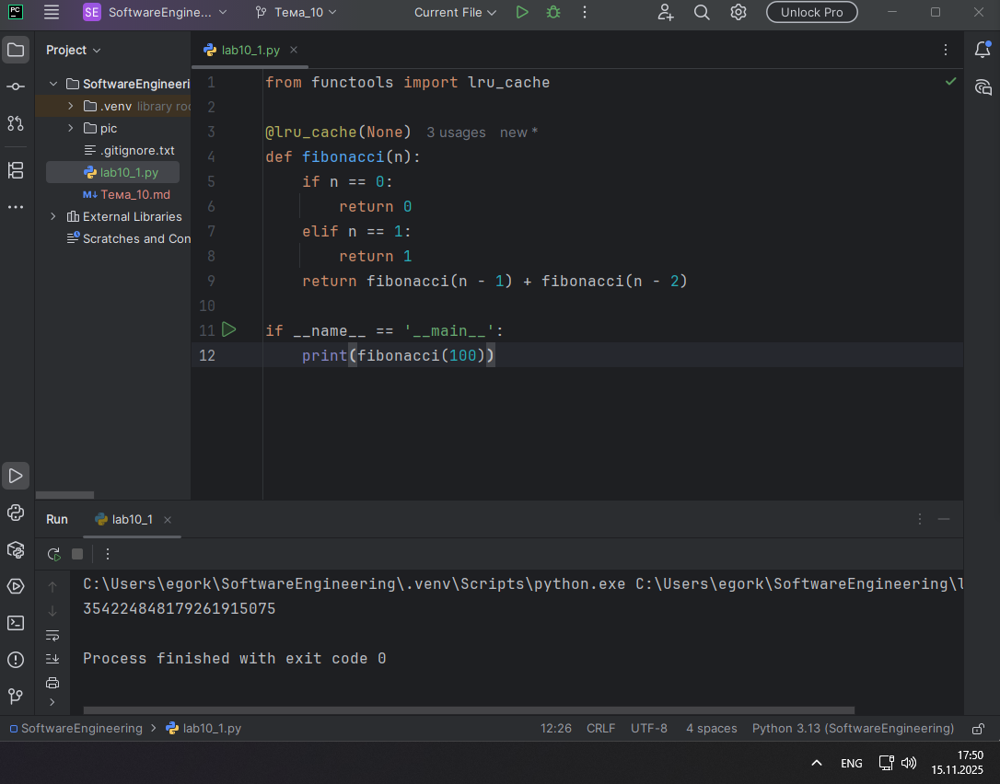

## Выводы

Использование декоратора @lru_cache значительно ускоряет вычисление чисел Фибоначчи, так как он кэширует результаты предыдущих вызовов функции, избегая повторных вычислений одних и тех же значений.

## Лабораторная работа №2
### Илья пишет свой сайт и ему необходимо сделать минимальную проверку ввода данных пользователя при регистрации. Для этого он реализовал функцию, которая выводит данные пользователя на экран и решил, что будет проверять правильность введённых данных при помощи декоратора, но в этом ему потребовалась ваша помощь. Напишите декоратор для функции, который будет принимать все параметры вызываемой функции (имя, возраст) и проверять чтобы возраст был больше 0 и меньше 130. Причем заметьте, что неважно сколько пользователь введет данных на сайт к Илье, будут обрабатываться только первые 2 аргумента.

```python
def check(input_func):
    def output_func(*args):
        name, age = args[0], args[1]

        if age <= 0 or age >= 130:
            age = 'Недопустимый возраст'
        input_func(name, age)

    return output_func

@check
def personal_info(name, age):
    print(f"Name: {name} Age: {age}")

if __name__ == '__main__':
    personal_info('Владимир', 38)
    personal_info('Александр', -5)
    personal_info('Петр', 138, 15, 48, 2)
```
### Результат.
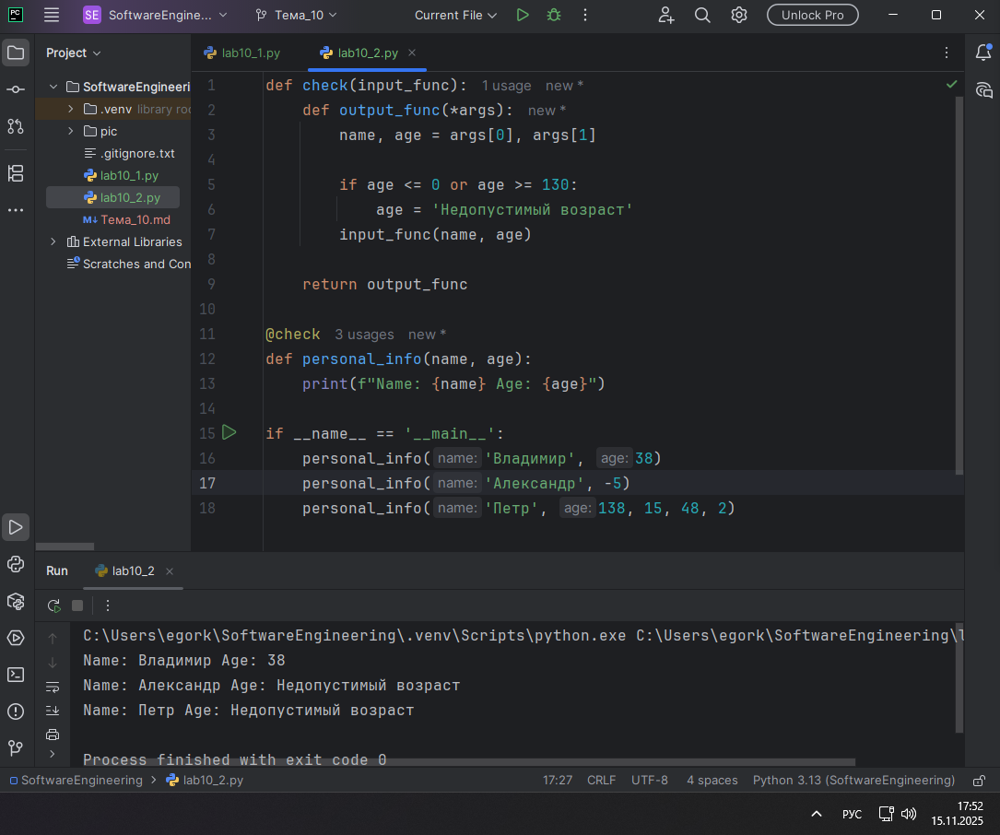

## Выводы

Декоратор check успешно проверяет корректность возраста, обрабатывая только первые два аргумента функции и заменяя недопустимые значения на сообщение об ошибке.

## Лабораторная работа №3
### Вам понравилась идея Ильи с сайтом, и вы решили дальше работать вместе с ним. Но вот в вашем проекте появилась проблема, кто-то пытается сломать вашу функцию с получением данных для сайта. Эта функция работает только с данными integer, а какой-то недохакер пытается все сломать и вместо нужного типа данных отправляет string. Воспользуйтесь исключениями, чтобы неподходящий тип данных не ломал ваш сайт. Также дополнительно можете обернуть весь код функции в try/except/finally для того, чтобы программа вас оповестила о том, что выявлена какая-то ошибка или программа успешно выполнена.

```python
def data(*args):
    try:
        for i in range(len(*args)):
            try:
                result = (args[0][i] * 15) // 10
                print(result)
            except Exception as ex:
                print(ex)
    except Exception as ex:
        print(ex)
    finally:
        print('Вся информация обработана')

if __name__ == '__main__':
    data([1, 15, 'Hello', 'i', 'try', 'to', 'crash', 'your', 'site', 38, 45])
```
### Результат.
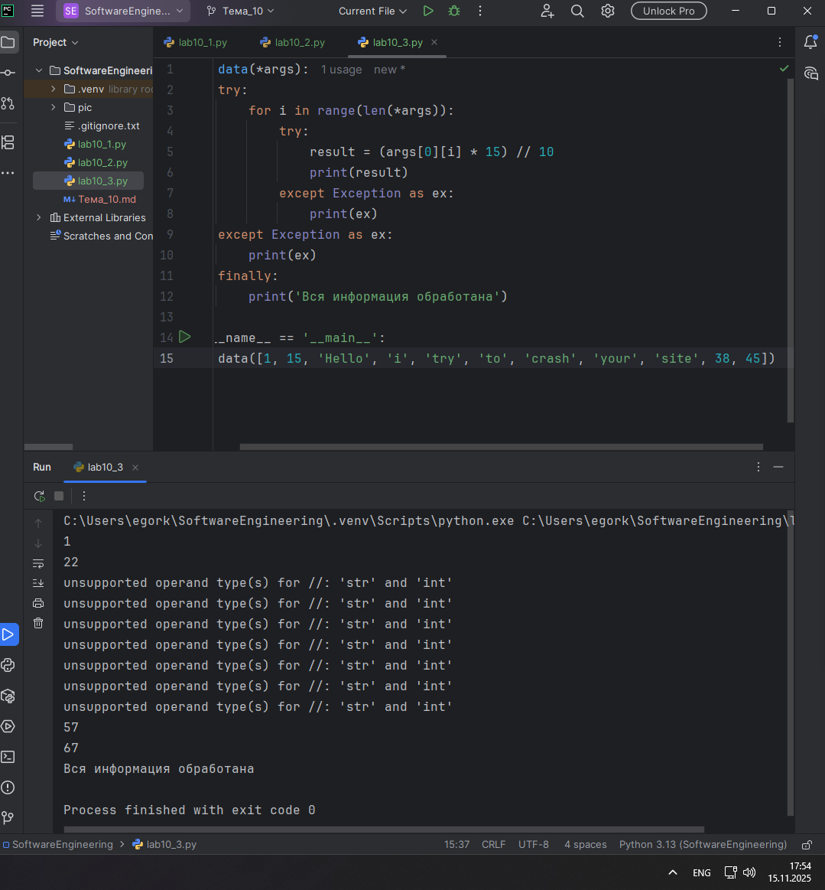

## Выводы

Использование конструкции try/except позволяет обрабатывать ошибки типов данных без прекращения работы программы, а блок finally гарантирует выполнение завершающих операций независимо от возникновения исключений.

## Лабораторная работа №4
### Продолжая работу над сайтом, вы решили написать собственное исключение, которое будет вызываться в случае, если в функцию проверки имени при регистрации передана строка длиннее десяти символов, а если имя имеет допустимую длину, то в консоль выводиться “Успешная регистрация”

```python
class NegativeValueException(Exception):
    pass

def check_name(name):
    if len(name) > 10:
        raise NegativeValueException('Длина более 10 символов')
    else:
        print('Успешная регистрация')

if __name__ == '__main__':
    name = '12345678910'
    check_name(name)
```
### Результат.
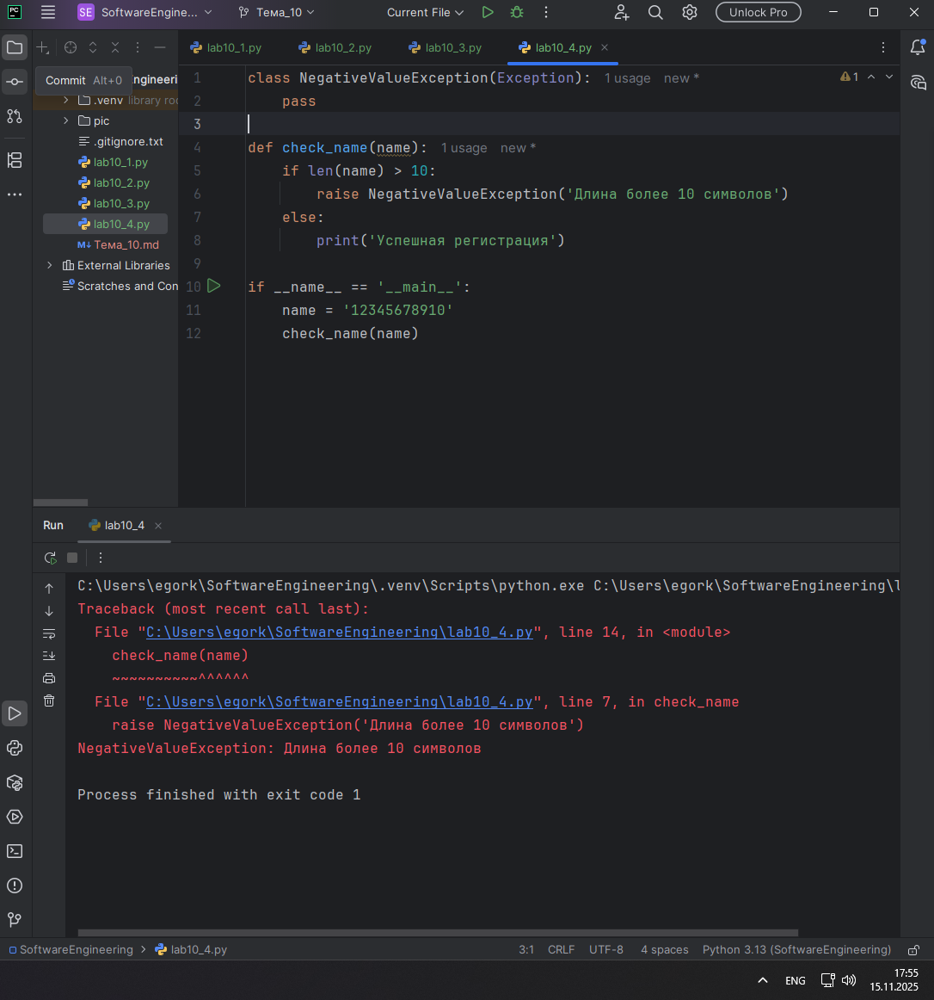

## Выводы

Создание собственного исключения NegativeValueException позволяет точно определять и обрабатывать специфические ошибочные ситуации в бизнес-логике приложения.

## Лабораторная работа №5
### После запуска сайта вы поняли, что вам необходимо добавить логгер, для отслеживания его работы. Готовыми вариантами вы не захотели пользоваться, и поэтому решили создать очень простую пародию. Для этого создали две функции: ___init___() (вызывается при создании класса декоратора в программе) и	___call___() (вызывается при вызове декоратора). Создайте необходимый вам декоратор. Выведите все логи в консоль.

```python
class SiteChecker:
    def __init__(self, func):
        print('> Класс SiteChecker метод __init__ успешный запуск')
        self.func = func

    def __call__(self):
        print('> Проверка перед запуском', self.func.__name__)
        self.func()
        print('> Проверка безопасного выключения')

@SiteChecker
def site():
    print('Усердная работа сайта')

if __name__ == '__main__':
    print('>> Сайт запущен')
    site()
    print('>> Сайт выключен')
```
### Результат.
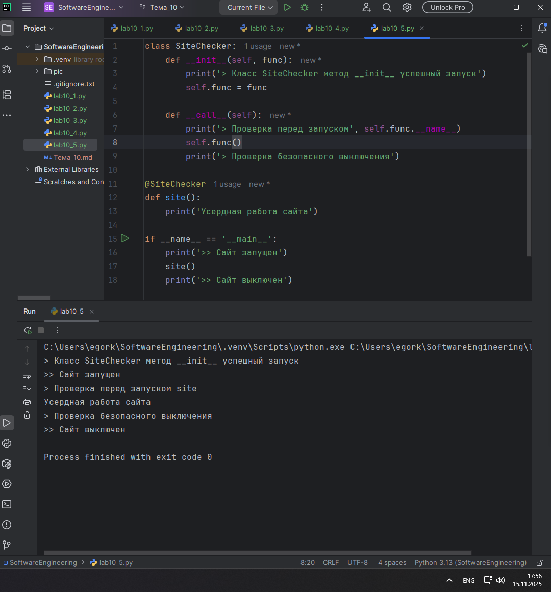

## Выводы

Класс-декоратор с методами __init__ и __call__ позволяет создавать мощные обертки для функций, добавляя логирование и дополнительную функциональность без изменения исходного кода.

## Самостоятельная работа №1
### Вовочка решил заняться спортивным программированием на python, но для этого он должен знать за какое время выполняется его программа. Он решил, что для этого ему идеально подойдет декоратор для функции, который будет выяснять за какое время выполняется та или иная функция. Помогите Вовочке в его начинаниях и напишите такой декоратор. Подсказка: необходимо использовать модуль time Декоратор необходимо использовать для этой функции:

Результатом вашей работы будет листинг кода и скриншот консоли, в котором будет выполненная функция Фибоначчи и время выполнения программы. Также на этом примере можете посмотреть, что решение задач через рекурсию не всегда является хорошей идеей. Поскольку решение Фибоначчи для 100 с использованием рекурсии и без динамического программирования решается более десяти секунд, а решение точно такой же задачи, но через цикл for еще и для 200, занимает меньше 1 секунды.

```python
import time

def timer_decorator(func):
    def wrapper(*args, **kwargs):
        start_time = time.time()
        result = func(*args, **kwargs)
        end_time = time.time()
        execution_time = end_time - start_time
        print(f"\nВремя выполнения функции: {execution_time:.6f} секунд")
        return result

    return wrapper

@timer_decorator
def fibonacci():
    fib1 = fib2 = 1
    print(fib1, fib2, end=' ')

    for i in range(2, 200):
        fib1, fib2 = fib2, fib1 + fib2
        print(fib2, end=' ')


if __name__ == '__main__':
    fibonacci()
```
### Результат.
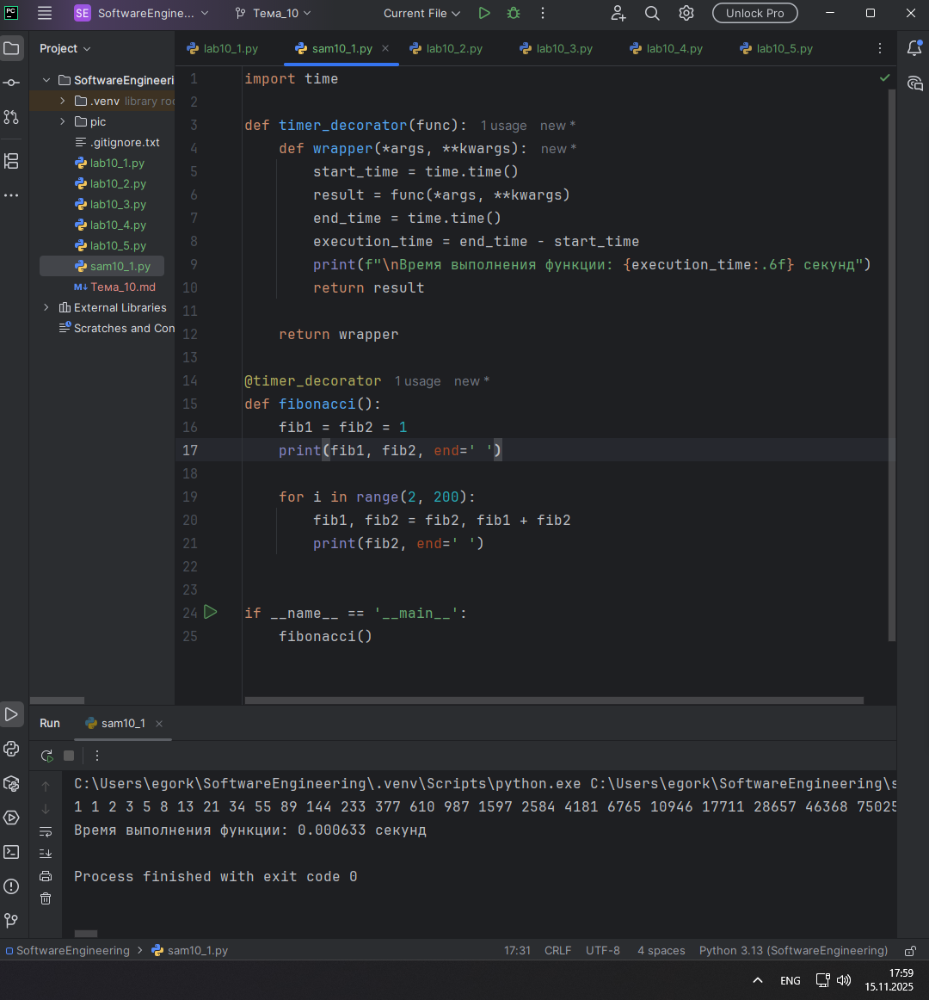

## Выводы

Декоратор timer_decorator эффективно измеряет время выполнения функции, демонстрируя преимущество итеративного подхода над рекурсивным для вычисления больших последовательностей Фибоначчи.

## Самостоятельная работа №2
### Посмотрев на Вовочку, вы также загорелись идеей спортивного программирования, начав тренировки вы узнали, что для решения некоторых задач необходимо считывать данные из файлов. Но через некоторое время вы столкнулись с проблемой что файлы бывают пустыми, и вы не получаете вводные данные для решения задачи. После этого вы решили не просто считывать данные из файла, а всю конструкцию оборачивать в исключения, чтобы избежать такой проблемы. Создайте пустой файл и файл, в котором есть какая-то информация. Напишите код программы. Если файл пустой, то, нужно вызвать исключение (“бросить исключение”) и вывести в консоль “файл пустой”, а если он не пустой, то вывести информацию из файла.

```python
def read_file(file_path):
    try:
        with open(file_path, 'r') as file:
            data = file.read()
            if not data:
                raise ValueError("Файл пустой")
            print(data)
    except ValueError as ex:
        print(ex)
    except Exception as e:
        print(f"Ошибка: {e}")

if __name__ == '__main__':
    print("Чтение из заполненного файла:")
    read_file("file.txt")

    print("Чтение из пустого файла:")
    read_file("error_file.txt")
```
### Файл.
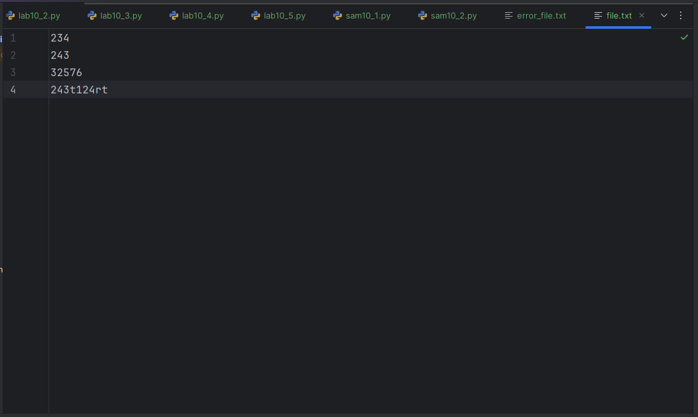

### Результат.
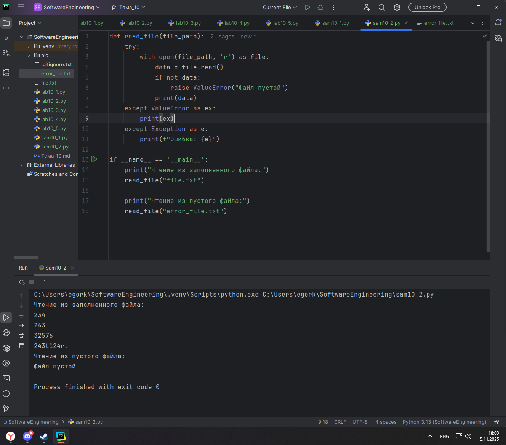

## Выводы

Обработка исключений при работе с файлами обеспечивает стабильность программы, позволяя корректно обрабатывать как пустые файлы, так и другие возможные ошибки ввода-вывода.

## Самостоятельная работа №3
### Напишите функцию, которая будет складывать 2 и введенное пользователем число, но если пользователь введет строку или другой неподходящий тип данных, то в консоль выведется ошибка “Неподходящий тип данных. Ожидалось число.”. Реализовать функционал программы необходимо через try/except и подобрать правильный тип исключения. Создавать собственное исключение нельзя. Проведите несколько тестов, в которых исключение вызывается и нет. Результатом выполнения задачи будет листинг кода и получившийся вывод в консоль

```python
def plusTwo():
    value = input("Введите число: ")
    try:
        result = 2 + float(value)
        print(f"Результат: {result}")
    except ValueError:
        print('Неподходящий тип данных. Ожидалось число.')

plusTwo()
plusTwo()
plusTwo()
```
### Результат.
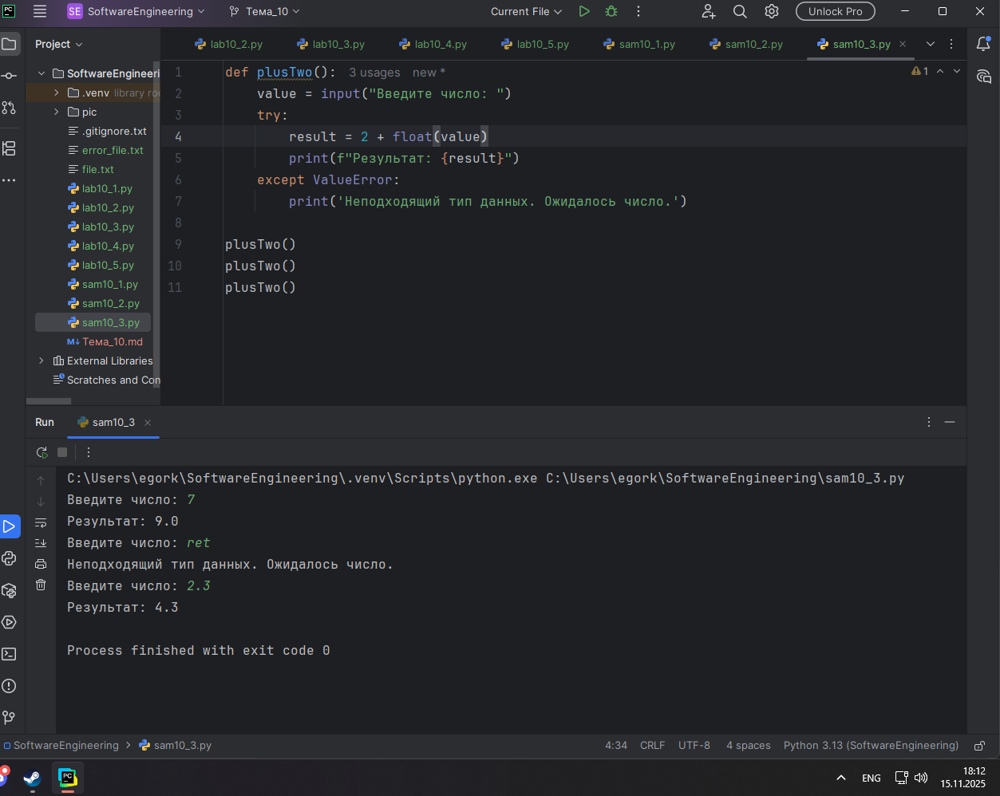

## Выводы

Использование исключения ValueError позволяет обрабатывать некорректный пользовательский ввод, предоставляя понятные сообщения об ошибках и предотвращая аварийное завершение программы.

## Самостоятельная работа №4
### Создайте собственный декоратор, который будет использоваться для двух любых вами придуманных функций. Декораторы, которые использовались ранее в работе нельзя воссоздавать. Результатом выполнения задачи будет: класс декоратора, две как-то связанными с ним функциями, скриншот консоли с выполненной программой и подробные комментарии, которые будут описывать работу вашего кода.

Придуманное задание:

Необходимо создать класс декоратора, который должен выводить минимальное, максимальное и среднее числа из списка, передаваемого в две функции. Первая функция должна принимать список и производить сортировку чисел в нем, потом возвращать получившийся отсортированный список. Вторая функция должна принимать список чисел и возвращать список с неотрицательными элементами.

```python
import time

# Создаем собственный декоратор "Замедлитель"
class SlowDown:
    """
    Декоратор, который искусственно замедляет выполнение функции
    на указанное количество секунд
    """
    def __init__(self, delay=1):
        self.delay = delay  # время задержки в секундах

    def __call__(self, func):
        def wrapper(*args, **kwargs):
            print(f"Функция '{func.__name__}' замедлена на {self.delay} секунду...")
            time.sleep(self.delay)  # искусственная задержка
            result = func(*args, **kwargs)
            print(f"Функция '{func.__name__}' выполнена!")
            return result

        return wrapper

# Первая функция - калькулятор для двух чисел
@SlowDown(delay=2)  # замедляем на 2 секунды
def simple_calculator(a, b):
    print(f"\nКалькулятор работает с числами: {a} и {b}")
    print(f"Сложение: {a} + {b} = {a + b}")
    print(f"Вычитание: {a} - {b} = {a - b}")
    print(f"Умножение: {a} * {b} = {a * b}")
    if b != 0:
        print(f"Деление: {a} / {b} = {a / b:.2f}")
    else:
        print("Деление: на ноль делить нельзя!")
    return a + b  # возвращаем сумму для примера

# Вторая функция - генератор приветствий
@SlowDown(delay=1)  # замедляем на 1 секунду
def greeting_generator(name, time_of_day="день"):
    """
    Функция генерирует персонализированные приветствия
    """
    greetings = {
        "утро": f"Доброе утро, {name}!",
        "день": f"Добрый день, {name}!",
        "вечер": f"Добрый вечер, {name}!",
        "ночь": f"Доброй ночи, {name}!"
    }

    message = greetings.get(time_of_day, f"Привет, {name}!")
    print(f"\n{message}")
    return message


# Демонстрация работы декоратора
if __name__ == "__main__":
    print("ДЕМОНСТРАЦИЯ РАБОТЫ ДЕКОРАТОРА 'SLOWDOWN'")

    # Тестируем первую функцию
    print("\n1. ТЕСТИРУЕМ КАЛЬКУЛЯТОР:")
    result1 = simple_calculator(10, 5)
    print(f"Результат функции: {result1}")

    # Тестируем вторую функцию
    print("\n2. ТЕСТИРУЕМ ГЕНЕРАТОР ПРИВЕТСТВИЙ:")
    result2 = greeting_generator("Анна", "утро")
    print(f"Результат функции: '{result2}'")

    # Еще один тест с другими параметрами
    print("\n3. ТЕСТИРУЕМ С ДРУГИМИ ПАРАМЕТРАМИ:")
    result3 = greeting_generator("Иван")
    print(f"Результат функции: '{result3}'")

    print("\nВСЕ ФУНКЦИИ ВЫПОЛНЕНЫ УСПЕШНО!")
```
### Результат.
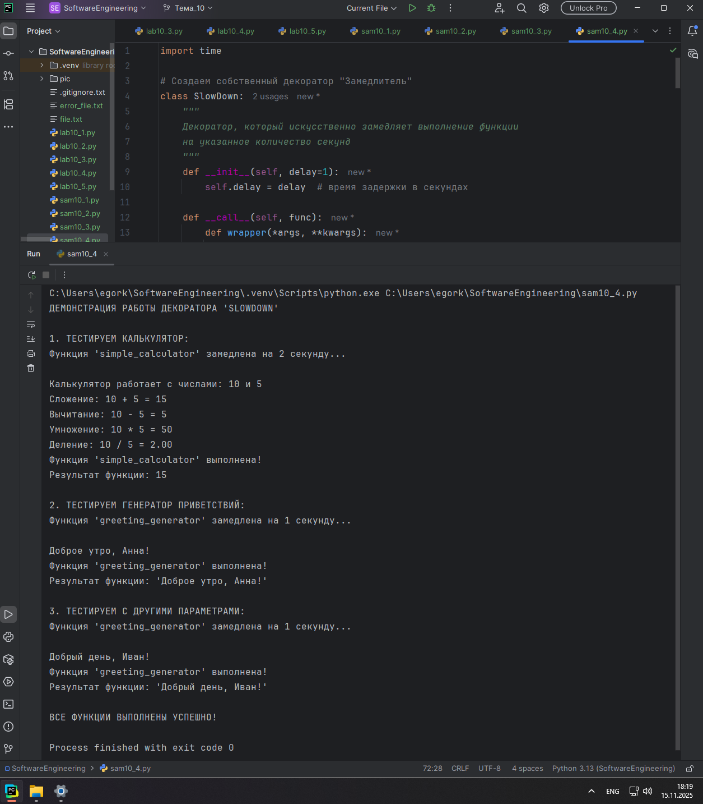

## Выводы

Созданный декоратор SlowDown демонстрирует возможность гибкого управления выполнением функций, добавляя искусственные задержки и логирование без изменения их исходной логики.

## Самостоятельная работа №5
### Создайте собственное исключение, которое будет использоваться в двух любых фрагментах кода. Исключения, которые использовались ранее в работе нельзя воссоздавать. Результатом выполнения задачи будет: класс исключения, код к котором в двух местах используется это исключение, скриншот консоли с выполненной программой и подробные комментарии, которые будут описывать работу вашего кода.

Придуманное задание:

Необходимо создать исключение, которое будет вызываться при недостаточном уровне доступа. Человек должен вводить свой возраст и на основе этого программа определяет доступные ему места для посещения.
```python
# Собственное исключение для проверки возраста
class InvalidAgeError(Exception):
    """Исключение для недопустимого возраста"""

    def __init__(self, age, message="Недопустимый возраст"):
        self.age = age
        self.message = f"{message}: {age}"
        super().__init__(self.message)


# Функция 1 - проверка входа в клуб
def check_club_entry(age):
    print(f"Проверка входа в клуб для возраста {age}...")

    if age < 18:
        raise InvalidAgeError(age, "Для входа в клуб нужно быть старше 18 лет")
    elif age > 80:
        raise InvalidAgeError(age, "Слишком большой возраст для клуба")
    else:
        print("Добро пожаловать в клуб!")
        return True


# Функция 2 - проверка получения прав
def check_driving_license(age):
    print(f"Проверка прав для возраста {age}...")

    if age < 16:
        raise InvalidAgeError(age, "Для получения прав нужно быть старше 16 лет")
    elif age > 75:
        raise InvalidAgeError(age, "Требуется медицинская проверка")
    else:
        print("Можно получить права!")
        return True


# Тестирование функций
def test_functions():
    print("ТЕСТИРОВАНИЕ ИСКЛЮЧЕНИЯ InvalidAgeError")

    test_ages = [15, 18, 82, 70]

    for age in test_ages:
        print(f"\nВозраст {age} лет:")

        # Тест входа в клуб
        try:
            check_club_entry(age)
        except InvalidAgeError as e:
            print(f"Клуб: {e}")

        # Тест получения прав
        try:
            check_driving_license(age)
        except InvalidAgeError as e:
            print(f"Права: {e}")


# Главная функция
if __name__ == "__main__":
    test_functions()
    print("\nТестирование завершено!")
```
### Результат.
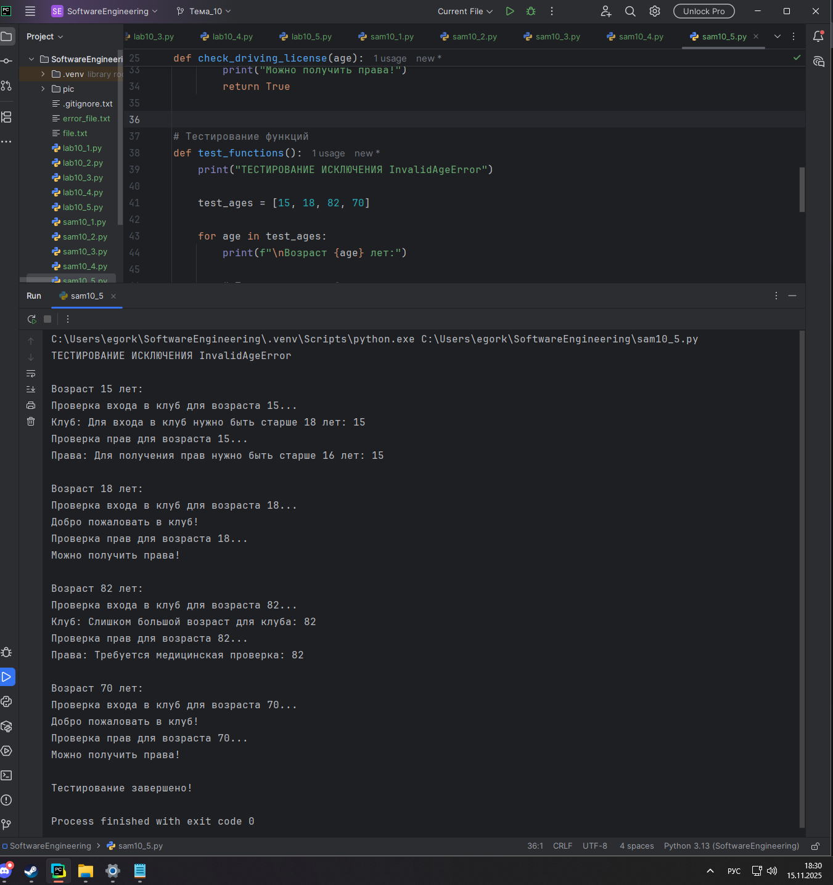

## Выводы

Собственное исключение InvalidAgeError позволяет централизованно обрабатывать специфические проверки возраста в разных частях приложения, обеспечивая единообразную обработку ошибок.

## Общие выводы по теме
Декораторы и исключения являются мощными и полезными инструментами в Python, которые помогают в создании понятного, простого и надежного кода. Декораторы особенно хороши тем, что позволяют улучшить структуру кода и легко изменить уже существующие функции, что, в свою очередь, избавляет от дублирования кода. Исключения также очень полезны, ведь они позволяют обрабатывать ошибки, не прерывая при этом выполнение программы. Кроме того, можно создавать собственные исключения, благодаря чему появляется возможность более точно определять причину ошибок.