# Тема 2. Базовые операции языка Python
Отчет по Теме #2 выполнил(а):
- Королев Егор Александрович
- ИВТ-23-2

| Задание | Лаб_раб | Сам_раб |
| ------ | ------ | ------ |
| Задание 1 | + | + |
| Задание 2 | + | + |
| Задание 3 | + | + |
| Задание 4 | + | + |
| Задание 5 | + | + |
| Задание 6 | + | + |
| Задание 7 | + | + |
| Задание 8 | + | + |
| Задание 9 | + | + |
| Задание 10 | + | + |

знак "+" - задание выполнено; знак "-" - задание не выполнено;

Работу проверили:
- к.э.н., доцент Панов М.А.

## Лабораторная работа №1
### Выведите в консоль три строки. Первая – любое число. Вторая – любое число в виде строки. Третья – любое число с плавающей точкой.

```python
print(123)
print("123")
print(1.23)
```
### Результат.
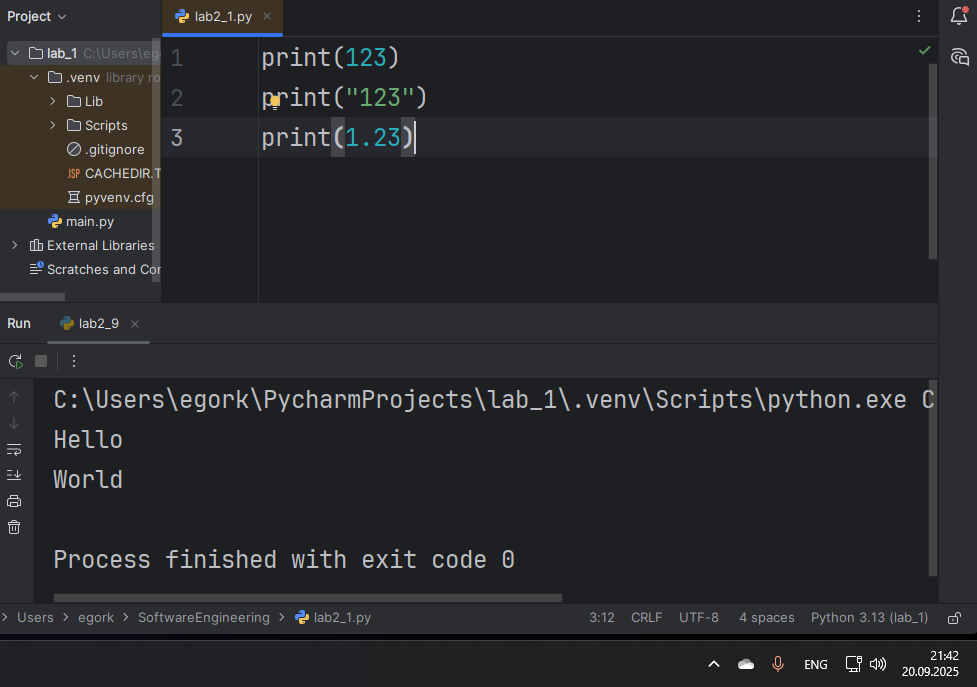

## Выводы

В ходе выполнения лабораторной работы были продемонстрированы различные способы вывода данных. Первый `print()` выводит целочисленное значение (тип `int`), второй — строку (тип `str`), содержащую цифры, а третий — число с плавающей запятой (тип `float`). Это наглядно показывает, как Python различает типы данных при выводе.

## Лабораторная работа №2
### Выведите в консоль три строки. Первая – результат сложения или вычитания минимум двух переменных типа int. Вторая – результат сложения или вычитания минимум двух переменных типа float. Третья – результат сложения или вычитания минимум двух переменных типа int и float.

```python
print(1823 - 486)
print(5.1 + 8.27)
print(3 + 7.04 + 1 + 2.33)
```
### Результат.
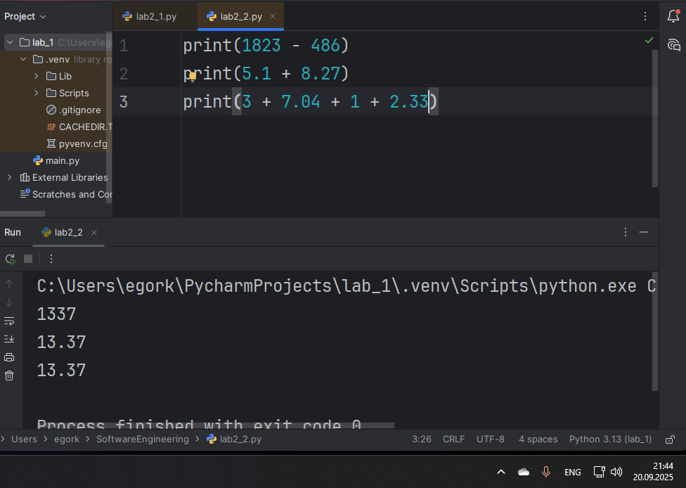

## Выводы

Данная работа иллюстрирует особенности арифметических операций с разными числовыми типами. Операции между целыми числами (`int`) возвращают целый результат. Операции между числами с плавающей точкой (`float`) возвращают результат типа `float`. При смешанных операциях (`int` и `float`) Python автоматически приводит тип результата к `float` для сохранения точности вычислений.

## Лабораторная работа №3
### Выведите в консоль три строки. Первая – обычная строка. Вторая – F строка с использованием заранее объявленной переменной. Третья – сложите две или более строк в одну.

```python
print("Привет, Мир!")

world = "Мир"
print(f"Привет, {world}!")

one = "Привет, "
two = "Мир!"
print(one + two)
```
### Результат.
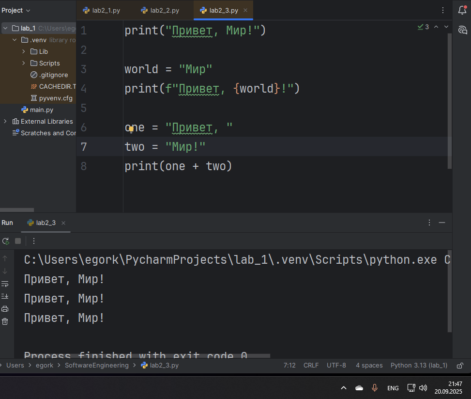

## Выводы

Были изучены три основных метода форматирования строк. Первый — прямое указание строкового литерала. Второй — использование f-строк (f-string) для подстановки значений переменных, что является современным и рекомендуемым способом. Третий — конкатенация (склеивание) строк с помощью оператора `+`. Каждый метод имеет свои преимущества в разных сценариях использования.

## Лабораторная работа №4
### Выведите в консоль три строки. Первая – трансформация любого типа переменной в bool. Вторая – трансформация любого типа переменной в float или int. Третья – трансформация любого типа переменной в str.

```python
one = "Hello"
print(bool(one))

two = 142
print(float(two))
three = None
print(str(three))
```
### Результат.
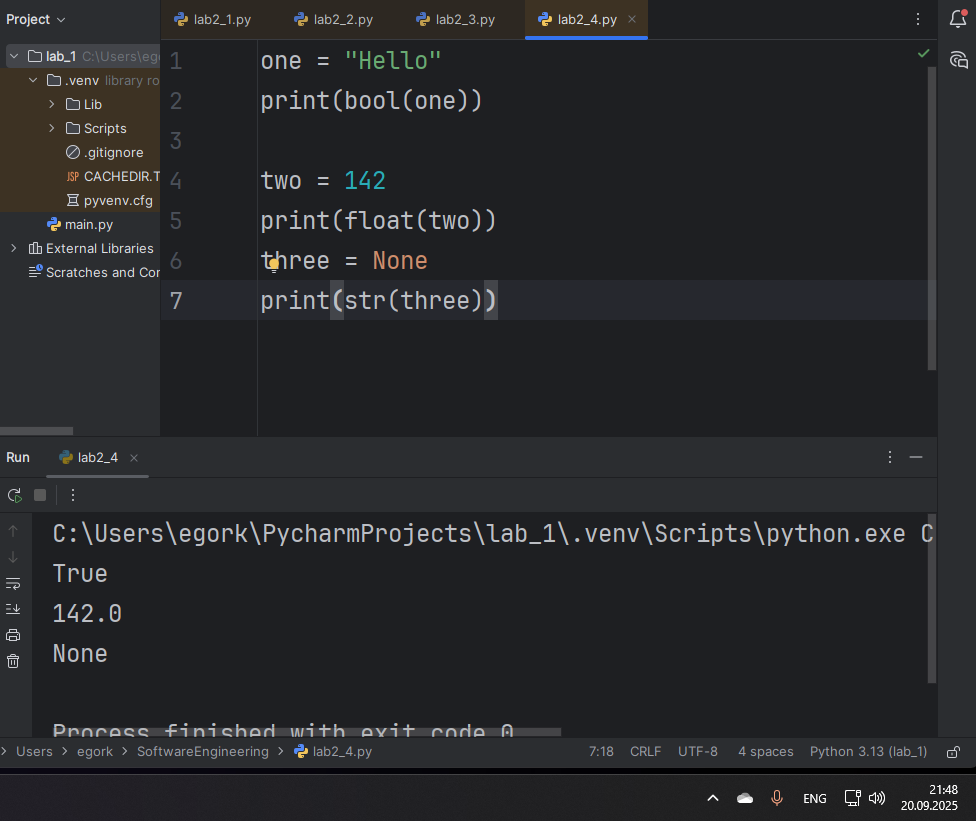

## Выводы

Эксперимент показал работу функций приведения типов. Функция `bool()` для непустой строки возвращает `True`. Функция `float()` преобразует целое число в число с плавающей точкой, добавляя дробную часть. Функция `str()` преобразует числовой тип в его строковое представление, после чего с ним нельзя производить математические операции, но можно манипулировать как с текстом.

## Лабораторная работа №5
### Присвойте трем переменным различные значения, воспользовавшись функцией input().

```python
one = input('one: ')
two = input('two: ')
three = input('three: ')
print(one, two, three)
```
### Результат.
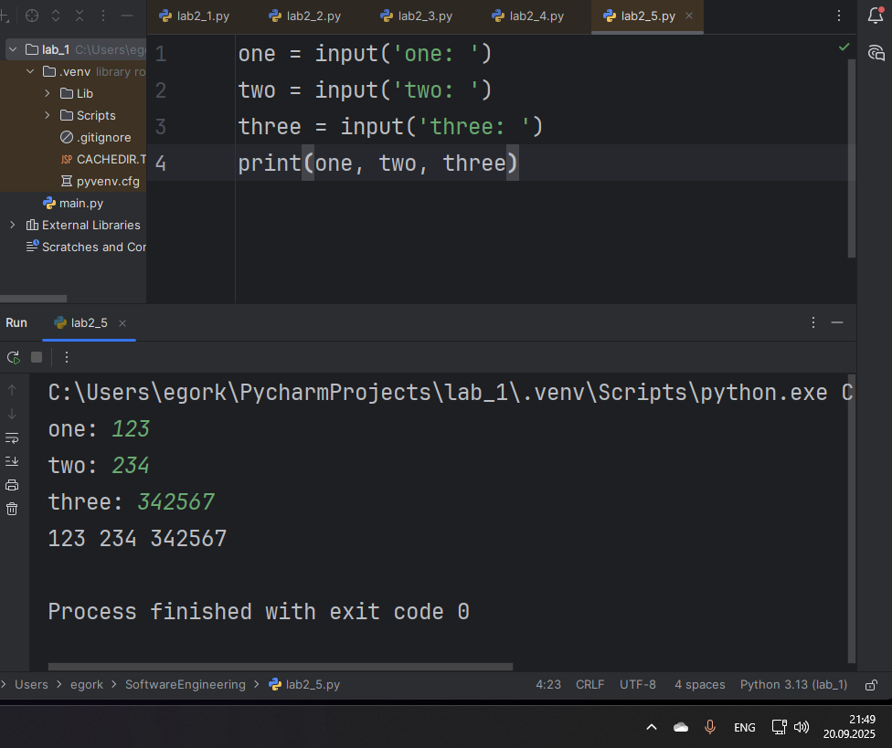

## Выводы

Была освоена работа с функцией `input()` для интерактивного ввода данных от пользователя. Важно помнить, что `input()` всегда возвращает данные в виде строки (тип `str`), даже если пользователь ввел цифры. Для последующих математических операций такие данные нужно явно преобразовывать в числовые типы с помощью `int()` или `float()`.

## Лабораторная работа №6
### Создайте две любые числовые переменные и выполните над ними несколько математических операций: возведение в степень, обычное деление, целочисленное деление, нахождение остатка от деления.

```python
a = 12
b = 5
print('Возведение в степень: ', a ** b)
print('Обычное деление: ', a / b)
print('Целочисленное деление: ', a // b)
print('Нахождение остатка от деления: ', a % b)
```
### Результат.
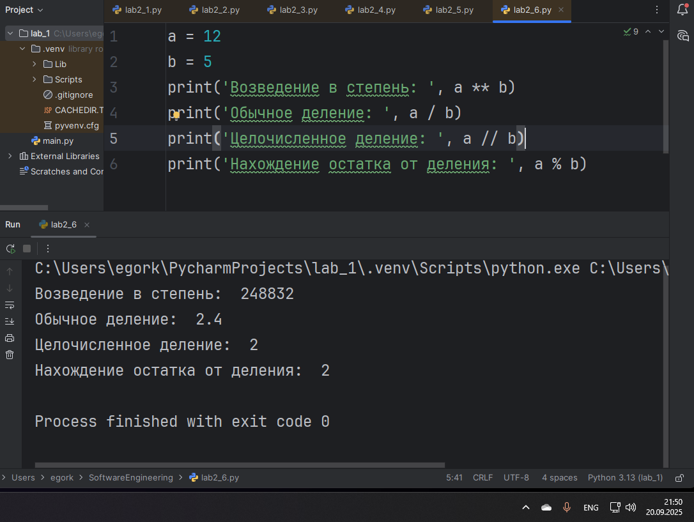

## Выводы

Работа демонстрирует различные арифметические операторы Python. Оператор `**` выполняет возведение в степень. Оператор `/` выполняет обычное деление, всегда возвращая результат типа `float`. Оператор `//` выполняет целочисленное деление, возвращая целую часть частного. Оператор `%` (модуль) возвращает остаток от деления. Эти операции фундаментальны для реализации множества алгоритмов.

## Лабораторная работа №7
### Создайте любую строковую переменную и произведите над ней математическое действие умножение на любое число.

```python
line = 'Hello!'
print(line * 6)
```
### Результат.
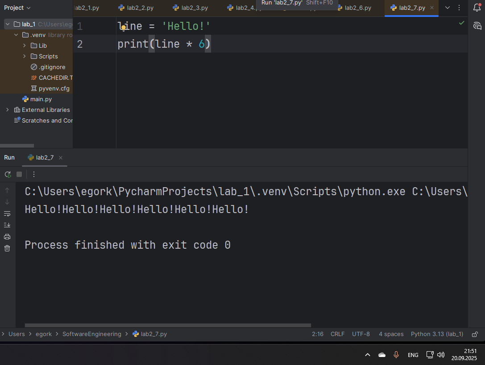

## Выводы

Умножение строки на целое число `n` является примером полиморфизма в Python — оператор `*` в зависимости от типов операндов меняет свое поведение. В данном случае он не выполняет арифметическое умножение, а повторяет строку указанное количество раз, возвращая новую строку. Это эффективный способ создания повторяющихся последовательностей символов.

## Лабораторная работа №8
### Посчитайте сколько раз символ 'o' встречается в строке 'Hello World'.

```python
sentence = 'Hello World'
print(sentence.count('o'))
```
### Результат.
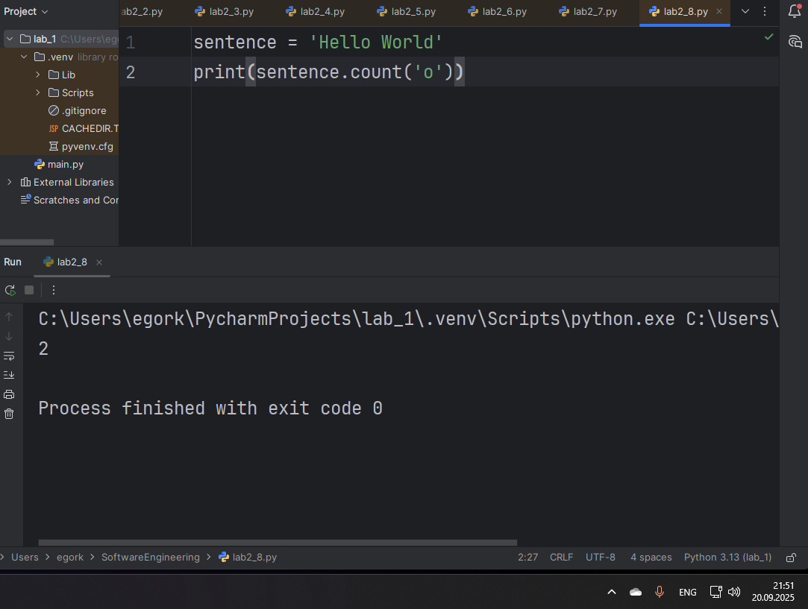

## Выводы

Метод `.count()` является мощным инструментом для работы со строками. Он позволяет найти количество непересекающихся вхождений указанной подстроки в исходной строке. Это часто используется в анализе текста, валидации данных и парсинге.

## Лабораторная работа №9
### Напишите предложение 'Hello World' в две строки. Написанная программа должна занимать одну строку в редакторе кода.

```python
print('Hello\nWorld')
```
### Результат.
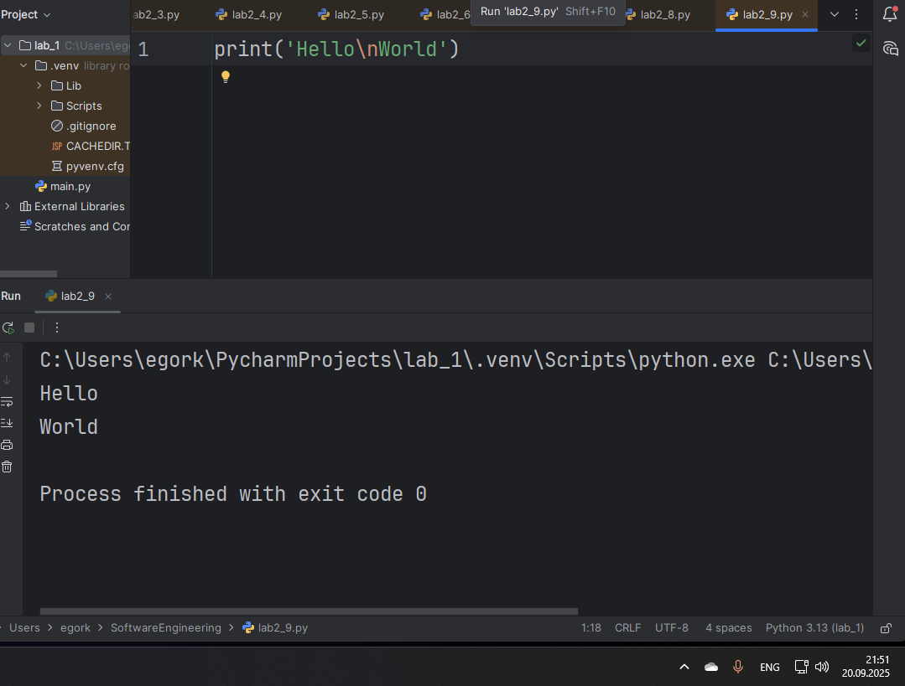

## Выводы

Использование управляющего символа `\n` (newline) является стандартным способом переноса строки в текстовых данных. Это позволяет управлять форматированием вывода, вставляя разрывы строк прямо внутри строкового литерала, без необходимости использовать несколько вызовов функции `print()`.

## Лабораторная работа №10
### Из предложения 'Hello World' выведите в консоль только 2 символ, а затем выведите слово 'Hello'

```python
sentence = "Hello World!"
print(sentence[1])
print(sentence[:5])
```
### Результат.
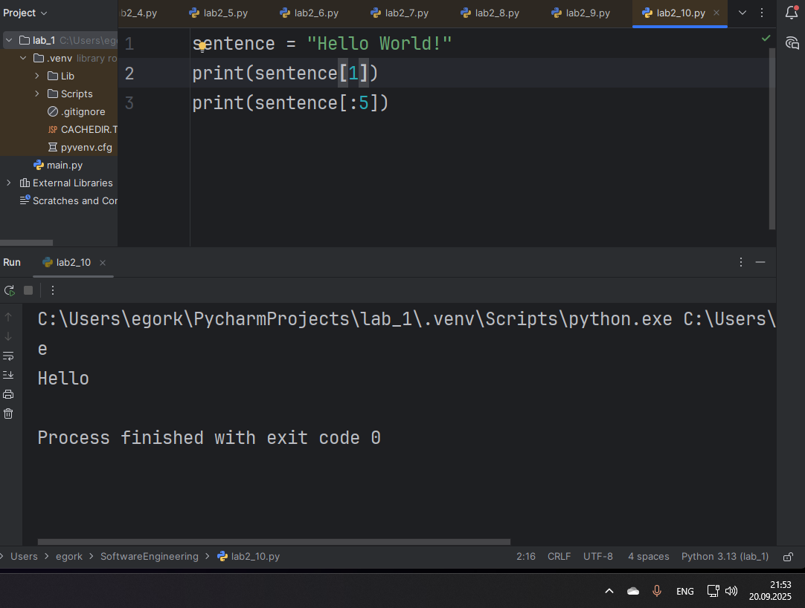

## Выводы

Работа иллюстрирует механизм индексации и срезов (slicing) в Python. Индексация начинается с 0, поэтому обращение к индексу [1] возвращает второй символ строки. Срез `[:5]` возвращает подстроку от начала (индекс 0) до индекса 5 (не включительно). Эти операции являются базовыми для извлечения конкретных частей из строк и других последовательностей.

## Самостоятельная работа №1
### Выведите в консоль булевую переменную False, не используя слово False в строке или изначально присвоенную булевую переменную.

```python
x = "hello"
print(x==1)
```
### Результат.
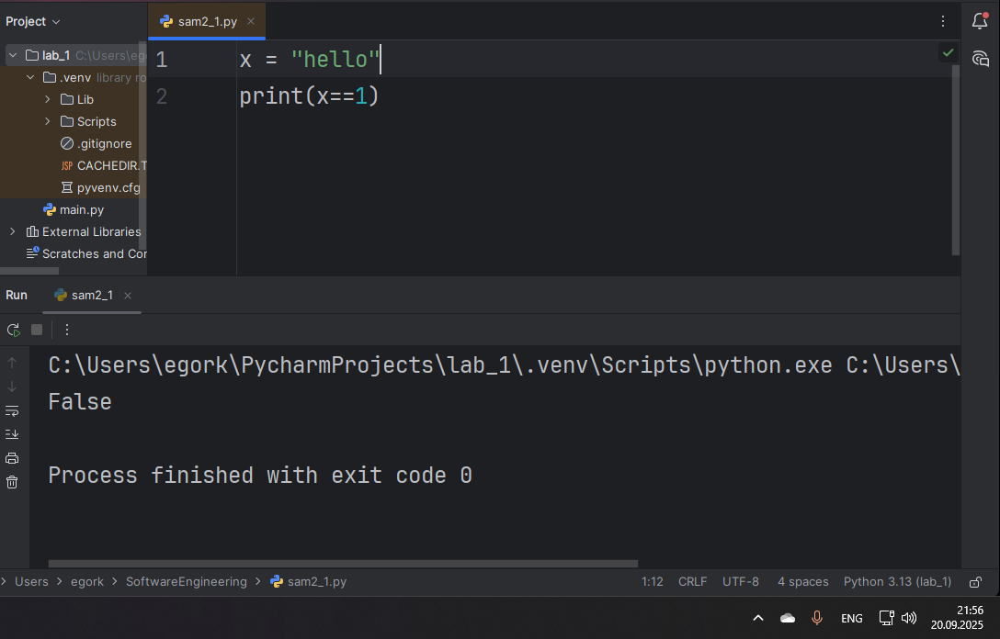

## Выводы

Операции сравнения в Python возвращают булевы значения. Сравнение строки "hello" и числа 1 всегда дает False, так как это разные типы данных. Этот подход демонстрирует генерацию логических значений через операции сравнения.

## Самостоятельная работа №2
### Присвоить значения трем переменным и вывести их в консоль, используя только две строки редактора кода

```python
a,b,c = 3,4,5
print(a,b,c)
```
### Результат.
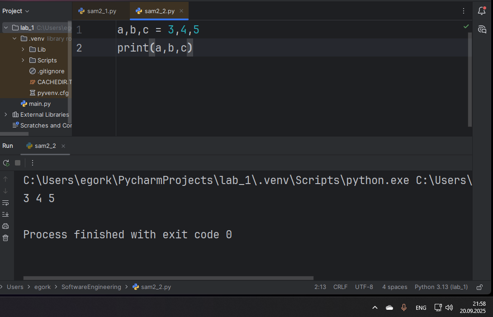

## Выводы

Множественное присваивание позволяет компактно инициализировать несколько переменных в одной строке. Вывод через print() с разделением пробелами обеспечивает читаемое отображение значений.

## Самостоятельная работа №3
### Реализуйте ввод данных в программу, через консоль, в виде только целых чисел (тип данных int).

```python
a = int(input())
print(a)
```
### Результат.
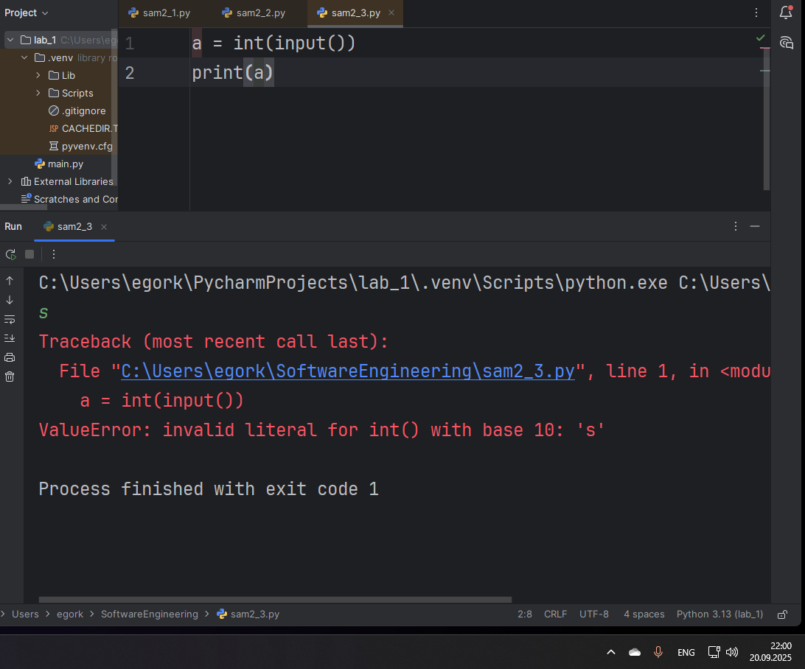

## Выводы

Функция int() строго преобразует ввод в целое число. При нечисловом вводе возникает ValueError, что требует обработки исключений для создания устойчивых программ.

## Самостоятельная работа №4
### Создайте только одну строковую переменную. Длина строки должна не превышать 5 символов. На выходе мы должны получить строку длиной не менее 16 символов.

```python
a = "hello"
print(a*4)
```
### Результат.
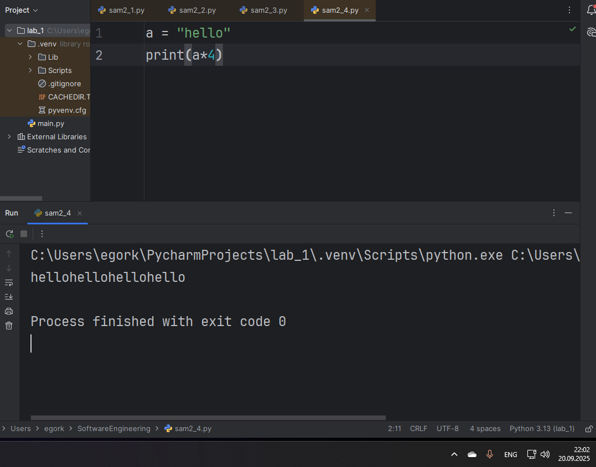

## Выводы

Умножение строки на число повторяет ее содержимое. Для строки из 5 символов умножение на 4 дает 20 символов, что решает задачу эффективно и лаконично.

## Самостоятельная работа №5
### Создайте три переменные: день (тип данных - числовой), месяц (тип данных - строка), год (тип данных - числовой) и выведите в консоль текущую дату.

```python
a,b,c = 20, " Сентября ", 2025
print(f"Сегодня {a} {b} {c}. ", end= "Всего хорошего!")
```
### Результат.
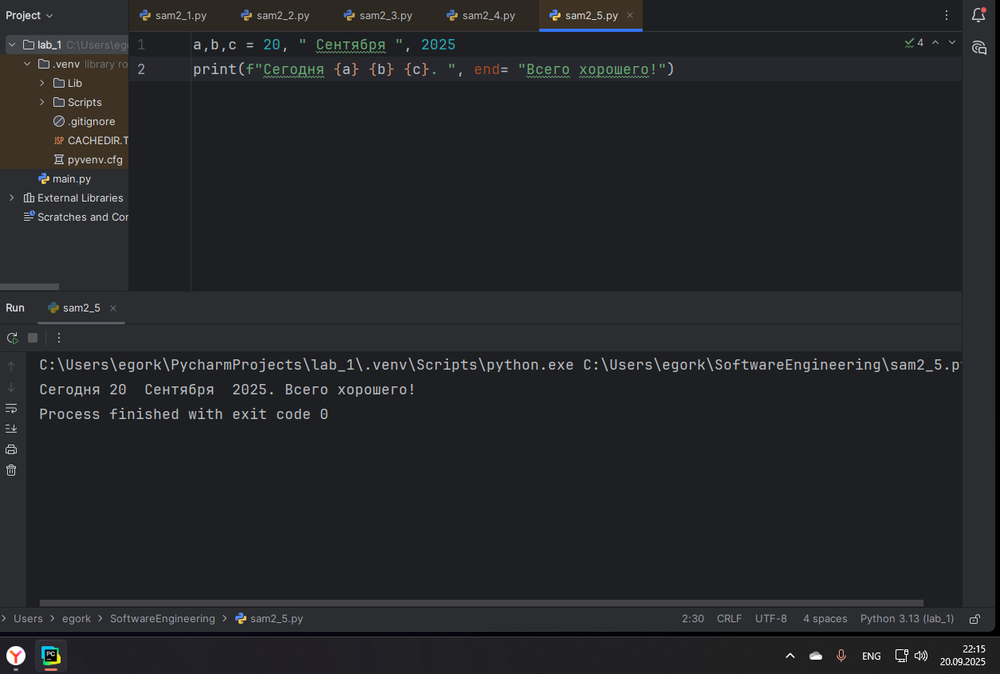

## Выводы

F-строка обеспечивает удобное форматирование, а параметр end в print() позволяет объединять вывод в одну строку, заменяя стандартный перенос.

## Самостоятельная работа №6
### В предложении 'Hello World' вставьте 'my' между двумя словами. Выведите полученное предложение в консоль в одну строку.

```python
a = "Hello World"
print(a[:6] + "my " + a[6:])
```
### Результат.
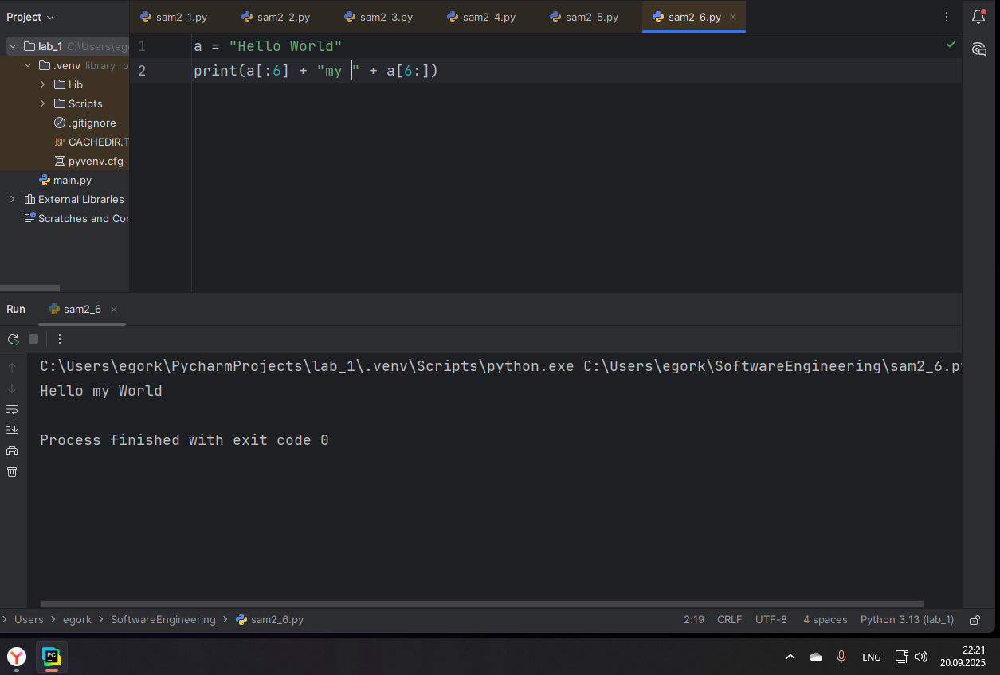

## Выводы

Срезы точно выделяют части строки, а конкатенация вставляет новый элемент. Метод эффективен для модификации строк без изменения оригинала.

## Самостоятельная работа №7
### Узнайте длину предложения 'Hello World', результат выведите в консоль.

```python
a = "Hello World"
print(len(a))
```
### Результат.
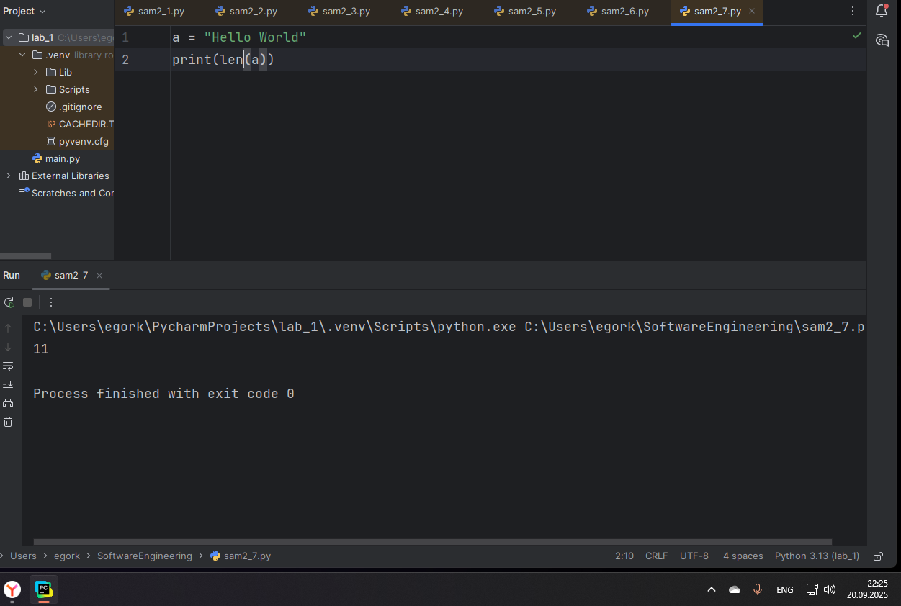

## Выводы

Функция len() возвращает точное количество символов, включая пробелы. Критически важна для валидации данных и работы с текстовой информацией.

## Самостоятельная работа №8
### Переведите предложение 'HELLO WORLD' в нижний регистр.

```python
a = "HELLO WORLD"
print(a.lower())
```
### Результат.
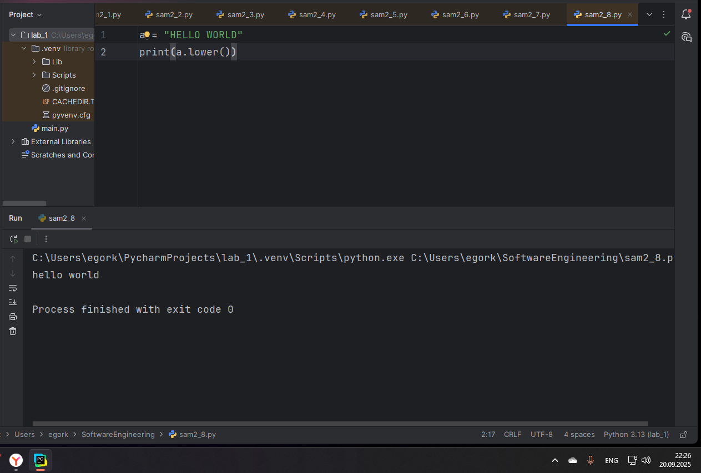

## Выводы

Метод lower() выполняет полное преобразование регистра. Основной инструмент для нормализации текстовых данных перед сравнением или обработкой.

## Самостоятельная работа №9
### Самостоятельно придумайте задачу по проходимой теме и решите ее. Задача должна быть связанна со взаимодействием с числовыми значениями.

```python
a = "hello world"
print(len(a) * 3.14 / 2.28)
```
### Результат.
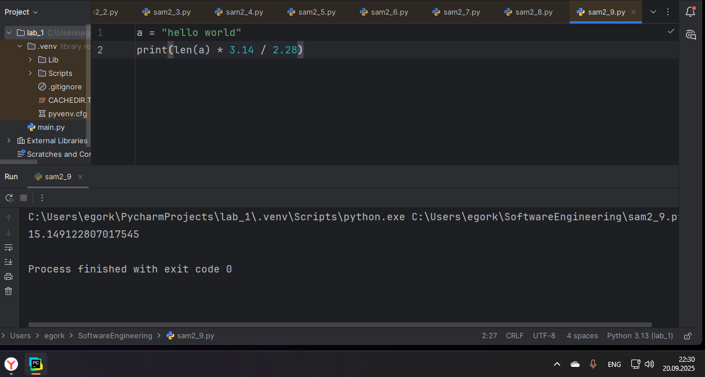

## Выводы

Комбинирование строковых и числовых операций: длина строки участвует в арифметических вычислениях, демонстрируя гибкость преобразования типов.

## Самостоятельная работа №10
### Самостоятельно придумайте задачу по проходимой теме и решите ее. Задача должна быть связанна со взаимодействием со строковыми значениями.

```python
a,b,c = "hello"," my ","world!"
print(a[:4]+a[:3][2:]*len(b)+a[4:]*len(b) + b + c)
```
### Результат.
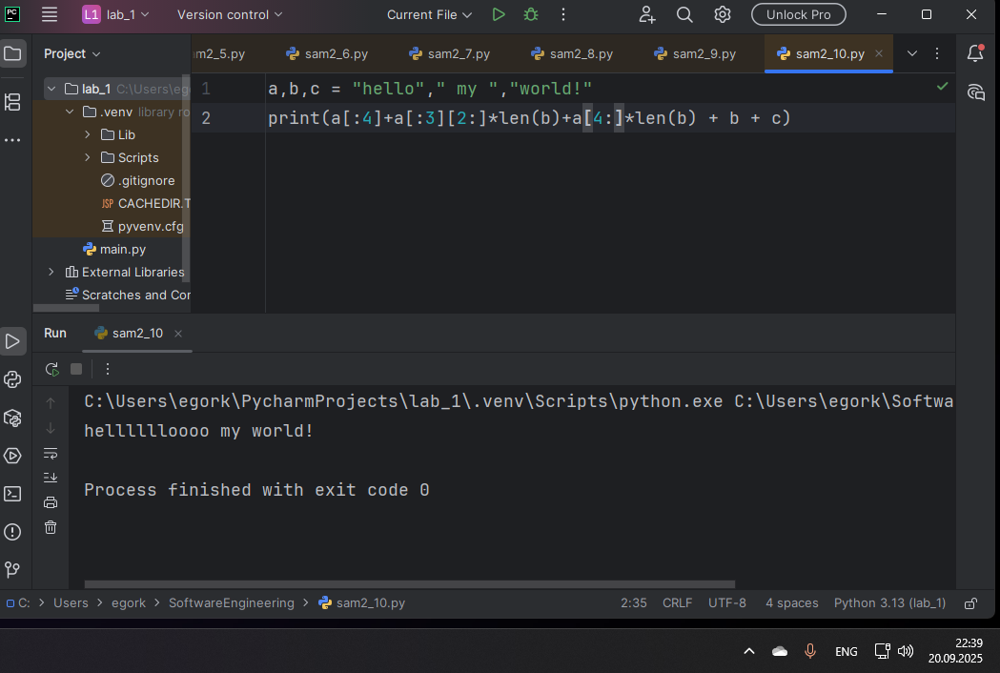

## Выводы

Комплексное использование срезов, конкатенации и повторения строк. Демонстрирует продвинутые возможности манипуляции с текстом средствами базовых операций.

## Общие выводы по теме
Практические задания охватили ключевые аспекты базовых операций Python: работу с типами данных, арифметические и строковые операции, форматирование вывода и взаимодействие с пользователем. Освоены основные методы преобразования данных, манипуляции со строками и различные подходы к выводу информации. Полученные навыки составляют фундамент для изучения более сложных концепций программирования.