# Тема 3. Операторы, условия, циклы
Отчет по Теме #3 выполнил(а):
- Королев Егор Александрович
- ИВТ-23-2

| Задание | Лаб_раб | Сам_раб |
| ------ | ------ | ------ |
| Задание 1 | + | + |
| Задание 2 | + | + |
| Задание 3 | + | + |
| Задание 4 | + | + |
| Задание 5 | + | + |
| Задание 6 | + |  |
| Задание 7 | + |  |
| Задание 8 | + |  |
| Задание 9 | + |  |
| Задание 10 | + |  |

знак "+" - задание выполнено; знак "-" - задание не выполнено;

Работу проверили:
- к.э.н., доцент Панов М.А.

## Лабораторная работа №1
### Создайте две переменные, значение которых будете вводить через консоль. Также составьте условие, в котором созданные ранее переменные будут сравниваться, если условие выполняется, то выведете в консоль «Выполняется», если нет, то «Не выполняется».

```python
one = int(input('Введите значение первой переменной: '))
two = int(input('Введите значение второй переменной: '))
if one >= two:
    print('Выполняется')
else:
    print('Не выполняется')
```
### Результат.
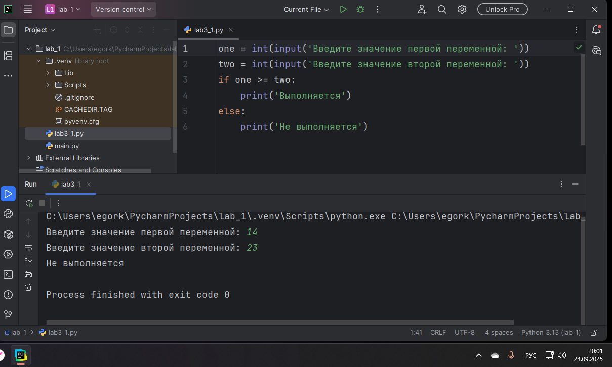

## Выводы

В данном коде пользователь вводит значение переменной, которая затем проверяется на принадлежность к одному из трех диапазонов: меньше 0, между 0 и 10, или больше 10, с выводом соответствующего сообщения.

## Лабораторная работа №2
### Напишите программу, которая будет определять значения переменной меньше 0, больше 0 и меньше 10 или больше 10. Это нужно реализовать при помощи одной переменной, значение которой будет вводится через консоль, а также при помощи конструкций if, elif, else.

```python
one = int(input('Введите значение первой переменной: '))
if one < 0:
    print('Переменная меньше 0')
elif 0 < one < 10:
    print('Переменная больше 0 и меньше 10')
else:
    print('Переменная больше 10')
```
### Результат.
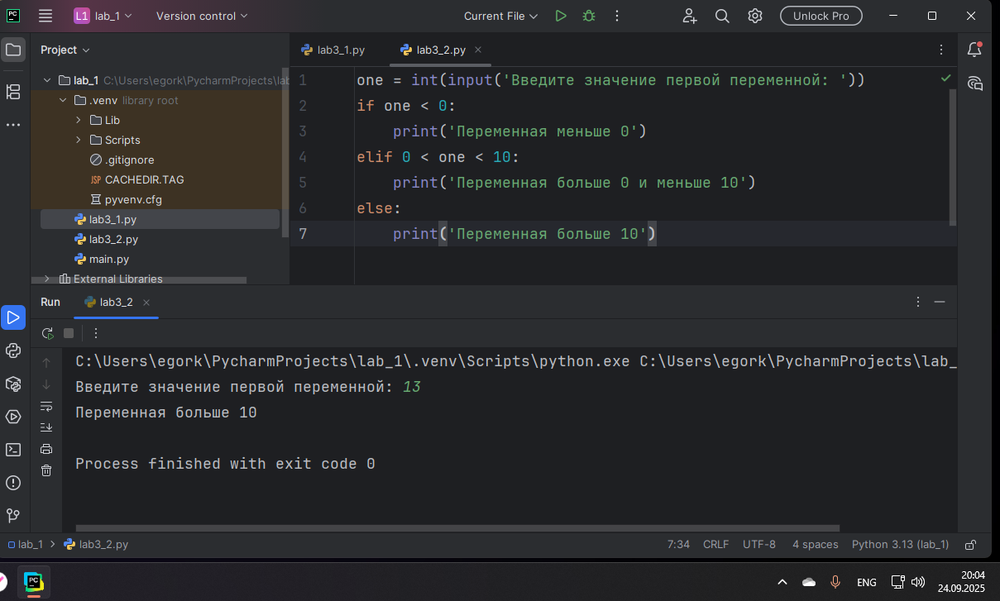

## Выводы

В данном коде пользователь вводит значение переменной, которая затем проверяется на принадлежность к одному из трех диапазонов: меньше 0, между 0 и 10, или больше 10, с выводом соответствующего сообщения.

## Лабораторная работа №3
### Напишите программу, в которой будет проверяться есть ли переменная в указанном массиве используя логический оператор in. Самостоятельно посмотрите, как работает программа со значениями которых нет в массиве numbers.

```python
numbers = [1, 3, 4, 6, 8, 9]
value = int(input('Введите значение переменной: '))
if value in numbers:
    print('Переменная есть в данном массиве')
else:
    print('Переменной нет в этом массиве')
```
### Результат.
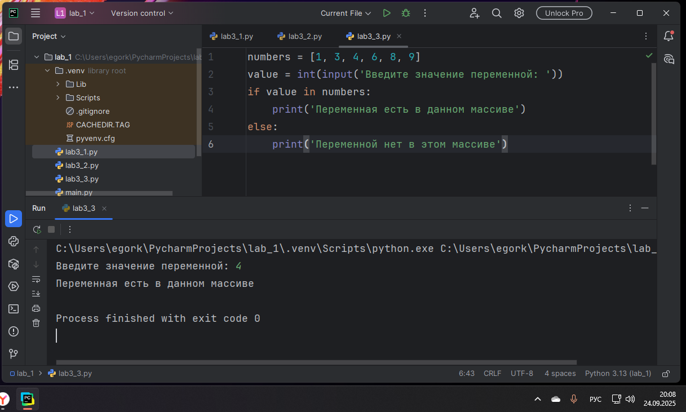

## Выводы

В данном коде проверяется наличие введенного пользователем числа в предопределенном массиве с использованием оператора in, с выводом соответствующего результата проверки.

## Лабораторная работа №4
### Напишите программу, которая будет определять находится ли переменная в указанном массиве и если да, то проверьте четная она или нет. Самостоятельно протестируйте данную программу с разными значениями переменной value. 

```python
numbers = [1, 3, 4, 6, 8, 9, 15, 16, 73, 321, 322]
value = int(input('Введите значение переменной: '))
if value in numbers:
    if value % 2 == 0:
        print('Переменная четная и есть в массиве numbers')
    else:
        print('Переменная нечетная и есть в массиве numbers')
else:
    print(f'Переменной нет в массиве numbers и она равна {value}')
```
### Результат.
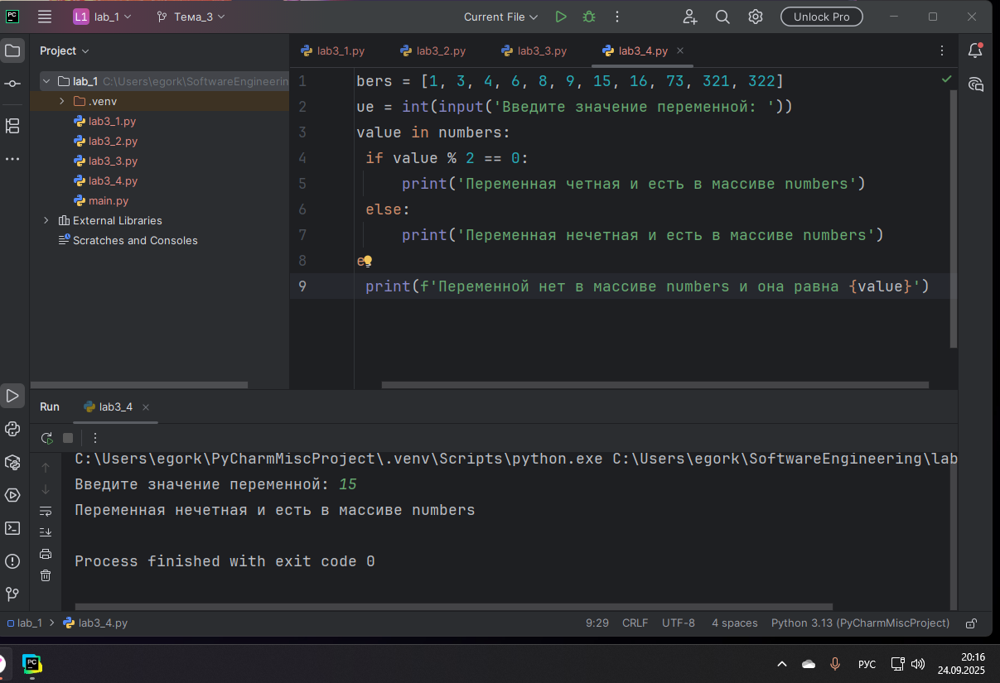

## Выводы

В данном коде сначала проверяется наличие числа в массиве, а затем, если число найдено, определяется его четность с выводом соответствующего сообщения.

## Лабораторная работа №5
### Напишите программу, в которой циклом for значения переменной i будут меняться от 0 до 10 и посмотрите, как разные виды сравнений и операций работают в цикле.

```python
for i in range(10):
    print('i = ', i)
    if i == 0:
        i += 2
    if i == 1:
        continue
    if i == 2 or i == 3:
        print('Переменная равна 2 или 3')
    elif i in [4, 5, 6]:
        print('Переменная равна 4,5 или 6')
    else:
        break
```
### Результат.
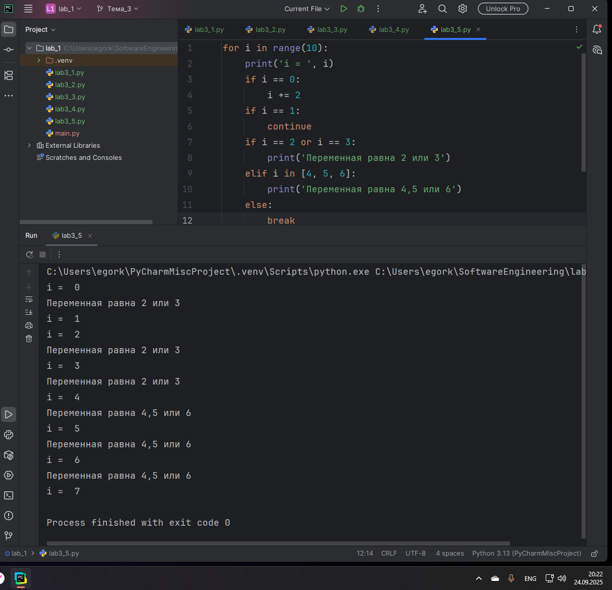

## Выводы

В данном коде демонстрируется работа цикла for с различными условиями внутри, включая изменение переменной цикла, использование continue и break для управления выполнением цикла.

## Лабораторная работа №6
### Напишите программу, в которой при помощи цикла for определяется есть ли переменная value в строке string и посмотрите, как работает оператор else для циклов. Самостоятельно посмотрите, что выведет программа, если значение переменной value оказалось в строке string. 

```python
string = 'Привет всем изучающим Python!'
value = input()
for i in string:
    if i == value:
        index = string.find(value)
        print(f"Буква '{value}' есть в строке под {index} индексом")
        break
else:
    print(f"Буквы '{value}' нет в указанной строке")
```
### Результат.
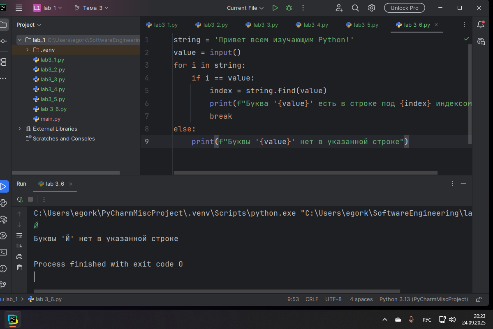

## Выводы

В данном коде используется цикл for с блоком else, который выполняется только если цикл завершился без прерывания break, что позволяет обработать случай отсутствия символа в строке.

## Лабораторная работа №7
### Напишите программу, в которой вы наглядно посмотрите, как работает цикл for проходя в обратном порядке, то есть, к примеру не от 0 до 10, а от 10 до 0. В уже готовой программе показано вычитание из 100, а вам во время реализации программы будет необходимо придумать свой вариант применения обратного цикла.

```python
value = 100
for i in range(10, -1, -1):
    value -= i
    print(i, value)
```
### Результат.
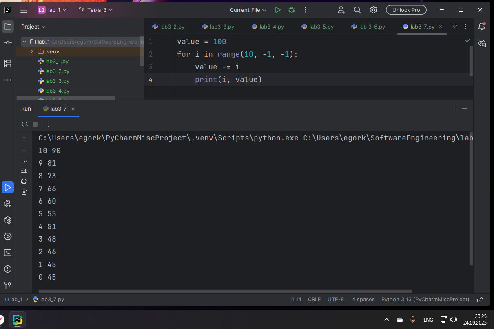

## Выводы

В данном коде демонстрируется обратный цикл for, который уменьшает значение переменной на величину текущей итерации, показывая работу цикла с отрицательным шагом.

## Лабораторная работа №8
### Напишите программу используя цикл while, внутри которого есть какие-либо проверки, но быть осторожным, поскольку циклы while при неправильно написанных условиях могут становится бесконечными, как указано в примере далее.

```python
value = 0
while value < 100:
    if value == 0:
        value += 10
    elif value // 5 > 1:
        value *= 5
    else:
        value -= 5
    print(value)
```
### Результат.
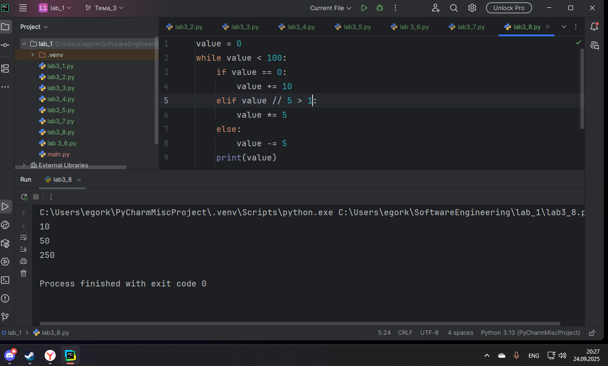

## Выводы

В данном коде показана работа цикла while с условиями, изменяющими переменную цикла, что гарантирует его конечность при правильном подборе условий изменения переменной.

## Лабораторная работа №9
### Напишите программу с использованием вложенных циклов и одной проверкой внутри них. Самое главное, не забудьте, что нельзя использовать одинаковые имена итерируемых переменных, когда вы используете вложенные циклы.

```python
value = 0
for i in range(10):
    for j in range(10):
        if i != j:
            value += j
        else:
            pass
print(value)
```
### Результат.
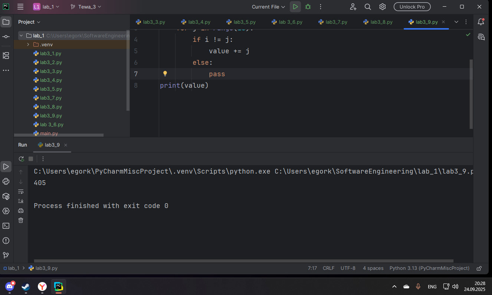

## Выводы

В данном коде используются вложенные циклы for с проверкой неравенства переменных циклов, что демонстрирует правильное использование разных имен для итерируемых переменных во вложенных циклах.

## Лабораторная работа №10
### Напишите программу с использованием flag, которое будет определять есть ли нечетное число в массиве. В данной задаче flag выступает в роли индикатора встречи нечетного числа в исходном массиве, четных чисел.

```python
even_array = [2, 4, 6, 8, 9]
flag = False
for value in even_array:
    if value % 2 == 1:
        flag = True

if flag is True:
    print('В массиве есть нечетное число')
else:
    print('В массиве все числа четные')
```
### Результат.
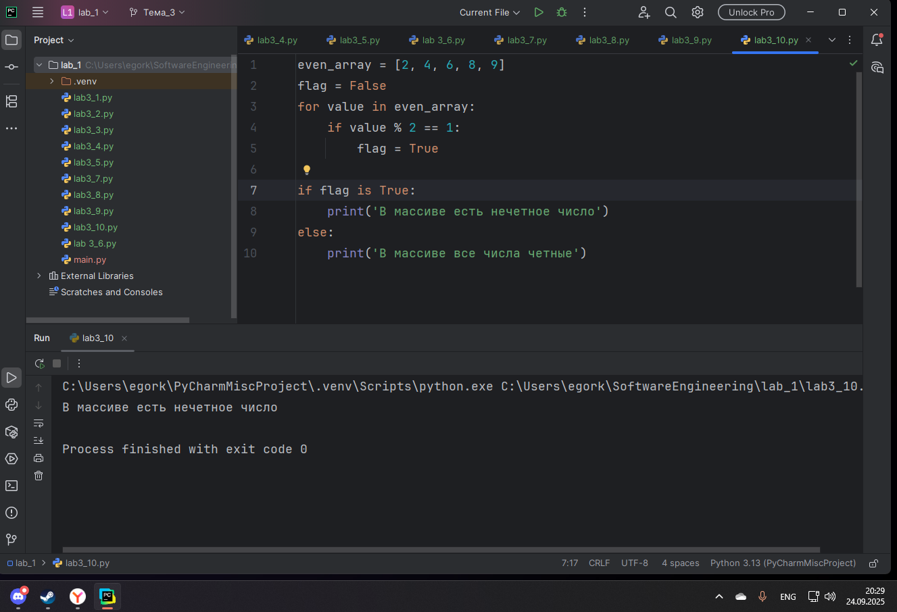

## Выводы

В данном коде используется флаг для отслеживания наличия нечетного числа в массиве, что демонстрирует эффективный способ проверки условия без преждевременного прерывания цикла.

## Самостоятельная работа №1
### Напишите программу, которая преобразует 1 в 31.
Для выполнения поставленной задачи необходимо обязательно и только один раз использовать:

•	Цикл for

•	*= 5

•	+= 1

Никаких других действий или циклов использовать нельзя.

```python
for i in range(7):
    i *= 5
i += 1
print(i)
```
### Результат.
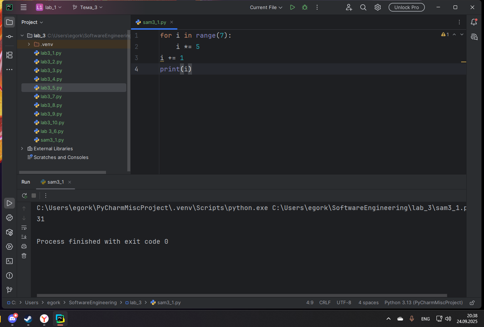

## Выводы

В данном коде используется цикл for с операциями умножения и сложения для преобразования числа 1 в 31 за заданное количество итераций.

## Самостоятельная работа №2
### Напишите программу, которая фразу «Hello World» выводит в обратном порядке, и каждая буква находится в одной строке консоли. При этом необходимо обязательно использовать любой цикл, а также программа должна занимать не более 3 строк в редакторе кода.

```python
word = 'Hello World'
for i in range(len(word) -1, -1, -1):
    print(word[i])
```
### Результат.
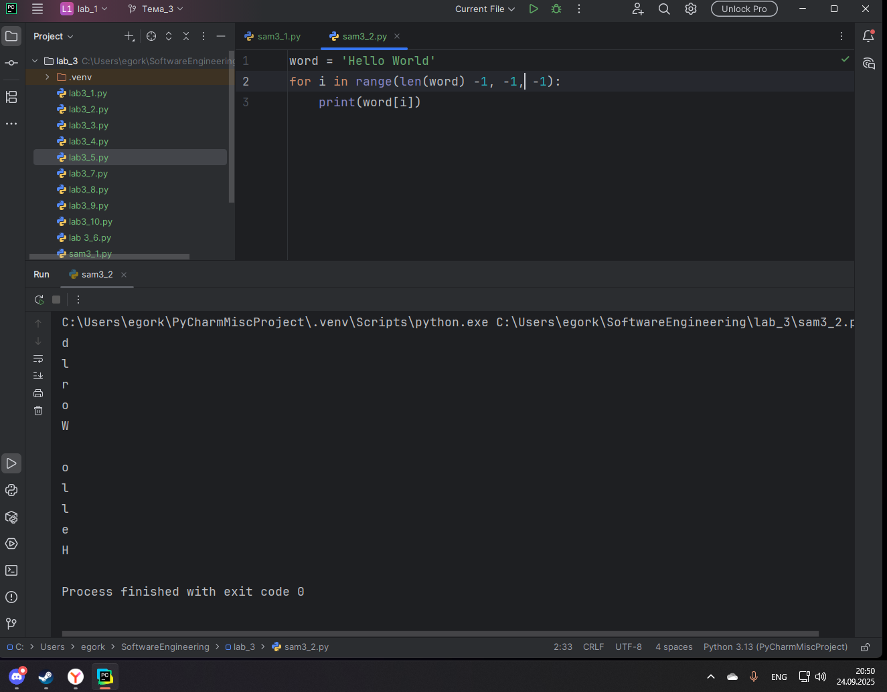

## Выводы

В данном коде используется цикл for с обратным порядком индексов для вывода строки посимвольно в обратном порядке, с соблюдением требования по количеству строк кода.

## Самостоятельная работа №3
### Напишите программу, на вход которой поступает значение из консоли, оно должно быть числовым и в диапазоне от 0 до 10 включительно (это необходимо учесть в программе). Если вводимое число не подходит по требованиям, то необходимо вывести оповещение об этом в консоль и остановить программу. Код должен вычислять в каком диапазоне находится полученное число. Нужно учитывать три диапазона:

•	от 0 до 3 включительно

•	от 3 до 6

•	от 6 до 10 включительно

Результатом работы программы будет выведенный в консоль диапазон. Программа должна занимать не более 10 строчек в редакторе кода.

```python
a = int(input("Введите число: "))
if 0 < a <= 3:
    print("от 0 до 3 включительно")
elif 3 < a < 6:
    print("от 3 до 6")
elif 6 < a <= 10:
    print("от 6 до 10 включительно")
else:
    print("Ошибка: введите число от 0 до 10")
```
### Результат.
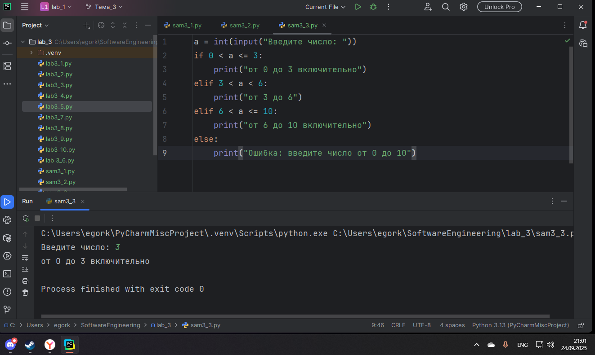

## Выводы

В данном коде реализована проверка ввода числа и его классификация по диапазонам с выводом ошибки при неверном вводе, с соблюдением требования по количеству строк кода.

## Самостоятельная работа №4
### Манипулирование строками. Напишите программу на Python, которая принимает предложение (на английском) в качестве входных данных от пользователя. Выполните следующие операции и отобразите результаты:

•	Выведите длину предложения.

•	Переведите предложение в нижний регистр.

•	Подсчитайте количество гласных (a, e, i, o, u) в предложении.

•	Замените все слова "ugly" на "beauty".

•	Проверьте, начинается ли предложение с "The" и заканчивается ли на "end".

Проверьте работу программы минимум на 3 предложениях, чтобы охватить проверку всех поставленных условий.

```python
word = input('Введите предложение: ')
print('Длина предложения: ', len(word))
print('Предложение в нижнем регистре: ', word.lower())
glas = ['a', 'e', 'i', 'o', 'u']
count = 0
for i in word:
    if i in glas:
        count += 1
print('Колличество гласных в предложении: ', count)
finish = len(word)-3

word = word.lower()


ugly = 'ugly'
beauty = 'beauty'
if ugly in word:
    print('Предложение с заменёнными словами: ', word.replace(ugly, beauty))


if (word[:3] == 'the') and (word[finish:] == 'end'):
    print('Да, предложение начинается с the и заканчивается на end')
else:
    print('Нет, предложение не начинается с the и заканчивается на end')
```
### Результат.
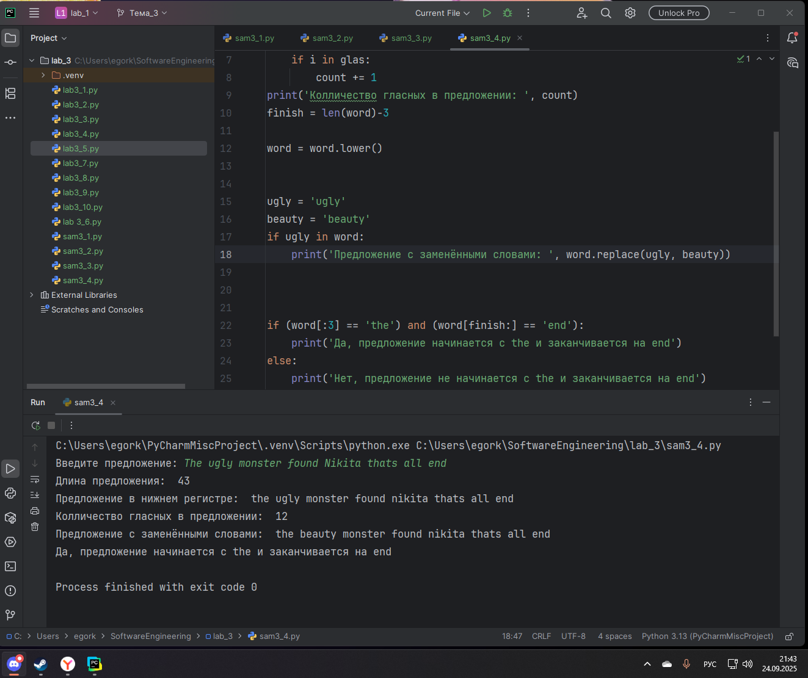

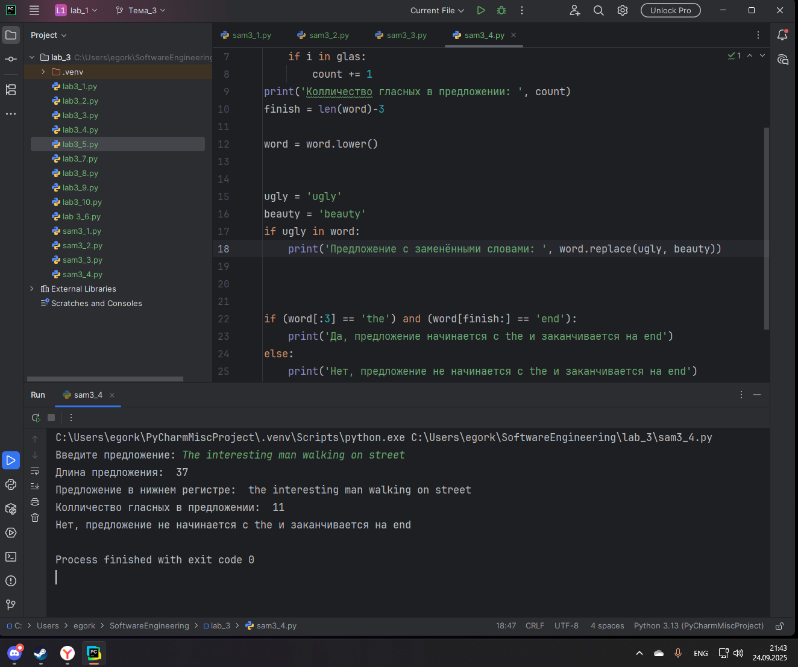

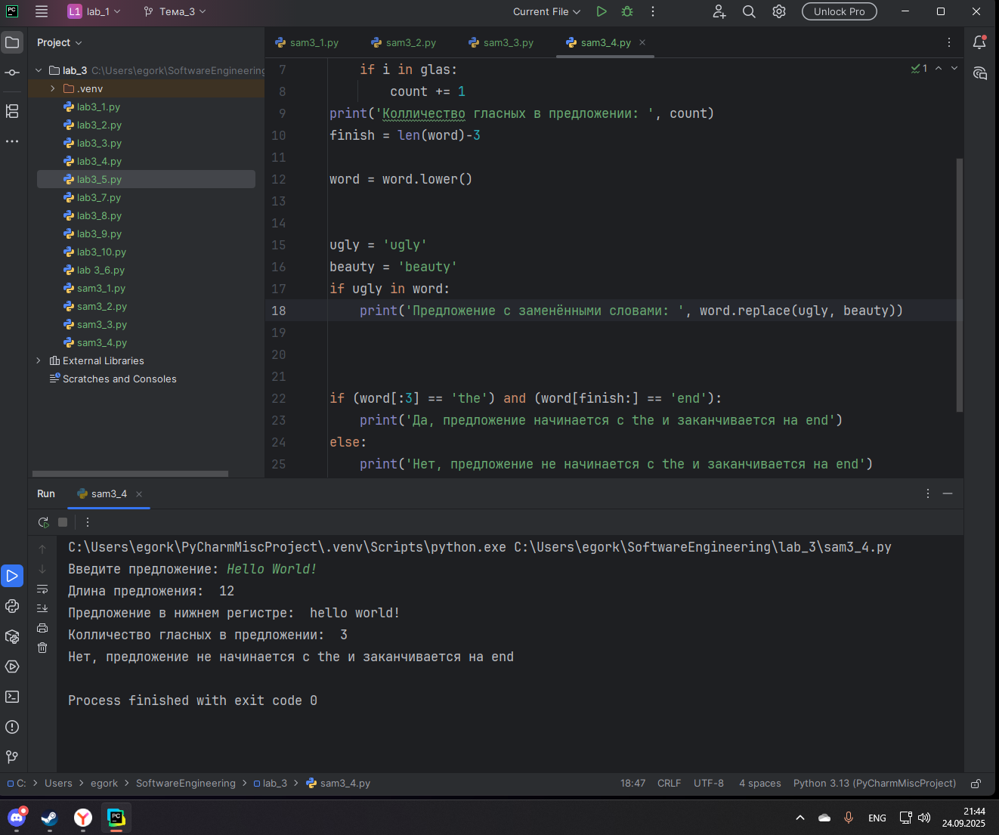

## Выводы

В данном коде реализованы различные операции со строками: определение длины, приведение к нижнему регистру, подсчет гласных, замена подстрок и проверка начала/конца строки, с тестированием на разных входных данных.

## Самостоятельная работа №5
### Составьте программу, результатом которой будет данный вывод в консоль:

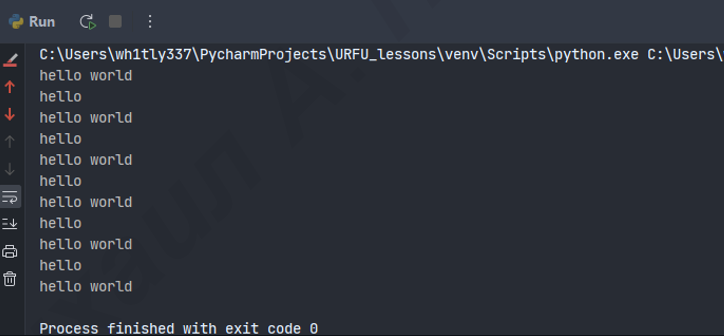

Программу нужно составить из данных фрагментов кода:

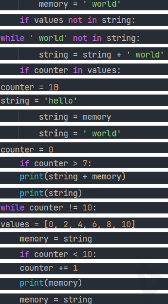

Строки кода можно использовать только один раз. Не обязательно использовать все строки кода.

```python
string = 'hello'
values = [0, 2, 4, 6, 8, 10]
counter = 0
while ' world' not in string:
    memory = string
    if counter in values:
        string = string + ' world'
    print(string)
    if counter < 10:
        string = memory
    counter += 1
```
### Результат.
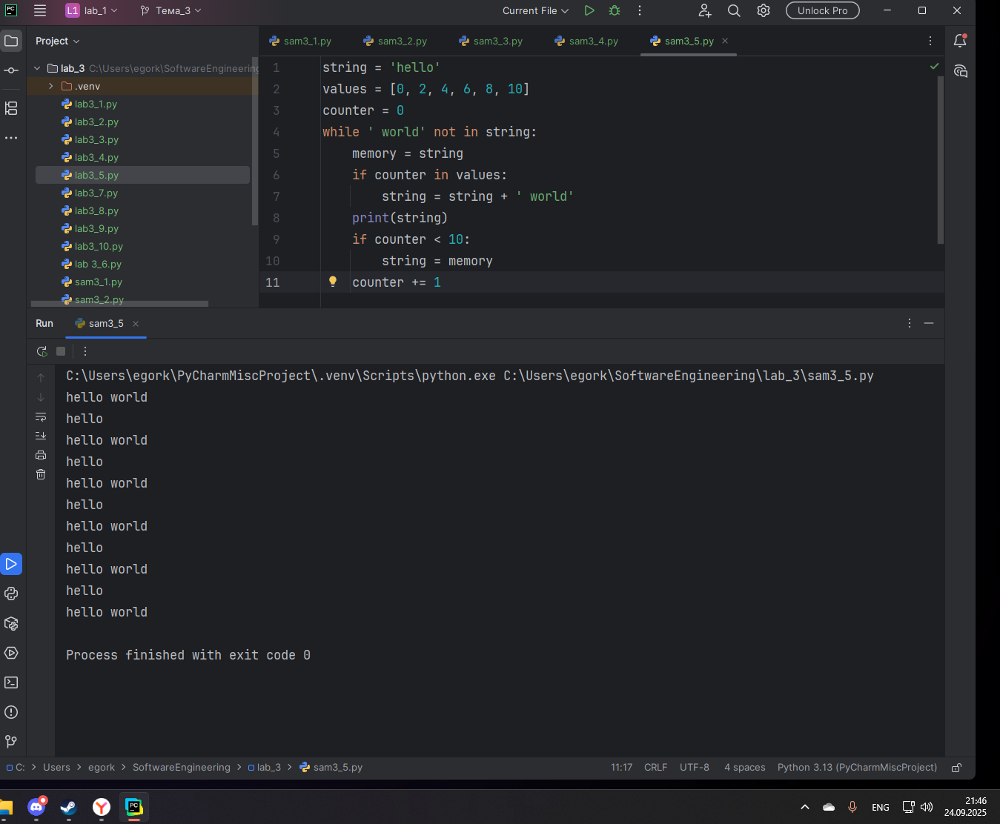

## Выводы

В данном коде используется цикл while с условием проверки наличия подстроки, что позволяет контролировать выполнение цикла до достижения нужного результата, с использованием флага для отслеживания состояния.

## Общие выводы по теме
В Python существуют различные операторы: арифметические операторы, операторы сравнения, операторы присваивания, логические операторы, операторы принадлежности и т.д. Все они важны и используются в программах повсеместно. Условные конструкции так же полезны, ведь они позволяют выполнять различные действия в зависимости от условия. Они основаны на ключевых словах if, else, elif. Для повторяющихся операций удобно использовать циклы - for и while, которые также могут быть и вложенными.