# Тема 4. Функции и стандартные модули/библиотеки
Отчет по Теме #4 выполнил(а):
- Королев Егор Александрович
- ИВТ-23-2

| Задание | Лаб_раб | Сам_раб |
| ------ | ------ | ------ |
| Задание 1 | + | + |
| Задание 2 | + | + |
| Задание 3 | + | + |
| Задание 4 | + | + |
| Задание 5 | + | + |
| Задание 6 | + |  |
| Задание 7 | + |  |
| Задание 8 | + |  |
| Задание 9 | + |  |
| Задание 10 | + |  |

знак "+" - задание выполнено; знак "-" - задание не выполнено;

Работу проверили:
- к.э.н., доцент Панов М.А.

## Лабораторная работа №1
### Напишите функцию, которая выполняет любые арифметические действия и выводит результат в консоль. Вызовите функцию используя “точку входа”.

```python
def main():
    print(2+2)

if __name__ == '__main__':
    main()
```
### Результат.
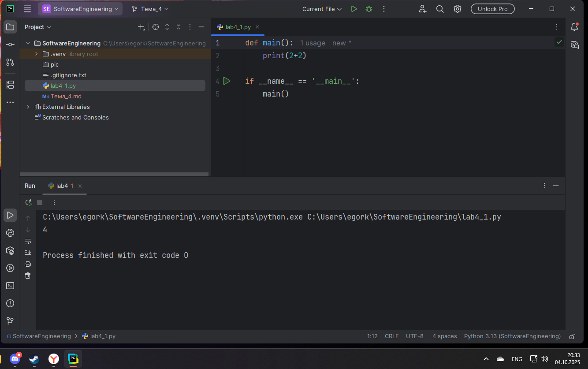

## Выводы

Создана функция main(), выполняющая сложение. Точка входа if __name__ == '__main__' обеспечивает вызов функции только при прямом запуске. Результат: вывод числа 4.

## Лабораторная работа №2
### Напишите функцию, которая выполняет любые арифметические действия, возвращает при помощи return значение в место, откуда вызывали функцию. Выведите результат в консоль. Вызовите функцию используя “точку входа”.

```python
def main():
    return 2+2

if __name__ == '__main__':
    print(main())
```
### Результат.
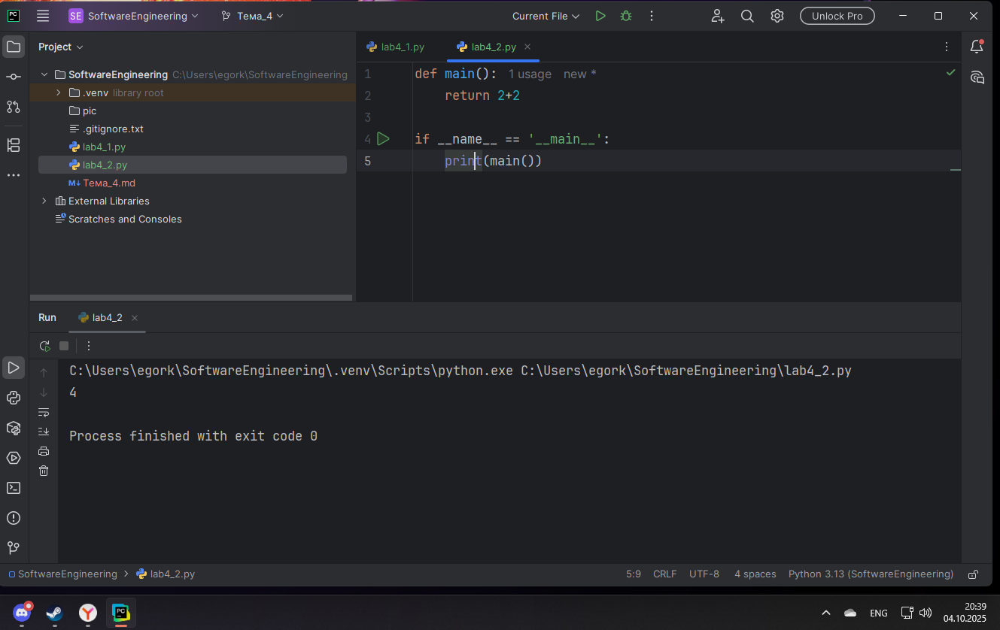

## Выводы

Функция main() возвращает результат сложения через return. Точка входа используется для вызова функции и вывода результата (4) в консоль.

## Лабораторная работа №3
### Напишите функцию, в которую передаются два аргумента, над ними производится арифметическое действие, результат возвращается туда, откуда эту функцию вызывали. Выведите результат в консоль. Вызовите функцию в любом небольшом цикле.

```python
def main(one, two):
    result = one + two
    return result

for i in range(5):
    x = 1
    y = 10
    answer = main(x, y)
    print(answer)
```
### Результат.
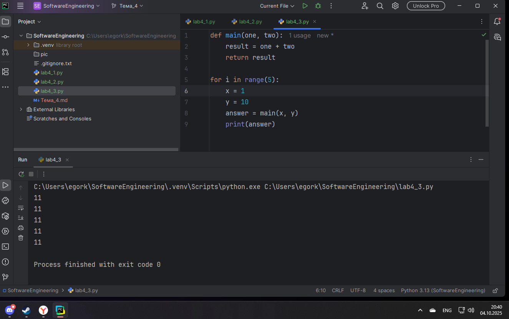

## Выводы

Функция main(one, two) принимает два аргумента и возвращает их сумму. При вызове в цикле 5 раз выводит одинаковый результат (11).

## Лабораторная работа №4
### Напишите функцию, на вход которой подается какое-то изначальное неизвестное количество аргументов, над которыми будет производится арифметические действия. Для выполнения задания необходимо использовать кортеж “*args”. 

```python
def main(x, *args):
    one = x
    two = sum(args)
    three = float(len(args))

    print(f"one={one}\ntwo={two}\nthree={three}")

    return x + sum(args) / float(len(args))

if __name__ == '__main__':
    result = main(10, 0, 1, 2, -1, 0, -1, 1, 1)
    print(f"\nresult={result}")
```
### Результат.
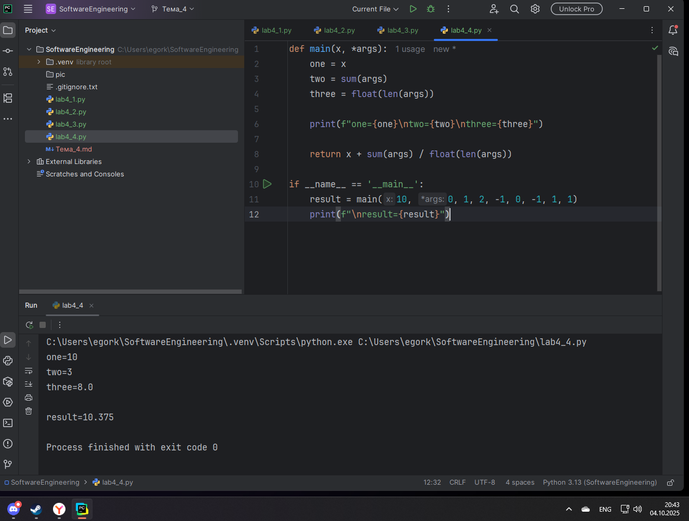

## Выводы

В данном коде с помощью точки входа вызывается функция main, которой в качестве параметров имеет переменную x и кортеж аргументов *args. Внутри функции переменной one присваивается значение x, переменной two - сумма переданных аргументов args, переменной three вещественное значение длины args. Функция возвращает результат операций one + two / three.

## Лабораторная работа №5
### Напишите функцию, которая на вход получает кортеж “**kwargs” и при помощи цикла выводит значения, поступившие в функцию. На скриншоте ниже указаны два варианта вызова функции с “**kwargs” и два варианта работы с данными, поступившими в эту функцию. Комментарии в коде и теоретическая часть помогут вам разобраться в этом нелегком аспекте. Вызовите функцию используя “точку входа”.

```python
def main(**kwargs):
    for i in kwargs.items():
        print(i[0], i[1])

    print()

    for key in kwargs:
        print(f"{key} = {kwargs[key]}")

if __name__ == '__main__':
    main(x=[1, 2, 3], y=[3, 3, 0], z =[2, 3, 0], q=[3, 3, 0], w=[3, 3, 0])
    print()
    main(**{'x': [1, 2, 3], 'y': [3, 3, 0]})
```
### Результат.
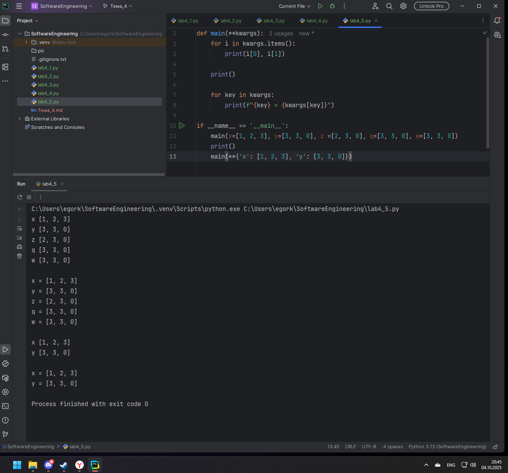

## Выводы

Функция main(**kwargs) принимает именованные аргументы. Два цикла for выводят одинаковые списки пар "ключ-значение".

## Лабораторная работа №6
### Напишите две функции. Первая – получает в виде параметра “**kwargs”. Вторая считает среднее арифметическое из значений первой функции. Вызовите первую функцию используя “точку входа” и минимум 4 аргумента.

```python
def main(**kwargs):
    for i, j in kwargs.items():
        print(f"{i}. Значение = {mean(j)}")

def mean(data):
    return sum(data) / float(len(data))

if __name__ == '__main__':
    main(x=[1, 2, 3], y=[3, 3, 0], z=[2, 4, 4], v=[4, 3, 5])
```
### Результат.
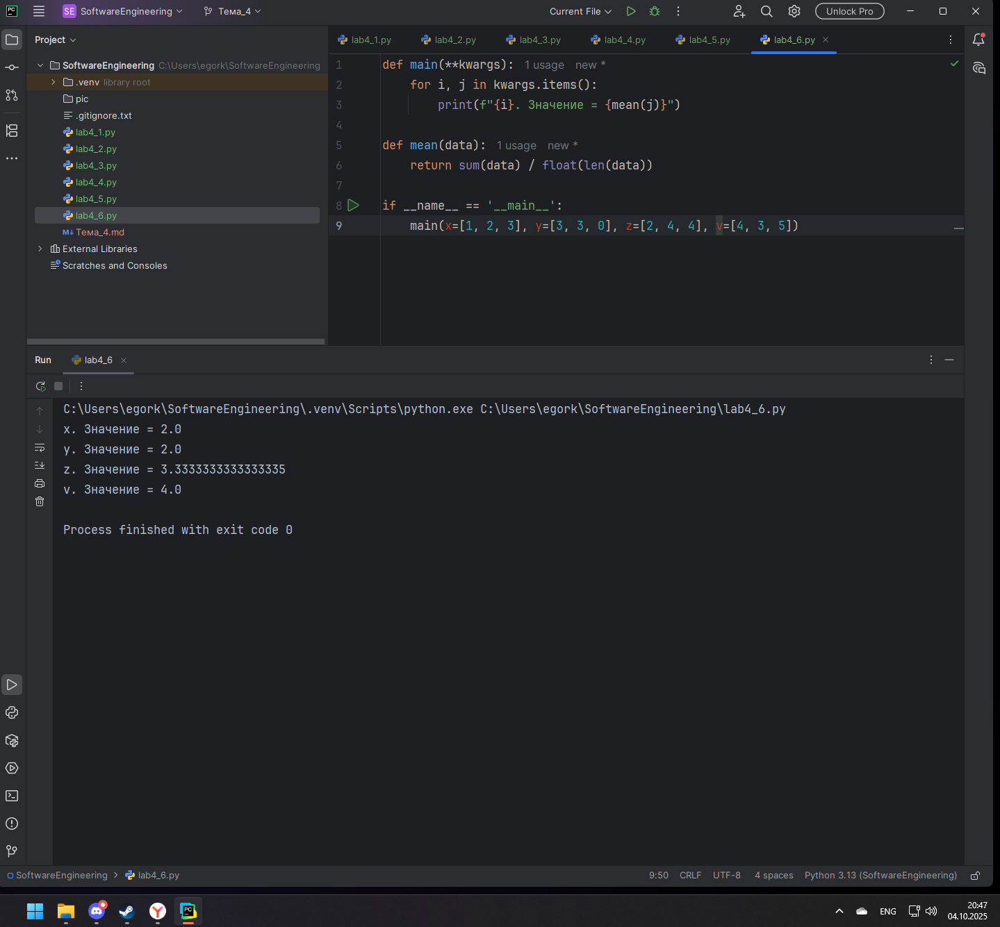

## Выводы

Функция main(**kwargs) выводит ключи и средние значения наборов чисел, используя функцию mean(data) для расчетов.

## Лабораторная работа №7
### Создайте дополнительный файл .py. Напишите в нем любую функцию, которая будет что угодно выводить в консоль, но не вызывайте ее в нем. Откройте файл main.py, импортируйте в него функцию из нового файла и при помощи “точки входа” вызовите эту функцию.

```python
from for_import import say_hello

if __name__ == "__main__":
    say_hello()
```
### Результат.
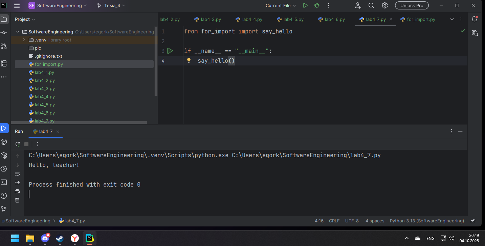

## Выводы

Функция say_hello() из отдельного файла импортирована в lab4_7.py. Точка входа обеспечивает вывод сообщения "Hello, teacher!".

## Лабораторная работа №8
### Напишите программу, которая будет выводить корень, синус, косинус полученного от пользователя числа.

```python
import math

def main():
    value = int(input('Введите значение: '))
    print(math.sqrt(value))
    print(math.sin(value))
    print(math.cos(value))


if __name__ == '__main__':
    main()
```
### Результат.
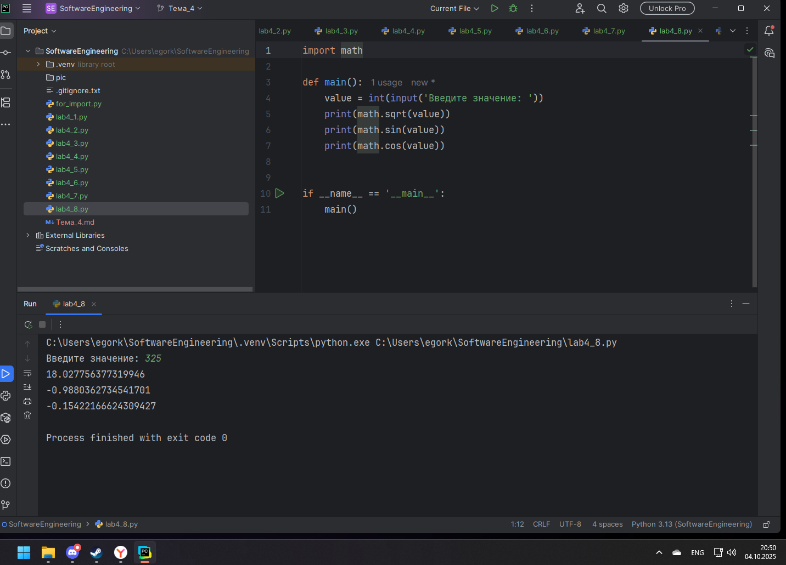

## Выводы

С помощью библиотеки math программа вычисляет и выводит корень, синус и косинус введенного пользователем числа.

## Лабораторная работа №9
### Напишите программу, которая будет рассчитывать какой день недели будет через n-нное количество дней, которые укажет пользователь.

```python
from datetime import datetime as dt
from datetime import timedelta as td
def main():
    print(
        f"Сегодня {dt.today().date()}. "
        f"День недели - {dt.today().isoweekday()}"
    )
    n = int(input('Введите количество дней: '))
    today = dt.today()
    result = today + td(days=n)
    print(
        f"Через {n} дней будет {result.date()}. "
        f"День недели - {result.isoweekday()}"
    )

if __name__ == '__main__':
    main()
```
### Результат.
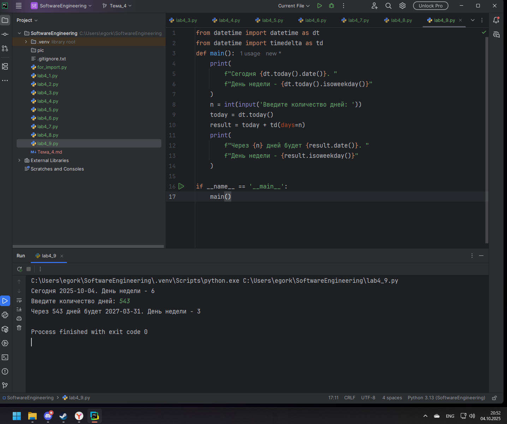

## Выводы

Используя datetime, программа вычисляет и выводит дату и день недели через n дней от текущей даты.

## Лабораторная работа №10
### Напишите программу с использованием глобальных переменных, которая будет считать площадь треугольника или прямоугольника в зависимости от того, что выберет пользователь. Получение всей необходимой информации реализовать через input(), а подсчет площадей выполнить при помощи функций. Результатом программы будет число, равное площади, необходимой фигуры.

```python
global result

def rectangle():
    a = float(input("Ширина: "))
    b = float(input("Высота: "))
    global result
    result = a * b

def triangle():
    a = float(input("Основание: "))
    h = float(input("Высота: "))
    global result
    result = 0.5 * a * h

figure = input("1 - прямоугольник, 2 - треугольник: ")
if figure == '1':
    rectangle()
if figure == '2':
    triangle()

print(f"Площадь: {result}")
```
### Результат.
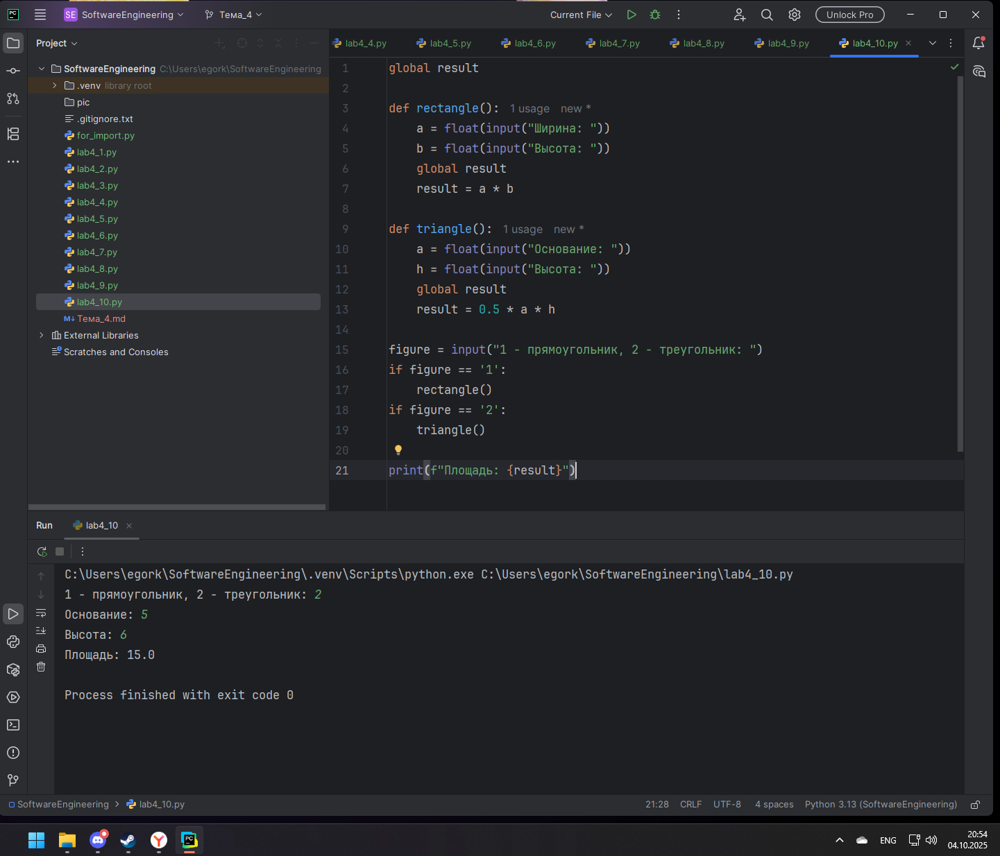

## Выводы

Глобальная переменная result передает значение между функциями rectangle()/triangle() и основной программой. Выводится площадь выбранной фигуры.

## Самостоятельная работа №1
### Дайте подробный комментарий для кода, написанного ниже. Комментарий нужен для каждой строчки кода, нужно описать что она делает. Не забудьте, что функции комментируются по-особенному.
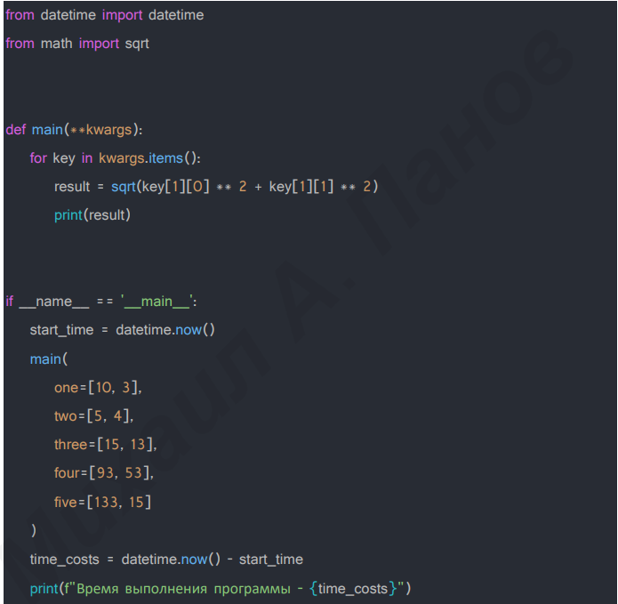

```python
# Импорт модуля datetime для работы с датой и временем
from datetime import datetime
# Импорт функции sqrt из модуля math для вычисления квадратного корня
from math import sqrt

# Определение главной функции, которая принимает произвольное количество именованных аргументов
def main(**kwargs):
    """
    Вычисляет длину вектора по теореме Пифагора
    Параметры:
        **kwargs (словарь) - элементы со значениями начала и конца вектора
    Возвращает:
        float: длина вектора
    """
    #Проходимся по элементам kwargs с ключом key
    for key in kwargs.items():
        # Вычисление длины вектора по теореме Пифагора
        result = sqrt(key[1][0] ** 2 + key[1][1] ** 2)
        # Вывод результата вычисления в консоль
        print(result)


# Проверка, запущен ли скрипт напрямую (а не импортирован как модуль)
if __name__ == '__main__':
    # Запись текущего времени в переменную start_time (время начала выполнения программы)
    start_time = datetime.now()

    # Вызов функции main с передачей пяти именованных аргументов
    # Каждый аргумент - список из двух чисел [x, y]
    main(
        # Векторы с координатами
        one=[10, 3],
        two=[5, 4],
        three=[15, 13],
        four=[93, 53],
        five=[133, 15]
    )

    # Вычисление времени выполнения программы (разница между текущим временем и временем начала)
    time_costs = datetime.now() - start_time

    # Вывод времени выполнения программы
    print(f"Время выполнения программы - {time_costs}")
```
### Результат.
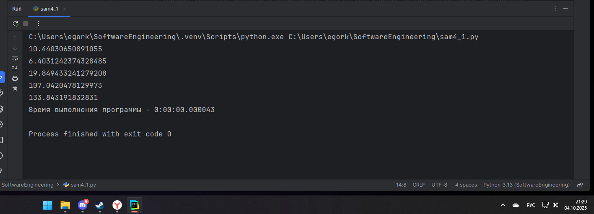

## Выводы

Программа вычисляет длину вектора по его координатам, используя теорему Пифагора. Функция main(**kwargs) принимает произвольное число именованных аргументов, где каждый аргумент — это список координат. Для каждого вектора вычисляется и выводится его длина. Дополнительно программа замеряет и выводит время своего выполнения.

## Самостоятельная работа №2
### Напишите программу, которая будет заменять игральную кость с 6 гранями. Если значение равно 5 или 6, то в консоль выводится «Вы победили», если значения 3 или 4, то вы рекурсивно должны вызвать эту же функцию, если значение 1 или 2, то в консоль выводится «Вы проиграли». При этом каждый вызов функции необходимо выводить в консоль значение “кубика”. Для выполнения задания необходимо использовать стандартную библиотеку random. Программу нужно написать, используя одну функцию и “точку входа”

```python
import random

def cubic():
    value = random.randint(1, 6)

    print(f"Выпало: {value}")

    if value == 5 or value == 6:
        print("Вы победили")
    elif value == 3 or value == 4:
        print("Бросаем еще раз...")
        cubic()
    elif value == 1 or value == 2:
        print("Вы проиграли")

if __name__ == "__main__":
    cubic()
```
### Результат.
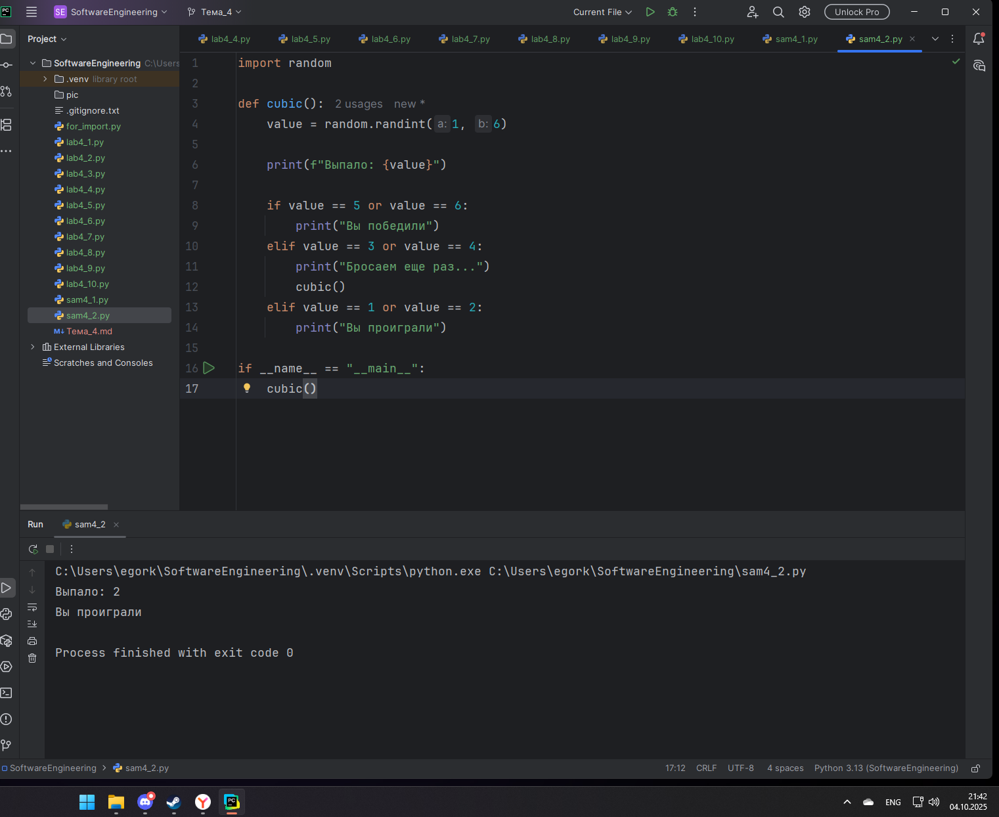

## Выводы

Программа имитирует бросок игральной кости с помощью функции random.randint(). В зависимости от выпавшего значения реализована следующая логика: при значениях 5-6 — победа, 3-4 — рекурсивный повтор броска, 1-2 — проигрыш. Рекурсивные вызовы функции наглядно демонстрируют, как программа может "продолжать игру" до достижения конечного результата.

## Самостоятельная работа №3
### Напишите программу, которая будет выводить текущее время, с точностью до секунд на протяжении 5 секунд. Программу нужно написать с использованием цикла. Подсказка: необходимо использовать модуль datetime и time, а также вам необходимо как-то “усыплять” программу на 1 секунду.

```python
import datetime as dt
import time as tm
from time import sleep

for i in range(5):
    print(dt.datetime.now().strftime("%H:%M:%S"))
    sleep(1)
```
### Результат.
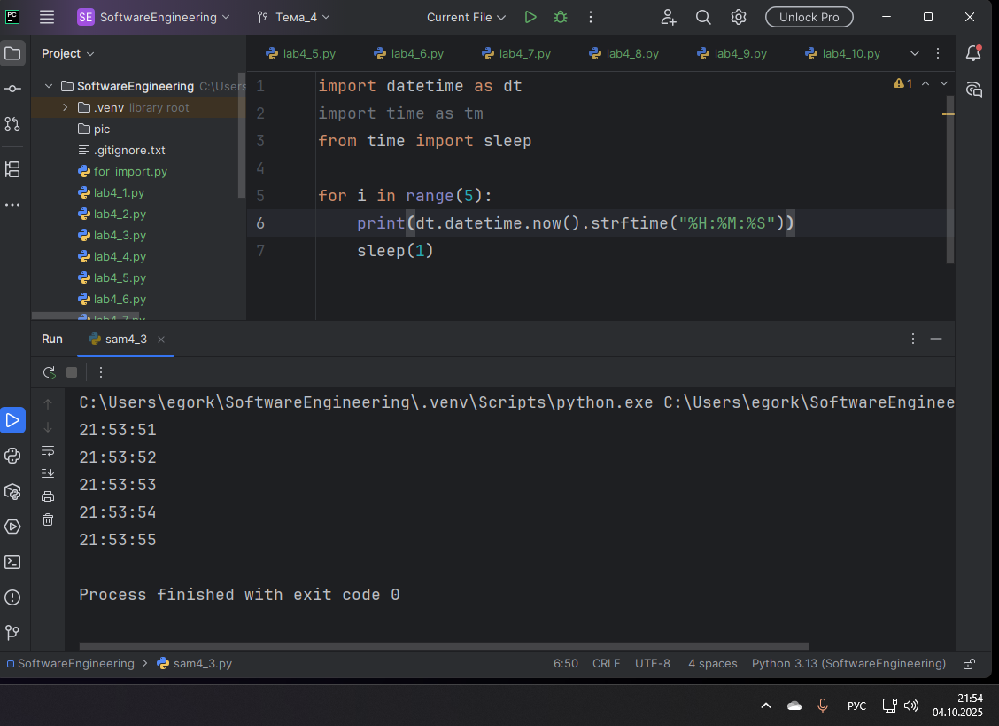

## Выводы

С помощью комбинации модулей datetime и time программа в цикле выводит текущее время с точностью до секунды с интервалом в 1 секунду. Функция sleep(1) приостанавливает выполнение программы на заданный интервал, что позволяет добиться точного временного шага.

## Самостоятельная работа №4
### Напишите программу, которая считает среднее арифметическое от аргументов вызываемое функции, с условием того, что изначальное количество этих аргументов неизвестно. Программу необходимо реализовать используя одну функцию и “точку входа”.

```python
def avg(*args):
    return sum(args) / len(args)

if __name__ == "__main__":
    result1 = avg(10, 20, 30)
    print(f"Среднее чисел 10, 20, 30: {result1}")

    result2 = avg(1, 2, 3, 4, 5)
    print(f"Среднее чисел 1, 2, 3, 4, 5: {result2}")
```
### Результат.
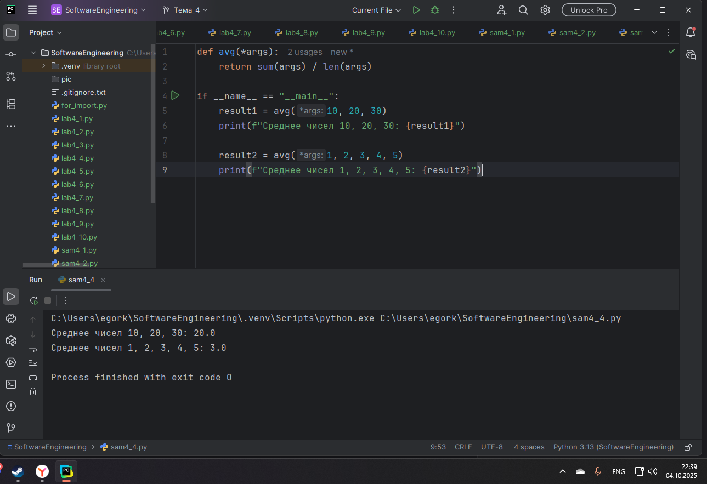

## Выводы

Была создана универсальная функция avg(*args), которая вычисляет среднее арифметическое от любого количества переданных аргументов, используя кортеж *args. Программа демонстрирует работу функции с разным количеством входных данных.

## Самостоятельная работа №5
### Создайте два Python файла, в одном будет выполняться вычисление площади треугольника при помощи формулы Герона (необходимо реализовать через функцию), а во втором будет происходить взаимодействие с пользователем (получение всей необходимой информации и вывод результатов). Напишите эту программу и выведите в консоль полученную площадь.

Первый файл

```python
import math
def geron(a, b, c):
    p = (a+b+c)/2
    s = math.sqrt(p * (p - a) * (p - b) * (p - c))
    return s
```
Второй файл

```python
from sam4_5_1 import geron

def polzovatel():
    a = float(input("Введите первую сторону: "))
    b = float(input("Введите вторую сторону: "))
    c = float(input("Введите третью  сторону: "))
    return a, b, c

def main():
    sides = polzovatel()

    area = geron(sides[0], sides[1], sides[2])

    print(f"Площадь треугольника: {area:.2f}")

if __name__ == "__main__":
    main()
```
### Результат.
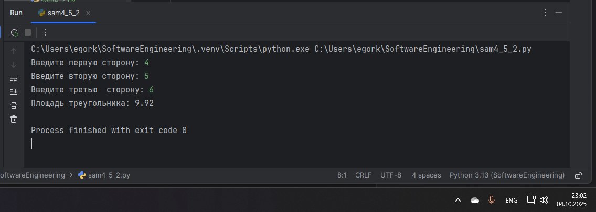

## Выводы

Программа разделена на два модуля для лучшей организации кода. В первом модуле содержится функция geron(a, b, c), реализующая формулу Герона для вычисления площади треугольника. Второй модуль отвечает за взаимодействие с пользователем: получает длины сторон, импортирует и вызывает функцию для расчета и выводит результат. Это демонстрирует принцип разделения логики и интерфейса программы.

## Общие выводы по теме

В ходе выполнения работы были успешно освоены ключевые аспекты работы с функциями в Python. На практике применены различные способы передачи аргументов - от позиционных параметров до произвольных наборов через *args и **kwargs. Особое внимание уделено организации кода с использованием точки входа, что обеспечивает корректное выполнение программы как при прямом запуске, так и при импорте в качестве модуля. Освоена работа со стандартными библиотеками math, datetime, time и random для решения практических задач. Важным результатом стало понимание принципов модульного программирования - создание пользовательских функций с последующим их импортом из отдельных файлов. Также получены навыки работы с возвратом значений, глобальными переменными и рекурсивными вызовами функций. Все это позволяет создавать более структурированный, читаемый и многократно используемый код, соответствующий современным стандартам программирования.
