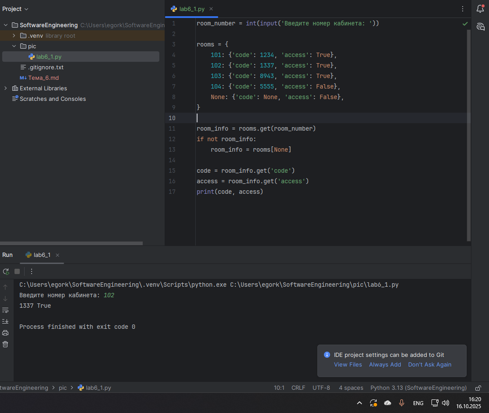
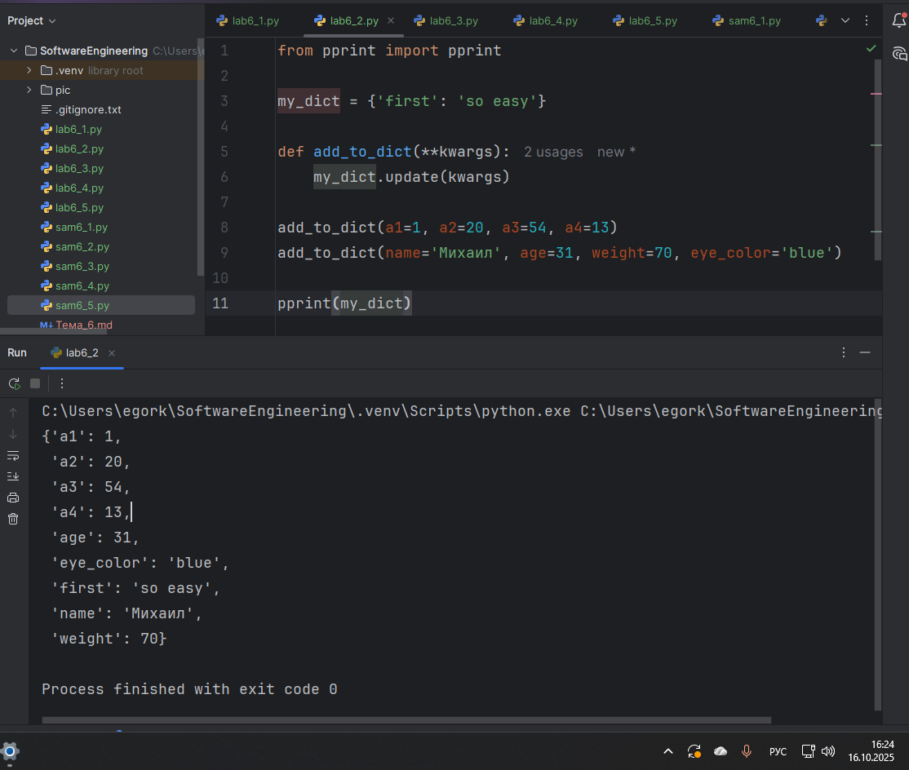
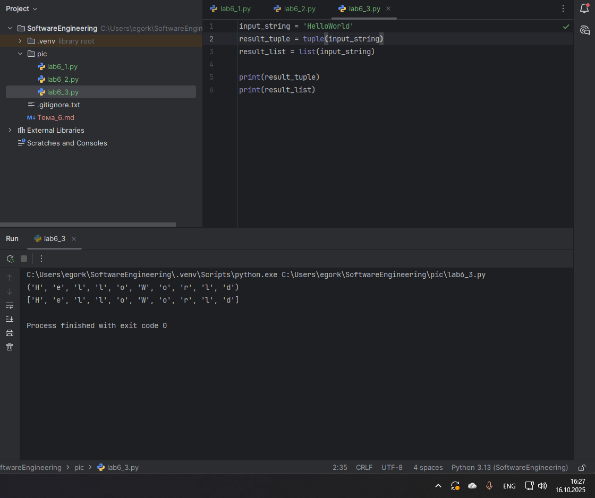
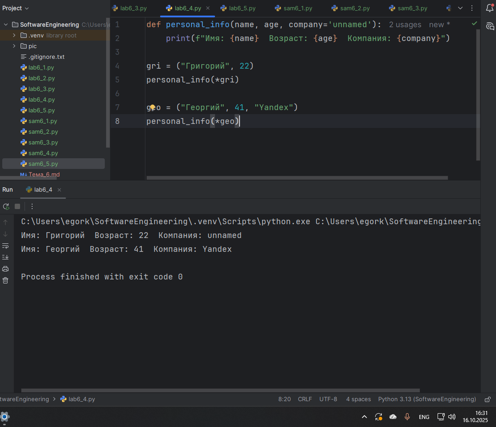
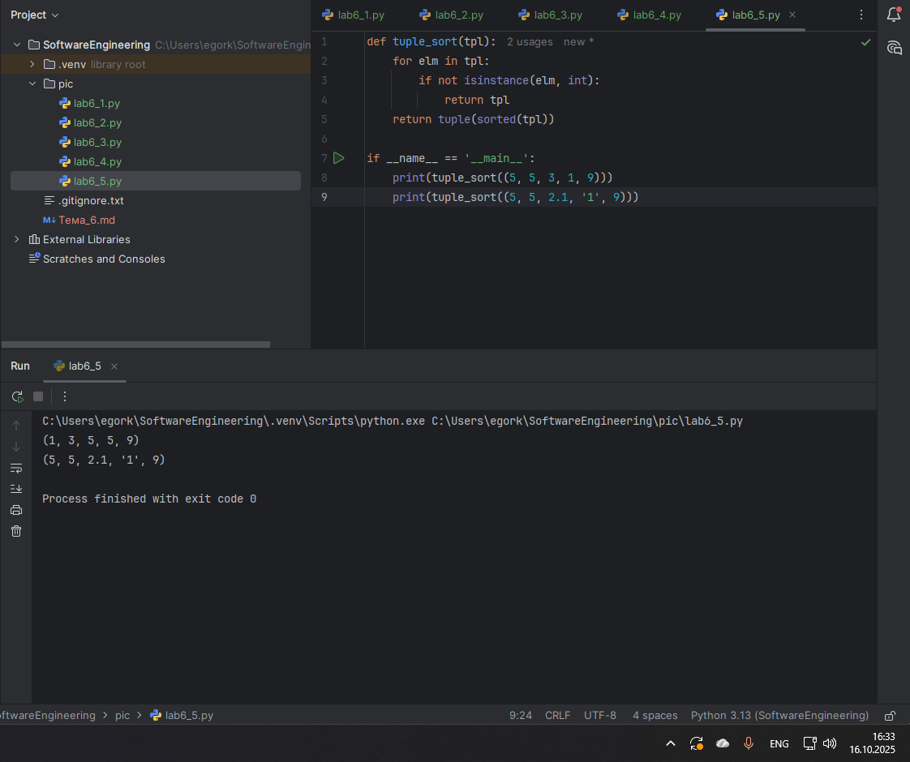
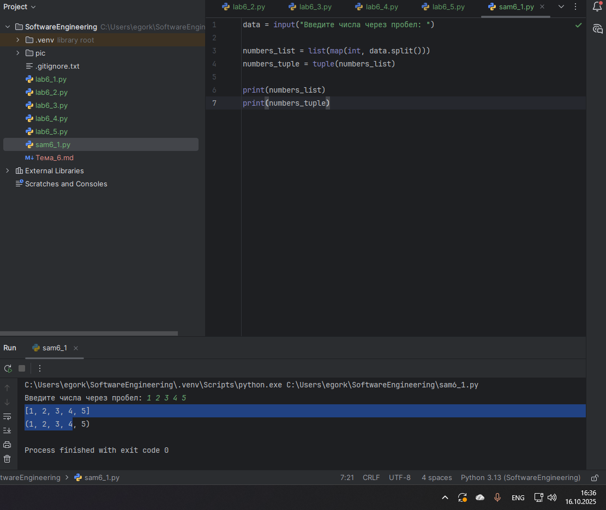
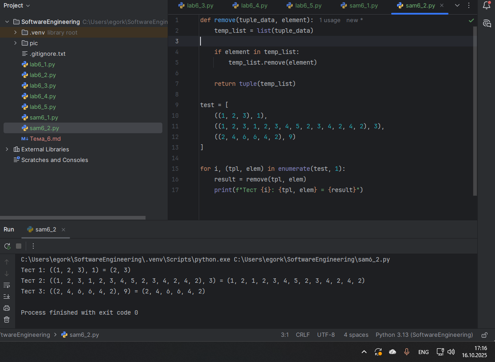
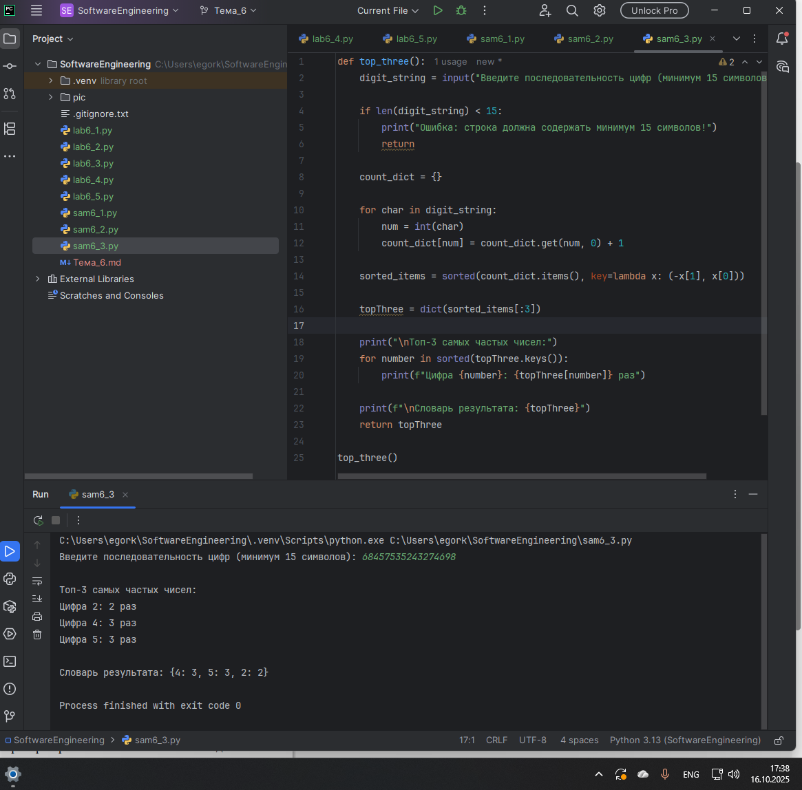
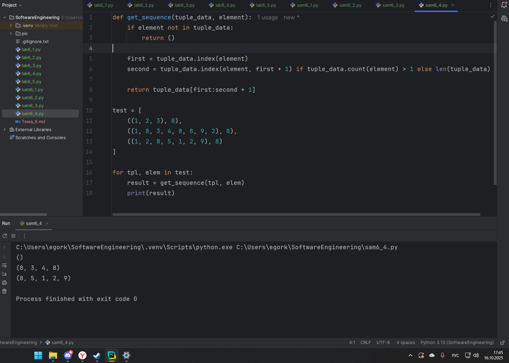
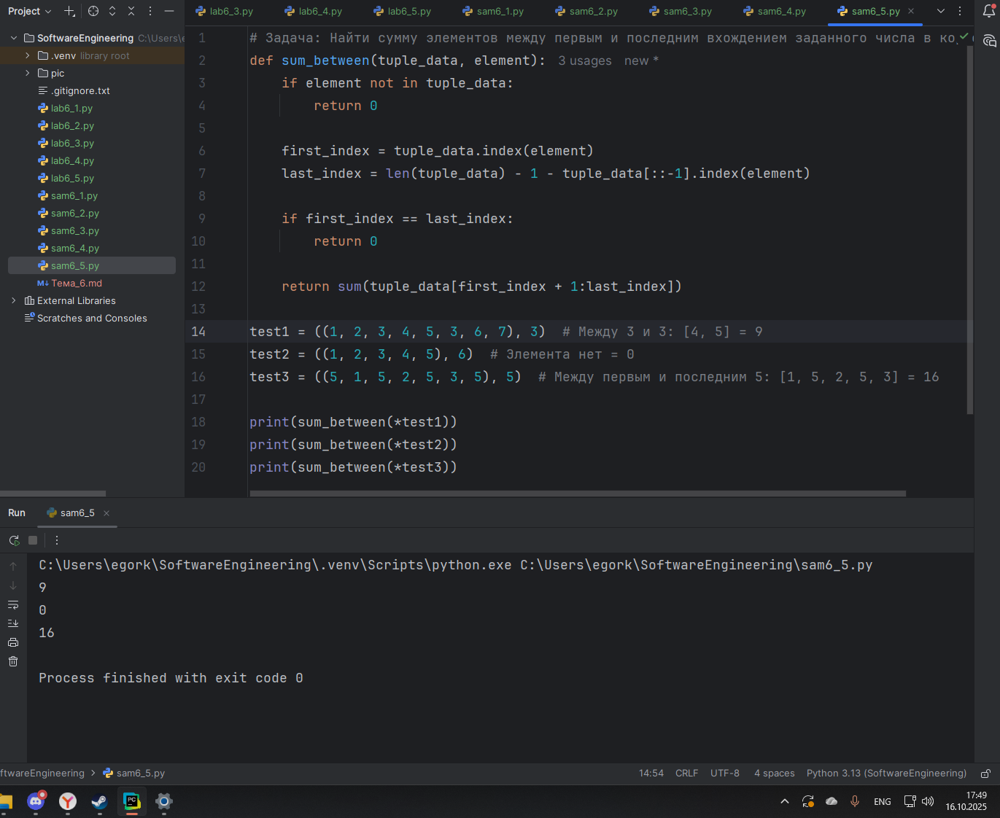

# Тема 6. Базовые коллекции: словари, кортежи
Отчет по Теме #6 выполнил(а):
- Королев Егор Александрович
- ИВТ-23-2

| Задание | Лаб_раб | Сам_раб |
| ------ | ------ | ------ |
| Задание 1 | + | + |
| Задание 2 | + | + |
| Задание 3 | + | + |
| Задание 4 | + | + |
| Задание 5 | + | + |

знак "+" - задание выполнено; знак "-" - задание не выполнено;

Работу проверили:
- к.э.н., доцент Панов М.А.

## Лабораторная работа №1
### В школе, где вы учились, узнали, что вы крутой программист и попросили написать программу для учителей, которая будет при вводе кабинета писать для него ключ доступа и статус, занят кабинет или нет. При написании программы необходимо использовать словарь (dict), который на вход получает номер кабинета, а выводит необходимую информацию. Если кабинета, который вы ввели нет в словаре, то в консоль в виде значения ключа нужно вывести “None” и виде статуса вывести “False”.

```python
room_number = int(input('Введите номер кабинета: '))

rooms = {
    101: {'code': 1234, 'access': True},
    102: {'code': 1337, 'access': True},
    103: {'code': 8943, 'access': True},
    104: {'code': 5555, 'access': False},
    None: {'code': None, 'access': False},
}

room_info = rooms.get(room_number)
if not room_info:
    room_info = rooms[None]

code = room_info.get('code')
access = room_info.get('access')
print(code, access)
```
### Результат.


## Выводы

В данном коде реализован словарь rooms, где ключами являются номера кабинетов, а значениями - вложенные словари с кодом доступа и статусом доступности. При вводе номера кабинета программа использует метод get() для безопасного извлечения данных. Если кабинет не найден, используется запасной вариант с ключом None. Это демонстрирует практическое применение словарей для организации структурированных данных с обработкой краевых случаев.

## Лабораторная работа №2
### Алексей решил создать самый большой словарь в мире. Для этого он придумал функцию dict_maker (**kwargs), которая принимает неограниченное количество параметров «ключ: значение» и обновляет созданный им словарь my_dict, состоящий всего из одного элемента «first» со значением «so easy». Помогите Алексею создать данную функцию.

```python
from pprint import pprint

my_dict = {'first': 'so easy'}

def add_to_dict(**kwargs):
    my_dict.update(kwargs)

add_to_dict(a1=1, a2=20, a3=54, a4=13)
add_to_dict(name='Михаил', age=31, weight=70, eye_color='blue')

pprint(my_dict)
```
### Результат.


## Выводы

Код демонстрирует работу с произвольным количеством именованных аргументов через **kwargs. Функция add_to_dict() использует метод update() для добавления новых пар ключ-значение в исходный словарь my_dict. Это показывает гибкость словарей Python для динамического расширения и модификации данных во время выполнения программы.

## Лабораторная работа №3
### Для решения некоторых задач бывает необходимо разложить строку на отдельные символы. Мы знаем что это можно сделать при помощи split(), у которого более гибкая настройка для разделения для этого, но если нам нужно посимвольно разделить строку без всяких условий, то для этого мы можем использовать кортежи (tuple). Для этого напишем любую строку, которую будем делить и “обвернем” ее в tuple и дальше мы можем как нам угодно с ней работать, например, сделать ее списком (тогда получится полный аналог split()) или же работать с ним дальше, как с кортежем.

```python
input_string = 'HelloWorld'
result_tuple = tuple(input_string)
result_list = list(input_string)

print(result_tuple)
print(result_list)
```
### Результат.


## Выводы

Программа наглядно показывает разницу между кортежами и списками при обработке строк. Строка 'HelloWorld' преобразуется в кортеж и список, демонстрируя, что оба типа данных могут содержать одинаковые элементы, но с разными характеристиками: кортеж неизменяем, а список может быть изменен. Это иллюстрирует принцип выбора структуры данных в зависимости от требований к изменяемости.

## Лабораторная работа №4
### Вовочка решил написать крутую функцию, которая будет писать имя, возраст и место работы, но при этом на вход этой функции будет поступать кортеж. Помогите Вовочке написать эту программу.

```python
def personal_info(name, age, company='unnamed'):
    print(f"Имя: {name}  Возраст: {age}  Компания: {company}")

gri = ("Григорий", 22)
personal_info(*gri)

geo = ("Георгий", 41, "Yandex")
personal_info(*geo)
```
### Результат.


## Выводы

Код демонстрирует технику распаковки кортежей при передаче аргументов в функцию. Использование оператора * перед кортежем gri и geo позволяет передать элементы кортежа как позиционные аргументы функции. Также показано использование значения по умолчанию для параметра company, что делает функцию более гибкой.

## Лабораторная работа №5
### Для сопровождения первых лиц государства X нужен кортеж, но никто не может определиться с порядком машин, поэтому вам нужно написать функцию, которая будет сортировать кортеж, состоящий из целых чисел по возрастанию, и возвращает его. Если хотя бы один элемент не является целым числом, то функция возвращает исходный кортеж.

```python
def tuple_sort(tpl):
    for elm in tpl:
        if not isinstance(elm, int):
            return tpl
    return tuple(sorted(tpl))

if __name__ == '__main__':
    print(tuple_sort((5, 5, 3, 1, 9)))
    print(tuple_sort((5, 5, 2.1, '1', 9)))
```
### Результат.


## Выводы

Функция tuple_sort() реализует безопасную сортировку с проверкой типов элементов. Использование isinstance(elm, int) гарантирует, что сортировка выполнится только если все элементы являются целыми числами. Это показывает важность валидации входных данных при работе с нетипизированными коллекциями.

## Самостоятельная работа №1
### При создании сайта у вас возникла потребность обрабатывать данные пользователя в странной форме, а потом переводить их в нужные вам форматы. Вы хотите принимать от пользователя последовательность чисел, разделенных пробелом, а после переформатировать эти данные в список и кортеж. Реализуйте вашу задумку. Для получения начальных данных используйте input(). Результатом программы будет выведенный список и кортеж из начальных данных.

```python
data = input("Введите числа через пробел: ")

numbers_list = list(map(int, data.split()))
numbers_tuple = tuple(numbers_list)

print(numbers_list)
print(numbers_tuple)
```
### Результат.


## Выводы

Программа эффективно преобразует пользовательский ввод из строки в структурированные данные. Метод split() разделяет строку по пробелам, а map(int, ...) преобразует каждый элемент в целое число. Демонстрируется практическое применение преобразований между строками, списками и кортежами.

## Самостоятельная работа №2
### Николай знает, что кортежи являются неизменяемыми, но он очень упрямый и всегда хочет доказать, что он прав. Студент решил создать функцию, которая будет удалять первое появление определенного элемента из кортежа по значению и возвращать кортеж без него. Попробуйте повторить шедевр не признающего авторитеты начинающего программиста. Но учтите, что Николай не всегда уверен в наличии элемента в кортеже (в этом случае кортеж вернется функцией в исходном виде).

Входные данные:

(1, 2, 3), 1)

(1, 2, 3, 1, 2, 3, 4, 5, 2, 3, 4, 2, 4, 2), 3)

(2, 4, 6, 6, 4, 2), 9)

Ожидаемый результат:

(2, 3)

(1, 2, 1, 2, 3, 4, 5, 2, 3, 4, 2, 4, 2)

(2, 4, 6, 6, 4, 2)

```python
def remove(tuple_data, element):
    temp_list = list(tuple_data)

    if element in temp_list:
        temp_list.remove(element)

    return tuple(temp_list)

test = [
    ((1, 2, 3), 1),
    ((1, 2, 3, 1, 2, 3, 4, 5, 2, 3, 4, 2, 4, 2), 3),
    ((2, 4, 6, 6, 4, 2), 9)
]

for i, (tpl, elem) in enumerate(test, 1):
    result = remove(tpl, elem)
    print(f"Тест {i}: {tpl, elem} = {result}")
```
### Результат.


## Выводы

Функция remove() обходит ограничение неизменяемости кортежей путем преобразования в список, удаления элемента и обратного преобразования. Использование element in temp_list обеспечивает проверку наличия элемента перед удалением. Это показывает стратегию работы с неизменяемыми структурами данных.

## Самостоятельная работа №3
### Ребята поспорили кто из них одним нажатием на numpad наберет больше повторяющихся цифр, но не понимают, как узнать победителя. Вам им нужно в этом помочь. Дана строка в виде случайной последовательности чисел от 0 до 9 (длина строки минимум 15 символов). Требуется создать словарь, который в качестве ключей будет принимать данные числа (т. е. ключи будут типом int), а в качестве значений – количество этих чисел в имеющейся последовательности. Для построения словаря создайте функцию, принимающую строку из цифр. Функция должна возвратить словарь из 3-х самых часто встречаемых чисел, также эти значения нужно вывести в порядке возрастания ключа.

```python
def top_three():
    digit_string = input("Введите последовательность цифр (минимум 15 символов): ")

    if len(digit_string) < 15:
        print("Ошибка: строка должна содержать минимум 15 символов!")
        return

    count_dict = {}

    for char in digit_string:
        num = int(char)
        count_dict[num] = count_dict.get(num, 0) + 1

    sorted_items = sorted(count_dict.items(), key=lambda x: (-x[1], x[0]))

    topThree = dict(sorted_items[:3])

    print("\nТоп-3 самых частых чисел:")
    for number in sorted(topThree.keys()):
        print(f"Цифра {number}: {topThree[number]} раз")

    print(f"\nСловарь результата: {topThree}")
    return topThree

top_three()
```
### Результат.


## Выводы

Программа строит частотный словарь цифр, используя метод get() для инициализации счетчиков. Сложная сортировка sorted(count_dict.items(), key=lambda x: (-x[1], x[0])) сначала по убыванию частоты, затем по возрастанию цифры, демонстрирует мощь встроенных функций Python для работы со словарями.

## Самостоятельная работа №4
### Ваш хороший друг владеет офисом со входом по электронным картам, ему нужно чтобы вы написали программу, которая показывала в каком порядке сотрудники входили и выходили из офиса. Определение сотрудника происходит по id. Напишите функцию, которая на вход принимает кортеж и случайный элемент (id), его можно придумать самостоятельно. Требуется вернуть новый кортеж, начинающийся с первого появления элемента в нем и заканчивающийся вторым его появлением включительно. Если элемента нет вовсе – вернуть пустой кортеж. Если элемент встречается только один раз, то вернуть кортеж, который начинается с него и идет до конца исходного.

Входные данные:

(1, 2, 3), 8)

(1, 8, 3, 4, 8, 8, 9, 2), 8)

(1, 2, 8, 5, 1, 2, 9), 8)

Ожидаемый результат:

()

(8, 3, 4, 8)

(8, 5, 1, 2, 9)

```python
def get_sequence(tuple_data, element):
    if element not in tuple_data:
        return ()

    first = tuple_data.index(element)
    second = tuple_data.index(element, first + 1) if tuple_data.count(element) > 1 else len(tuple_data)

    return tuple_data[first:second + 1]

test = [
    ((1, 2, 3), 8),
    ((1, 8, 3, 4, 8, 8, 9, 2), 8),
    ((1, 2, 8, 5, 1, 2, 9), 8)
]

for tpl, elem in test:
    result = get_sequence(tpl, elem)
    print(result)
```
### Результат.


## Выводы

Функция get_sequence() использует методы index() и count() для поиска первого и второго вхождения элемента. Обработка случаев с одним вхождением через len(tuple_data) и отсутствием через return () показывает тщательную проработку граничных условий при работе с кортежами.

## Самостоятельная работа №5
### Самостоятельно придумайте и решите задачу, в которой будут обязательно использоваться кортеж или список. Проведите минимум три теста для проверки работоспособности вашей задачи. Задача: необходимо создать функцию, которая на вход принимает кортеж из чисел, а на выходе возвращает этот же кортеж без трех различных наименьших чисел. То есть, если какое-то число встречается больше 1 раза, то все его дубликаты будут считаться за одно наименьшее число, их необходимо будет удалить и найти еще 2 других наименьших числа. Например, если подается кортеж (1, 2, 2, 2, 4, 5, 3, 3), то на выходе получится кортеж (4, 5) со всеми удаленными наименьшими элементами 1, 2, 3, хотя некоторые из них и встречаются несколько раз. Если количество уникальных элементов в кортеже меньше 4, то необходимо вернуть пустой кортеж.

```python
# Задача: Найти сумму элементов между первым и последним вхождением заданного числа в кортеже
def sum_between(tuple_data, element):
    if element not in tuple_data:
        return 0

    first_index = tuple_data.index(element)
    last_index = len(tuple_data) - 1 - tuple_data[::-1].index(element)

    if first_index == last_index:
        return 0

    return sum(tuple_data[first_index + 1:last_index])

test1 = ((1, 2, 3, 4, 5, 3, 6, 7), 3)  # Между 3 и 3: [4, 5] = 9
test2 = ((1, 2, 3, 4, 5), 6)  # Элемента нет = 0
test3 = ((5, 1, 5, 2, 5, 3, 5), 5)  # Между первым и последним 5: [1, 5, 2, 5, 3] = 16

print(sum_between(*test1))
print(sum_between(*test2))
print(sum_between(*test3))
```
### Результат.


## Выводы

Функция sum_between() демонстрирует продвинутую работу с индексами в кортежах. Использование tuple_data[::-1].index(element) для поиска с конца и срезы [first_index + 1:last_index] для извлечения подпоследовательности показывают эффективные техники обработки последовательностей.

## Общие выводы по теме
- Кортежи и словари являются фундаментальными структурами данных в Python, каждая со своей областью применения. Кортежи обеспечивают неизменяемость и целостность данных, что полезно для представления фиксированных наборов значений. Словари предоставляют гибкость для работы с ассоциативными массивами и динамическими структурами. Практические задания показали, что правильный выбор структуры данных значительно упрощает решение задач - словари идеальны для конфигураций и поиска по ключу, а кортежи - для гарантированно неизменяемых данных и распаковки аргументов.