# Тема 7. Работа с файлами (ввод, вывод)
Отчет по Теме #7 выполнил(а):
- Королев Егор Александрович
- ИВТ-23-2

| Задание | Лаб_раб | Сам_раб |
| ------ | ------ | ------ |
| Задание 1 | + | + |
| Задание 2 | + | + |
| Задание 3 | + | + |
| Задание 4 | + | + |
| Задание 5 | + | + |
| Задание 6 | + |  |
| Задание 7 | + |  |
| Задание 8 | + |  |
| Задание 9 | + |  |
| Задание 10 | + |  |

знак "+" - задание выполнено; знак "-" - задание не выполнено;

Работу проверили:
- к.э.н., доцент Панов М.А.

## Лабораторная работа №1
### Составьте текстовый файл и положите его в одну директорию с программой на Python. Текстовый файл должен состоять минимум из двух строк.

### Результат.
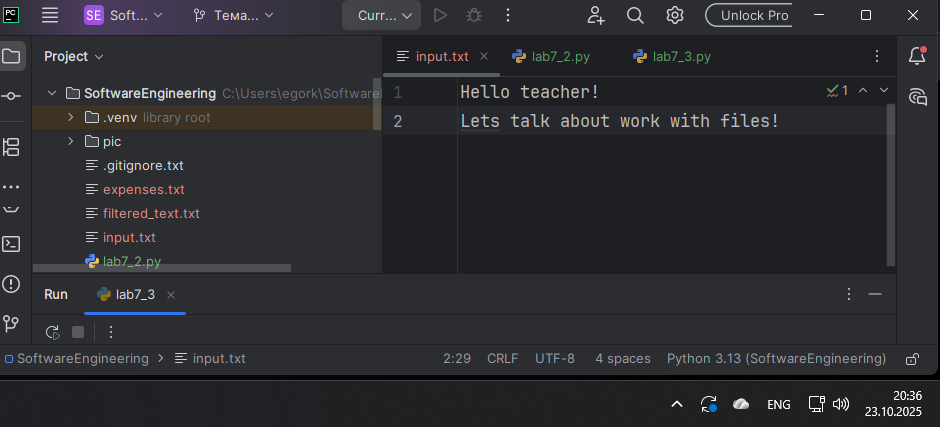

## Выводы

В ходе выполнения данной лабораторной работы был создан базовый текстовый файл.

## Лабораторная работа №2
### Напишите программу, которая выведет только первую строку из вашего файла, при этом используйте конструкцию open()/close().

```python
f = open('input.txt', 'r')
print(f.readline())
f.close()
```
### Результат.
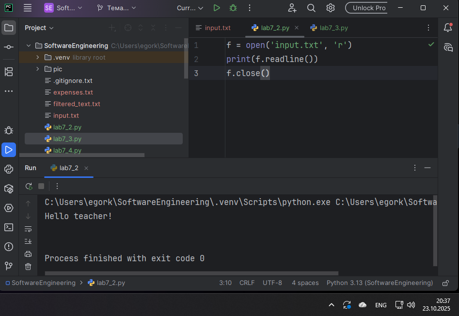

## Выводы

Данный код демонстрирует классический подход к работе с файлами через явное открытие и закрытие файлового объекта.

## Лабораторная работа №3
### Напишите программу, которая выведет все строки из вашего файла в массиве, при этом используйте конструкцию open()/close().

```python
f = open('input.txt', 'r')
print(f.readlines())
f.close()
```
### Результат.
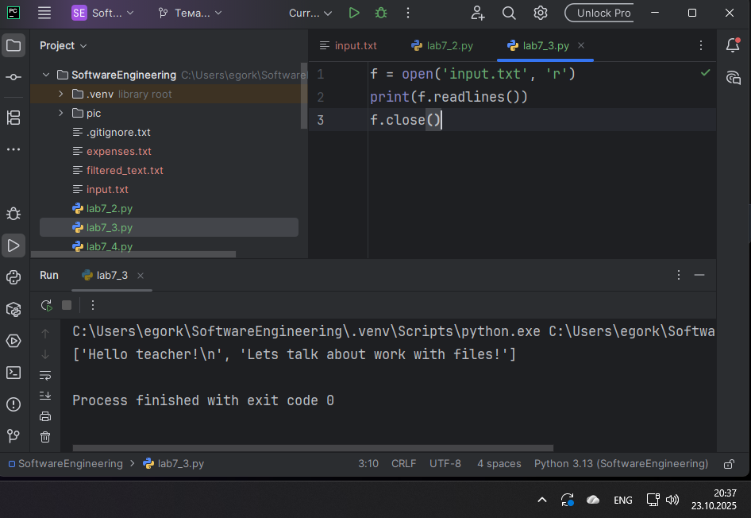

## Выводы

Использование метода readlines() позволяет получить все строки файла в виде списка, где каждая строка представляет отдельный элемент.

## Лабораторная работа №4
### Напишите программу, которая выведет все строки из вашего файла в массиве, при этом используйте конструкцию with open().

```python
with open('input.txt') as f:
    print(f.readlines())
```
### Результат.
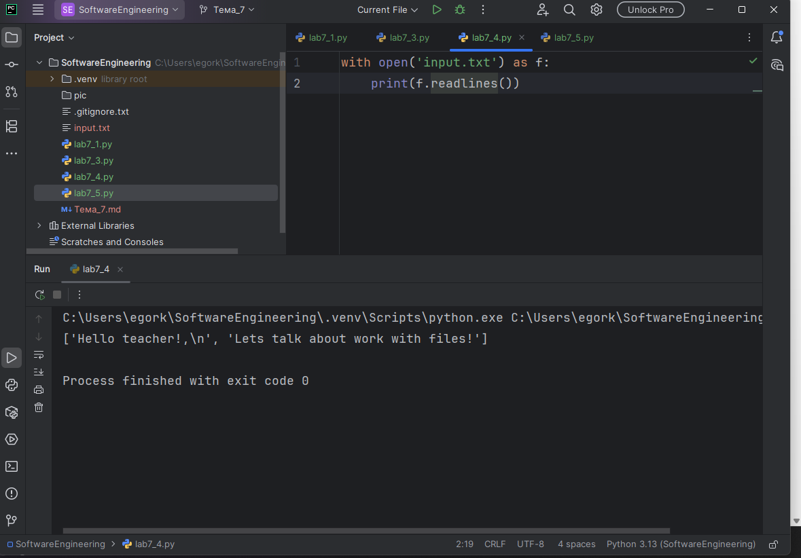

## Выводы

Конструкция with open() представляет более безопасный и рекомендуемый способ работы с файлами, поскольку автоматически управляет закрытием файлового объекта даже при возникновении исключений.

## Лабораторная работа №5
### Напишите программу, которая выведет каждую строку из вашего файла отдельно, при этом используйте конструкцию with open().

```python
with open('input.txt') as f:
    for line in f:
        print(line)
```
### Результат.
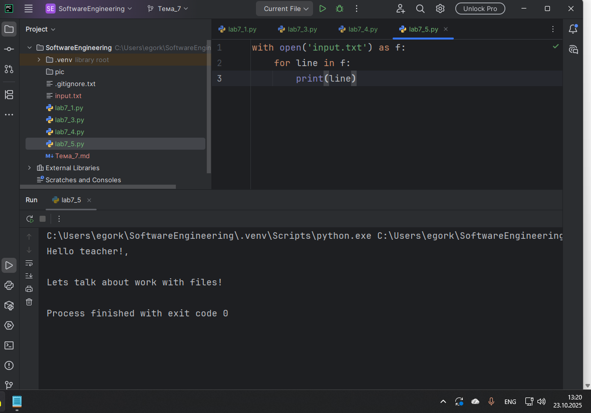

## Выводы

Итерация по файловому объекту напрямую является эффективным способом обработки файлов, особенно больших, поскольку не требует загрузки всего содержимого в память. Каждая строка обрабатывается последовательно, что оптимизирует использование ресурсов.

## Лабораторная работа №6
### Напишите программу, которая будет добавлять новую строку в ваш файл, а потом выведет полученный файл в консоль. Вывод можно осуществлять любым способом. Обязательно проверьте сам файл, чтобы изменения в нем тоже отображались.

```python
with open('input.txt', 'a+') as f:
    f.write('\nIm additional line')

with open('input.txt', 'r') as f:
    result = f.readlines()
    print(result)
```
### Результат.
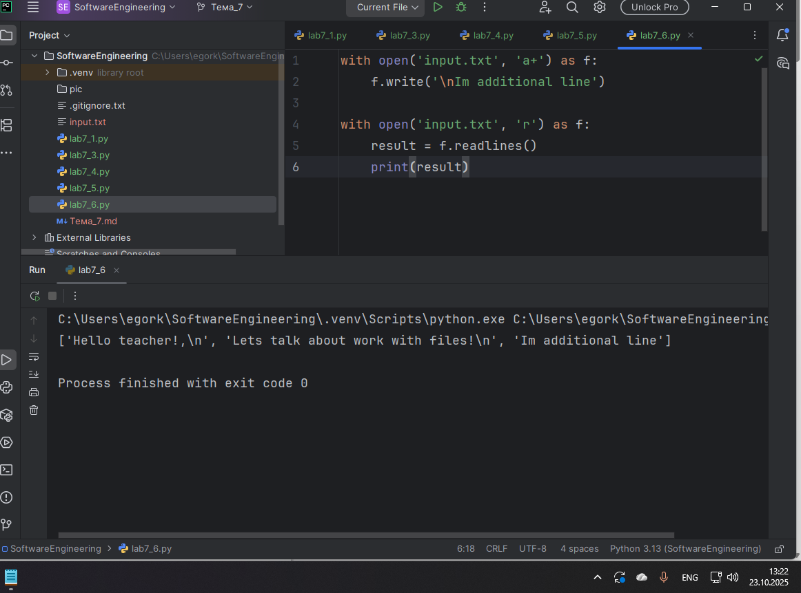

## Выводы

Режим 'a+' позволяет одновременно дописывать данные в конец файла и читать его содержимое. Данный пример демонстрирует важность правильного выбора режима открытия файла в зависимости от требуемых операций

## Лабораторная работа №7
### Напишите программу, которая перепишет всю информацию, которая была у вас в файле до этого, например напишет любые данные из произвольно вами составленного списка. Также не забудьте проверить что измененная вами информация сохранилась в файле.

```python
lines = ['one', 'two', 'three']
with open('output.txt', 'w') as f:
    for line in lines:
        f.write('\nCycle run ' + line)
    print('Done!')
```
### Результат.
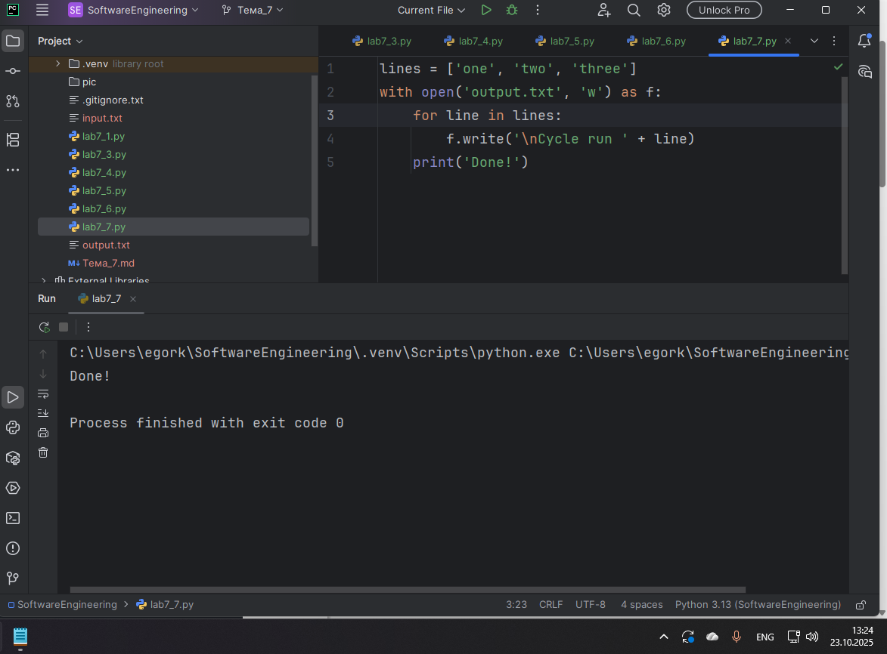

## Выводы

Режим 'w' обеспечивает полную перезапись файла, удаляя предыдущее содержимое. Это демонстрирует различие между добавлением данных ('a') и полной заменой содержимого ('w'), что является критически важным при выборе стратегии работы с файлами.

## Лабораторная работа №8
### Выберите любую папку на своем компьютере, имеющую вложенные директории. Выведите на печать в терминал ее содержимое, как и всех подкаталогов при помощи функции print_docs(directory).

```python
import os

def print_docs(directory):
    all_files = os.walk(directory)
    for catalog in all_files:
        print(f'Папка {catalog[0]} содержит:')
    print(f'Директории:  {", ".join([folder for folder in catalog[1]])}')
    print(f'Файлы:  {", ".join([folder for folder in catalog[2]])}')
    print('-' * 40)

print_docs('E:/3D')
```
### Результат.
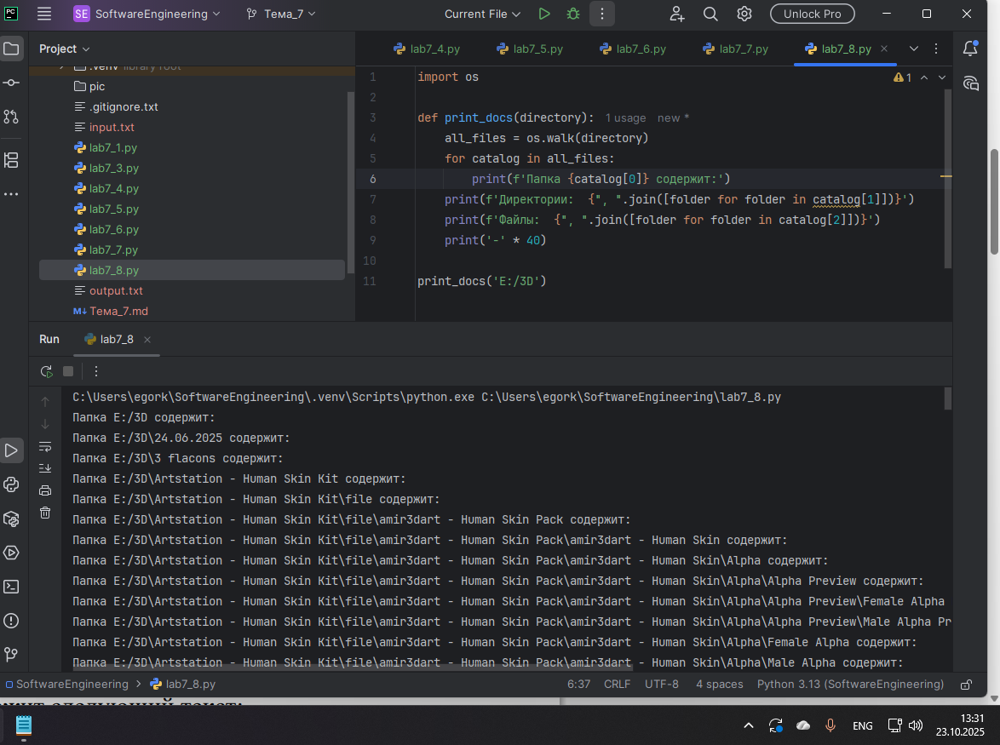

## Выводы

Функция os.walk() предоставляет мощный инструмент для рекурсивного обхода директорий, возвращая генератор с информацией о каждой найденной папке, ее поддиректориях и файлах. Это основа для создания утилит анализа файловой системы.

## Лабораторная работа №9
### Документ «input.txt» содержит следующий текст:

Приветствие

Спасибо

Извините

Пожалуйста

До свидания

Ты готов?

Как дела?

С днем рождения!

Удача!

Я тебя люблю.

Требуется реализовать функцию, которая выводит слово, имеющее максимальную длину (или список слов, если таковых несколько).

```python
def longest_words(file):
    with open(file, encoding='utf-8') as f:
        words = f.read().split()
        max_length = len(max(words, key=len))
        for word in words:
            if len(word) == max_length:
                sought_words = word
        if len(sought_words) == 1:
            return sought_words[0]
        return sought_words

print(longest_words('input.txt'))
```
### Результат.
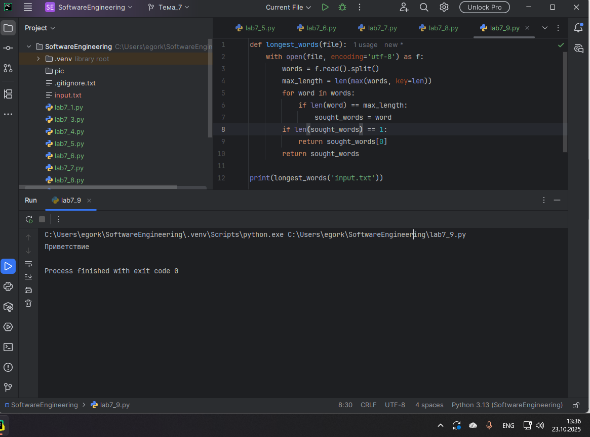

## Выводы

Алгоритм поиска самых длинных слов демонстрирует эффективную работу с текстовыми данными: чтение всего содержимого, разбиение на слова и поиск максимального значения с использованием ключевой функции. Важность указания кодировки 'utf-8' особенно заметна при работе с не-ASCII символами.

## Лабораторная работа №10
### Требуется создать csv-файл «rows_300.csv» со следующими столбцами:

•	№ - номер по порядку (от 1 до 300);
 
•	Секунда – текущая секунда на вашем ПК;

•	Микросекунда – текущая миллисекунда на часах.

Для наглядности на каждой итерации цикла искусственно приостанавливайте скрипт на 0,01 секунды.

```python
import csv
import datetime
import time

with open('rows_300.csv', 'w', encoding='utf-8', newline='') as f:
    writer = csv.writer(f)
    writer.writerow(['№', 'Секунда ', 'Микросекунда'])
    for line in range(0, 301):
        writer.writerow([line, datetime.datetime.now().second,
                         datetime.datetime.now().microsecond])
        time.sleep(0.01)
```
### Результат.
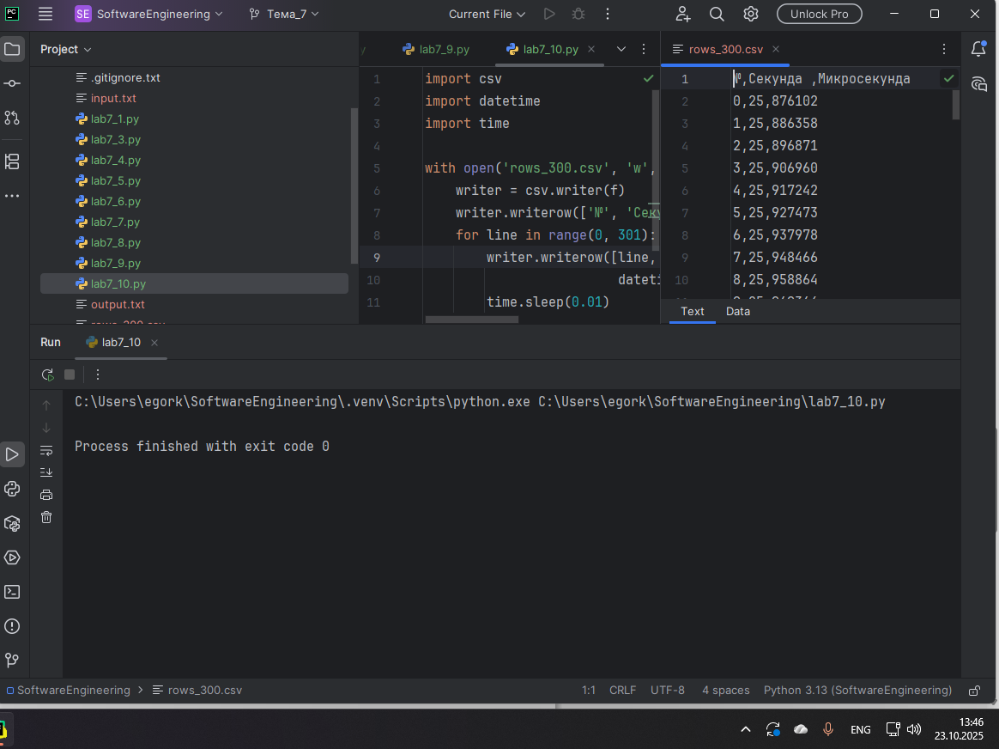

## Выводы

Модуль csv предоставляет удобные средства для работы с табличными данными. Параметр newline='' предотвращает появление лишних пустых строк. Искусственная задержка time.sleep() демонстрирует работу с временными интервалами и сбор временных меток в реальном времени.

## Самостоятельная работа №1
### Найдите в интернете любую статью (объем статьи не менее 200 слов), скопируйте ее содержимое в файл и напишите программу, которая считает количество слов в текстовом файле и определит самое часто встречающееся слово. Результатом выполнения задачи будет: скриншот файла со статьей, листинг кода, и вывод в консоль, в котором будет указана вся необходимая информация.

```python
from collections import Counter

def analyze_article():
    with open('sam7_1.txt', 'r', encoding='utf-8') as file:
        text = file.read()

    words = text.split()
    total_words = len(words)

    word_counts = Counter(words)
    most_common_word = word_counts.most_common(1)[0]

    print("Количество слов в статье:", total_words)
    print("Самое частое слово:", most_common_word[0])
    print("Оно встречается", most_common_word[1], "раз")


analyze_article()
```
### Результат.
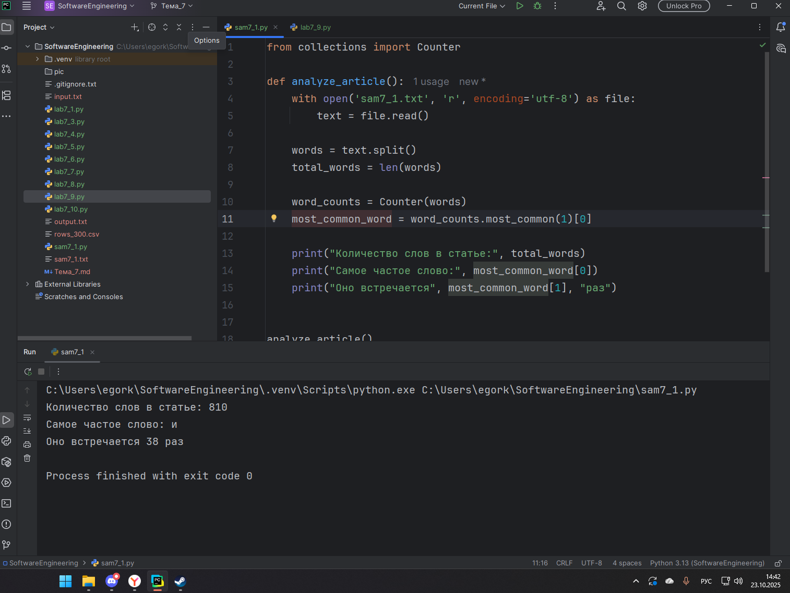

### Статья.
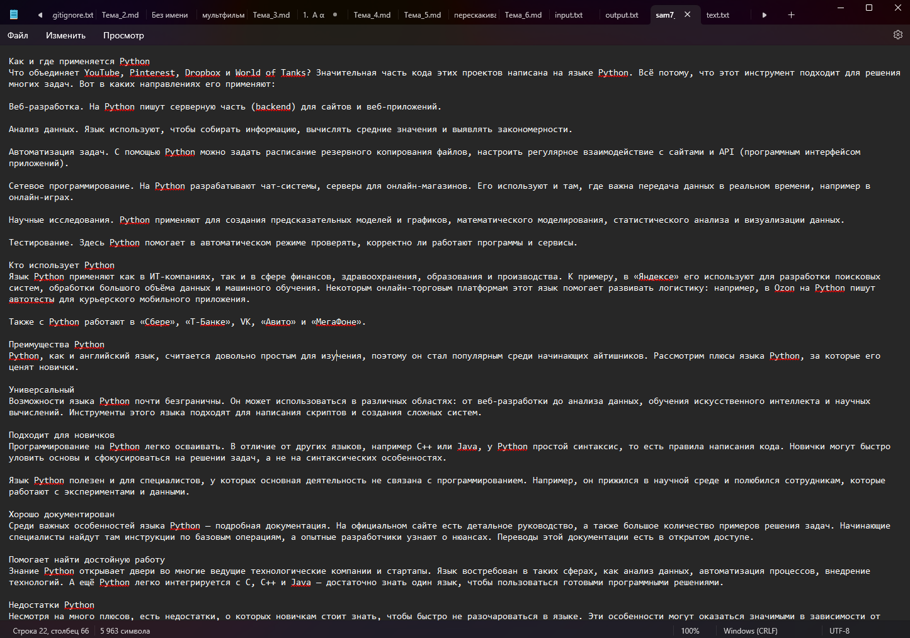

## Выводы

Использование Counter из модуля collections значительно упрощает подсчет частоты элементов. Данный подход демонстрирует эффективность специализированных структур данных Python для решения типовых задач анализа текста, экономя время и уменьшая вероятность ошибок.

## Самостоятельная работа №2
### У вас появилась потребность в ведении книги расходов, посмотрев все существующие варианты вы пришли к выводу что вас ничего не устраивает и нужно все делать самому. Напишите программу для учета расходов. Программа должна позволять вводить информацию о расходах, сохранять ее в файл и выводить существующие данные в консоль. Ввод информации происходит через консоль. Результатом выполнения задачи будет: скриншот файла с учетом расходов, листинг кода, и вывод в консоль, с демонстрацией работоспособности программы.

```python
def expense_tracker():
    expenses = []

    while True:
        print("1 - Добавить расход")
        print("2 - Посмотреть расходы")
        print("3 - Выход")

        choice = input("Выберите действие: ")

        if choice == '1':
            category = input("Категория: ")
            amount = input("Сумма: ")
            description = input("Описание: ")

            expense = f"{category} | {amount} руб. | {description}"
            expenses.append(expense)

            with open('expenses.txt', 'a', encoding='utf-8') as file:
                file.write(expense + '\n')

            print("Расход добавлен!")

        elif choice == '2':
            print("Все расходы:")
            for expense in expenses:
                print(expense)

        elif choice == '3':
            break

expense_tracker()
```
### Результат.
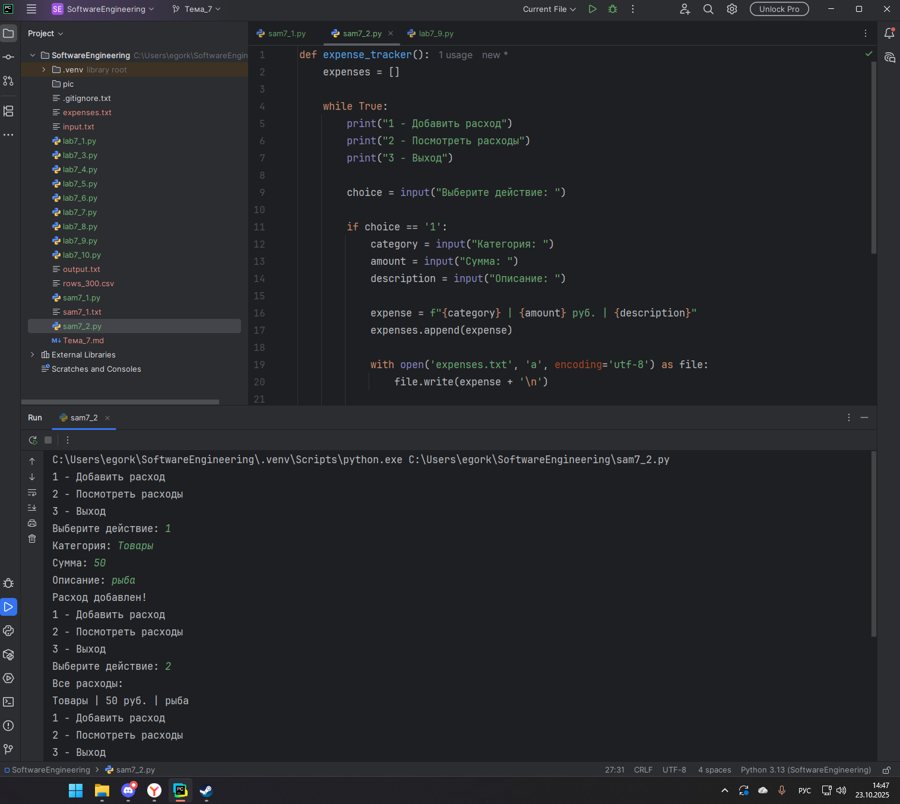

### Расходы.
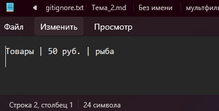
## Выводы

Программа демонстрирует принципы создания интерактивных консольных приложений с постоянным хранением данных. Использование режима 'a' гарантирует, что новые записи добавляются в конец файла без потери предыдущих данных, что критически важно для приложений учета.

## Самостоятельная работа №3
### Имеется файл input.txt с текстом на латинице. Напишите программу, которая выводит следующую статистику по тексту: количество букв латинского алфавита; число слов; число строк.

•	Текст в файле:

Beautiful is better than ugly.

Explicit is better than implicit.

Simple is better than complex.

Complex is better than complicated.

•	Ожидаемый результат: Input file contains:

108 letters

20 words

4 lines

```python
def analyze_text():
    with open('input.txt', 'r', encoding='utf-8') as file:
        text = file.read()

    lines = text.split('\n')
    words = text.split()

    letters = 0
    for char in text:
        if char.isalpha():
            letters += 1

    print("Input file contains:")
    print(letters, "letters")
    print(len(words), "words")
    print(len(lines), "lines")

analyze_text()
```
### Результат.
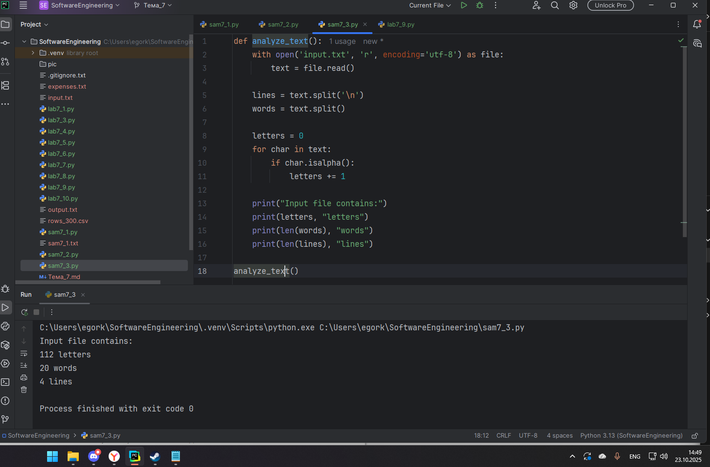

## Выводы

Метод isalpha() обеспечивает корректный подсчет только буквенных символов, игнорируя пунктуацию и цифры. Различные способы разбиения текста (split() для слов и split('\n') для строк) демонстрируют гибкость обработки текстовых данных в зависимости от требуемой гранулярности.

## Самостоятельная работа №4
### Напишите программу, которая получает на вход предложение, выводит его в терминал, заменяя все запрещенные слова звездочками * (количество звездочек равно количеству букв в слове). Запрещенные слова, разделенные символом пробела, хранятся в текстовом файле input.txt. Все слова в этом файле записаны в нижнем регистре. Программа должна заменить запрещенные слова, где бы они ни встречались, даже в середине другого слова. Замена производится независимо от регистра: если файл input.txt содержит запрещенное слово exam, то слова exam, Exam, ExaM, EXAM и exAm должны быть заменены на ****.

•	Запрещенные слова:

hello email python the exam wor is

•	Предложение для проверки:

Hello, world! Python IS the programming language of thE future. My EMAIL is....

PYTHON is awesome!!!!

•	Ожидаемый результат:

*****, ***ld! ****** ** *** programming language of *** future. My ***** **....

****** ** awesome!!!!

```python
def replace_bad_words():
    with open('input.txt', 'r', encoding='utf-8') as file:
        bad_words = file.read().split()

    text = input("Введите предложение: ")

    for word in bad_words:
        start = 0
        while True:
            pos = text.lower().find(word, start)
            if pos == -1:
                break

            stars = '*' * len(word)
            text = text[:pos] + stars + text[pos + len(word):]
            start = pos + len(stars)

    print("Результат:")
    print(text)

replace_bad_words()
```
### Результат.
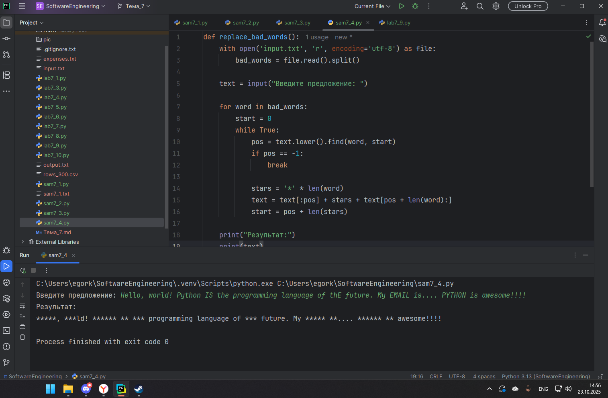

## Выводы

Алгоритм демонстрирует сложность поиска и замены подстрок с учетом различных регистров. Использование text.lower().find() обеспечивает регистронезависимый поиск, while сохраняет позицию для продолжения поиска после каждой замены. Такой подход эффективен для цензурирования текста.

## Самостоятельная работа №5
### Самостоятельно придумайте и решите задачу, которая будет взаимодействовать с текстовым файлом. Задача: написать программу, которая убирает слова меньше 3-х символов и больше 8 символов в тексте.

```python
def filter_words():
    with open('text.txt', 'r', encoding='utf-8') as file:
        text = file.read()

    print("Исходный текст:")
    print(text)

    words = text.split()
    filtered_words = []

    for word in words:
        clean_word = ''.join(char for char in word if char.isalpha())

        if len(clean_word) >= 3 and len(clean_word) <= 8:
            filtered_words.append(word)

    result = ' '.join(filtered_words)

    print("\nТекст после фильтрации:")
    print(result)

    with open('filtered_text.txt', 'w', encoding='utf-8') as file:
        file.write(result)

filter_words()
```
### Результат.
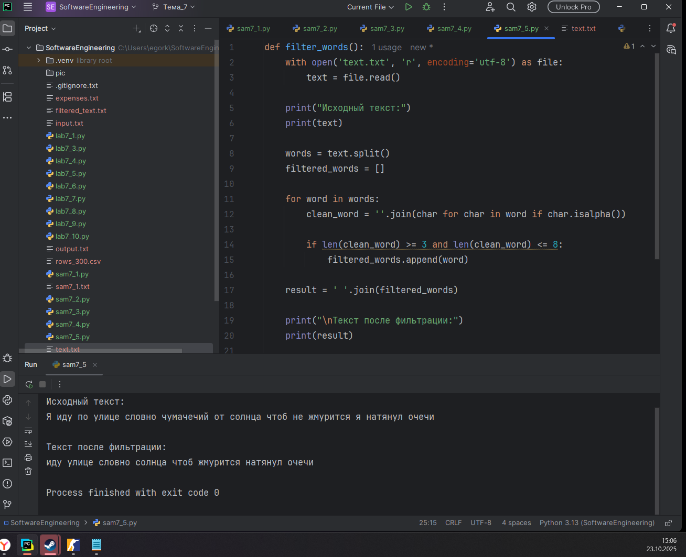

## Выводы

Программа демонстрирует технику фильтрации текста по длине слов с предварительной очисткой от не-буквенных символов. Генератор списка с условием isalpha() эффективно обрабатывает слова со знаками пунктуации. Такой подход полезен для лингвистического анализа и подготовки текстовых данных.

## Общие выводы по теме
- Работа с файлами является фундаментальным навыком в программировании, охватывающим создание, чтение, запись и модификацию файлов различных форматов
- Конструкция with open() обеспечивает безопасное управление файловыми ресурсами, автоматизируя их закрытие
- Различные режимы открытия файлов ('r', 'w', 'a', 'a+') предоставляют гибкость в зависимости от требуемых операций
- Модули os и csv расширяют возможности работы с файловой системой и структурированными данными
- Правильное указание кодировки (особенно utf-8) критически важно для корректной работы с текстами на разных языках

