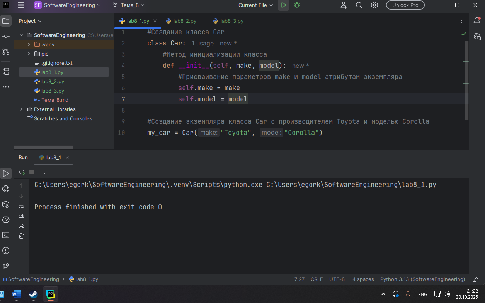
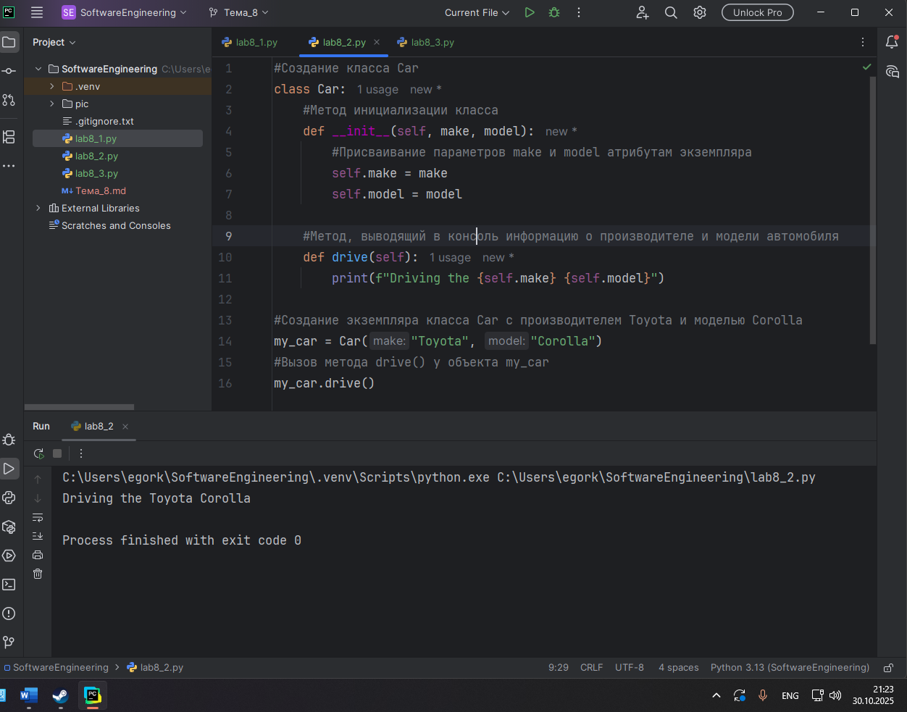
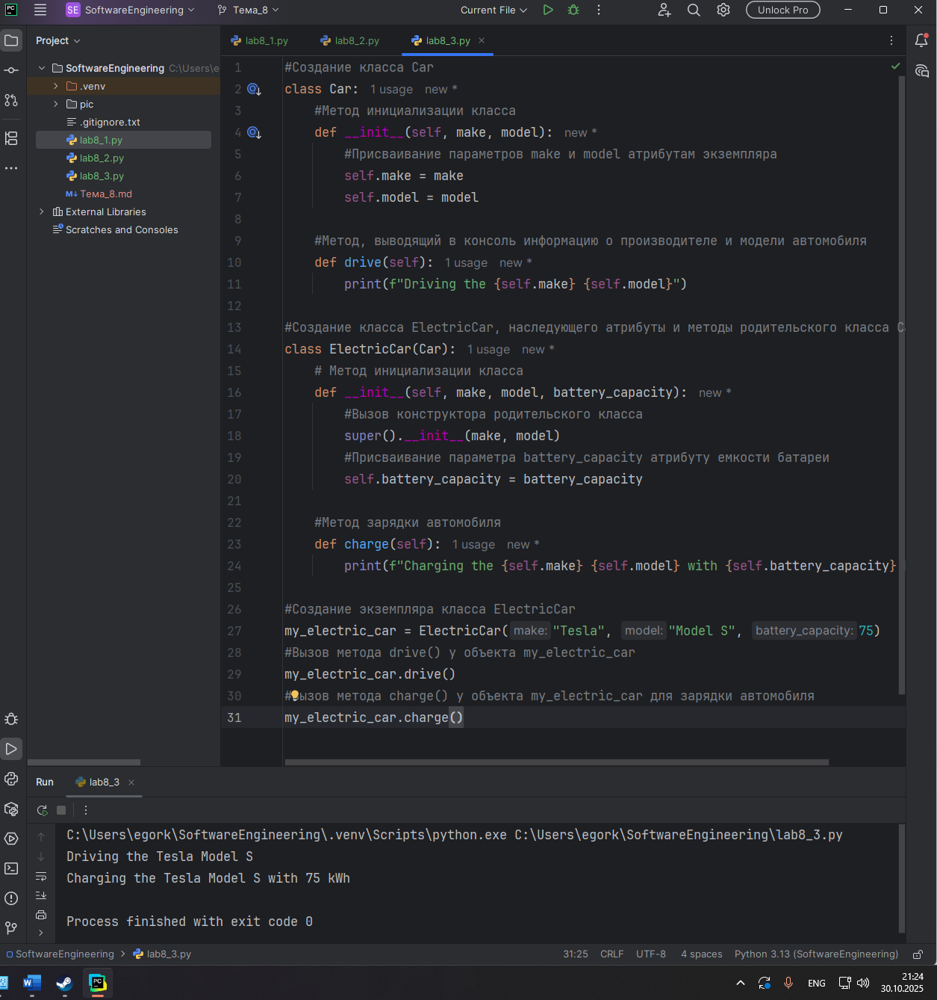
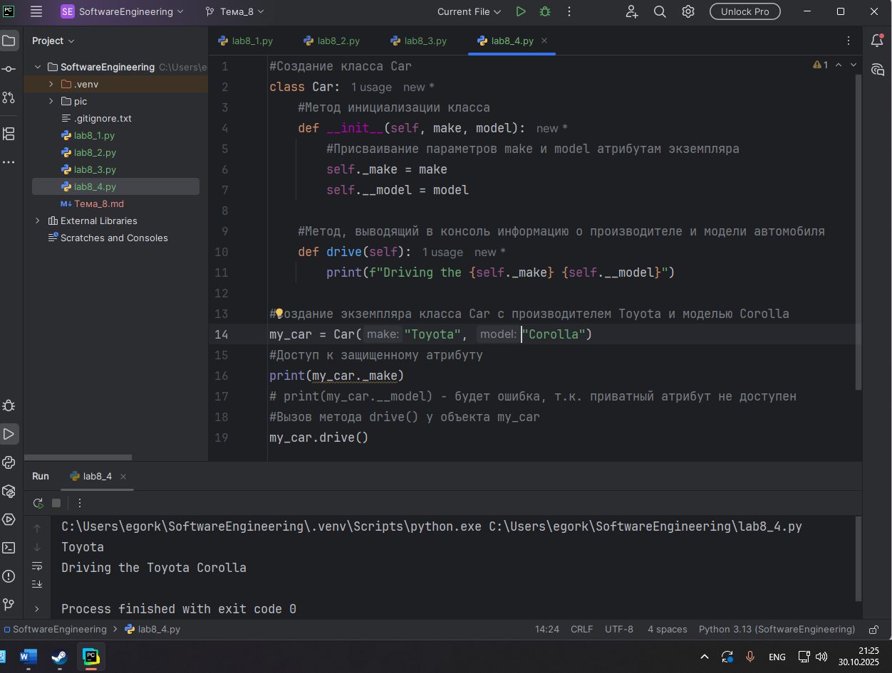
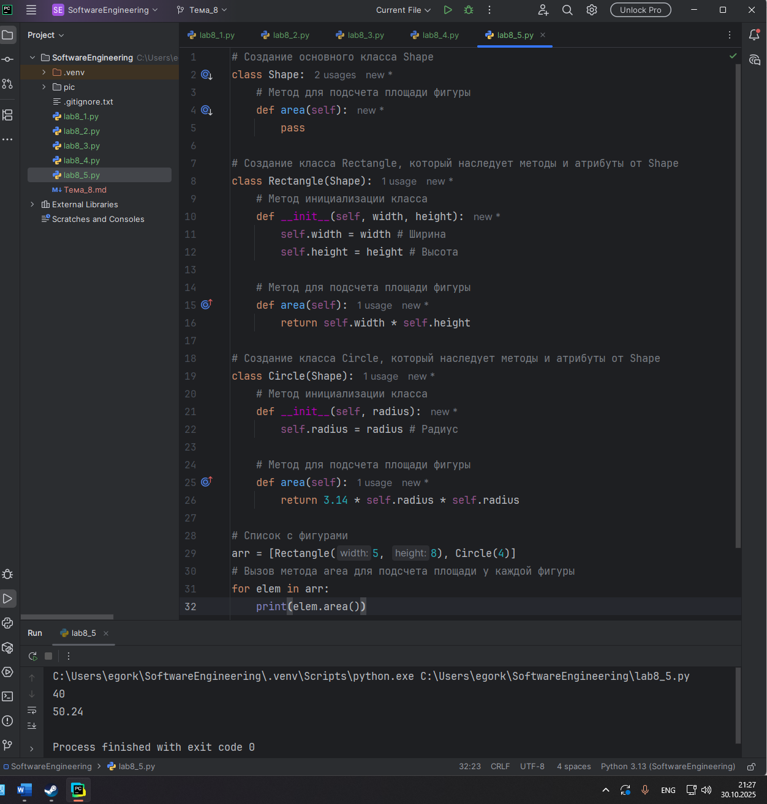
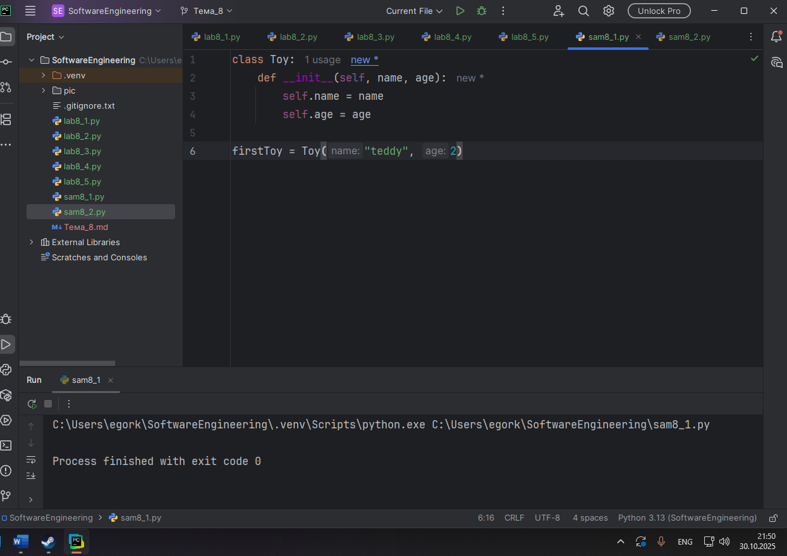
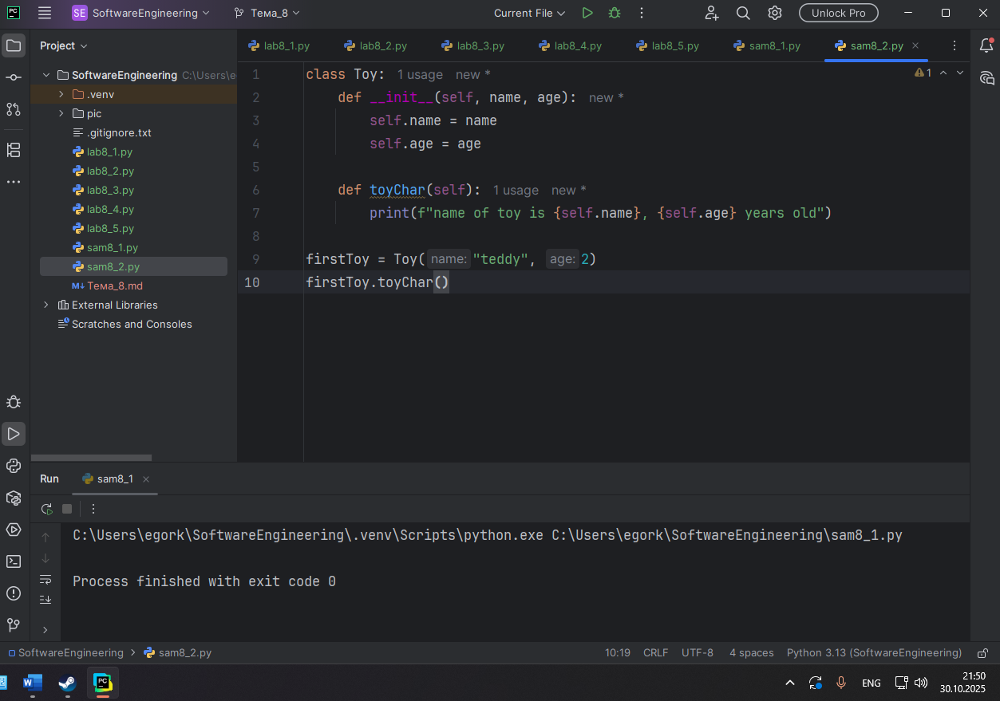
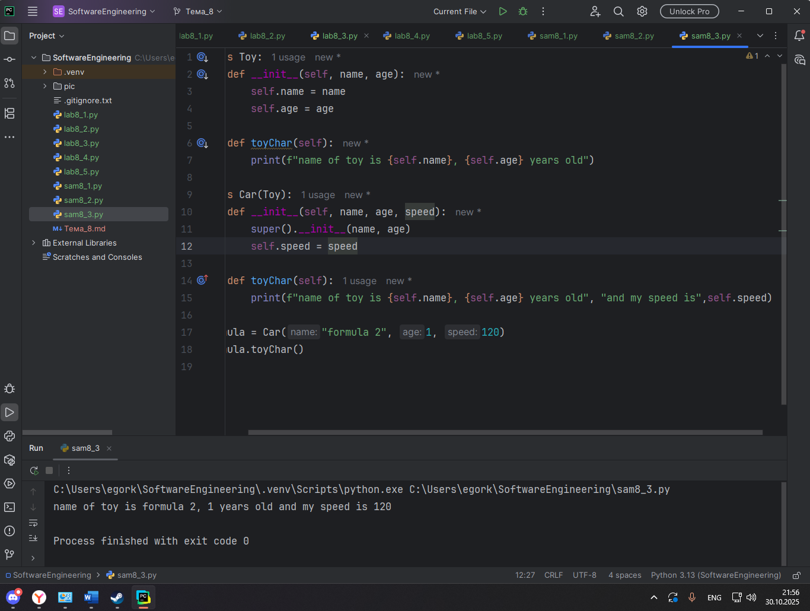
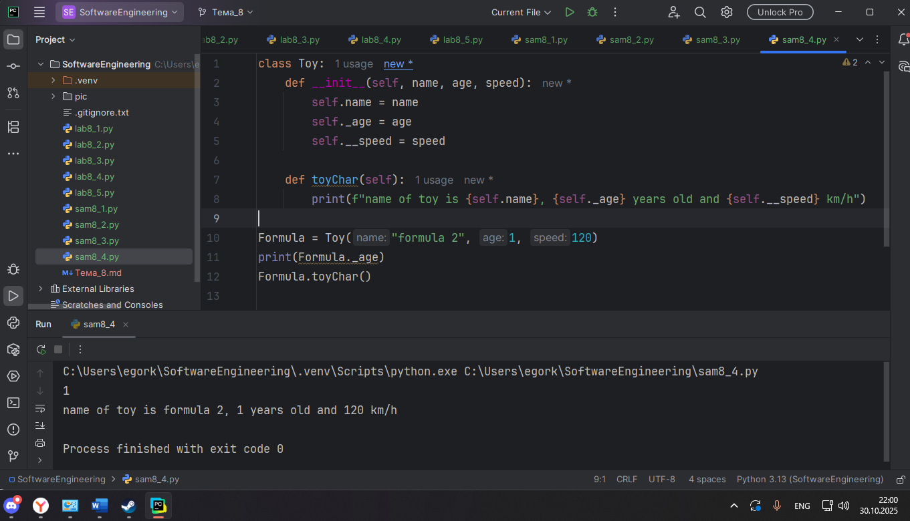
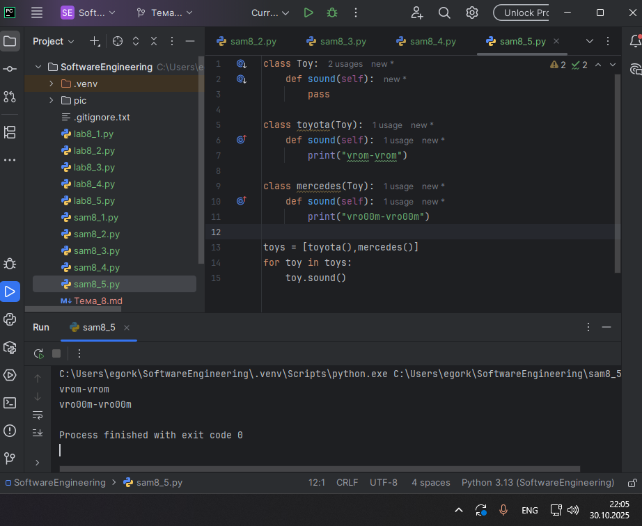

# Тема 8. Основы объектно-ориентированного программирования
Отчет по Теме #8 выполнил(а):
- Королев Егор Александрович
- ИВТ-23-2

| Задание | Лаб_раб | Сам_раб |
| ------ | ------ | ------ |
| Задание 1 | + | + |
| Задание 2 | + | + |
| Задание 3 | + | + |
| Задание 4 | + | + |
| Задание 5 | + | + |

знак "+" - задание выполнено; знак "-" - задание не выполнено;

Работу проверили:
- к.э.н., доцент Панов М.А.

## Лабораторная работа №1
### Создайте класс “Car” с атрибутами производитель и модель. Создайте объект этого класса. Напишите комментарии для кода, объясняющие его работу. Результатом выполнения задания будет листинг кода с комментариями.

```python
#Создание класса Car
class Car:
    #Метод инициализации класса
    def __init__(self, make, model):
        #Присваивание параметров make и model атрибутам экземпляра
        self.make = make
        self.model = model

#Создание экземпляра класса Car с производителем Toyota и моделью Corolla
my_car = Car("Toyota", "Corolla")
```
### Результат.


## Выводы

В данном коде создается класс "Car" с атрибутами "make" (производитель) и "model" (модель). Затем создается экземпляр этого класса с производителем Toyota и моделью Corolla.

## Лабораторная работа №2
### Дополните код из первого задания, добавив в него атрибуты и методы класса, заставьте машину “поехать”. Напишите комментарии для кода, объясняющие его работу. Результатом выполнения задания будет листинг кода с комментариями и получившийся вывод в консоль.

```python
#Создание класса Car
class Car:
    #Метод инициализации класса
    def __init__(self, make, model):
        #Присваивание параметров make и model атрибутам экземпляра
        self.make = make
        self.model = model

    #Метод, выводящий в консоль информацию о производителе и модели автомобиля
    def drive(self):
        print(f"Driving the {self.make} {self.model}")

#Создание экземпляра класса Car с производителем Toyota и моделью Corolla
my_car = Car("Toyota", "Corolla")
#Вызов метода drive() у объекта my_car
my_car.drive()
```
### Результат.


## Выводы

Данный код дополнен предыдущим методом drive() класса Car, который выводит информацию об автомобиле, заставляя его "поехать". После создании объекта my_car класса Car вызывается этот добавленный метод drive().

## Лабораторная работа №3
### Создайте новый класс “ElectricCar” с методом “charge” и атрибутом емкость батареи. Реализуйте его наследование от класса, созданного в первом задании. Заставьте машину поехать, а потом заряжаться. Напишите комментарии для кода, объясняющие его работу. Результатом выполнения задания будет листинг кода с комментариями и получившийся вывод в консоль.

```python
#Создание класса Car
class Car:
    #Метод инициализации класса
    def __init__(self, make, model):
        #Присваивание параметров make и model атрибутам экземпляра
        self.make = make
        self.model = model

    #Метод, выводящий в консоль информацию о производителе и модели автомобиля
    def drive(self):
        print(f"Driving the {self.make} {self.model}")

#Создание класса ElectricCar, наследующего атрибуты и методы родительского класса Car
class ElectricCar(Car):
    # Метод инициализации класса
    def __init__(self, make, model, battery_capacity):
        #Вызов конструктора родительского класса
        super().__init__(make, model)
        #Присваивание параметра battery_capacity атрибуту емкости батареи
        self.battery_capacity = battery_capacity

    #Метод зарядки автомобиля
    def charge(self):
        print(f"Charging the {self.make} {self.model} with {self.battery_capacity} kWh")

#Создание экземпляра класса ElectricCar
my_electric_car = ElectricCar("Tesla", "Model S", 75)
#Вызов метода drive() у объекта my_electric_car
my_electric_car.drive()
#Вызов метода charge() у объекта my_electric_car для зарядки автомобиля
my_electric_car.charge()
```
### Результат.


## Выводы

В данном коде создается класс "ElectricCar", который наследует атрибуты и методы родительского класса "Car". Новый класс имеет новый метод charge() для зарядки автомобиля и новый атрибут емкости батареи. Ниже создается объект класса ElectricCar и вызываются его методы.

## Лабораторная работа №4
### Реализуйте инкапсуляцию для класса, созданного в первом задании. Создайте защищенный атрибут производителя и приватный атрибут модели. Вызовите защищенный атрибут и заставьте машину поехать. Напишите комментарии для кода, объясняющие его работу. Результатом выполнения задания будет листинг кода с комментариями и получившийся вывод в консоль.

```python
#Создание класса Car
class Car:
    #Метод инициализации класса
    def __init__(self, make, model):
        #Присваивание параметров make и model атрибутам экземпляра
        self._make = make
        self.__model = model

    #Метод, выводящий в консоль информацию о производителе и модели автомобиля
    def drive(self):
        print(f"Driving the {self._make} {self.__model}")

#Создание экземпляра класса Car с производителем Toyota и моделью Corolla
my_car = Car("Toyota", "Corolla")
#Доступ к защищенному атрибуту
print(my_car._make)
# print(my_car.__model) - будет ошибка, т.к. приватный атрибут не доступен
#Вызов метода drive() у объекта my_car
my_car.drive()
```
### Результат.


## Выводы

В данном коде реализована инкапсуляция для класса Car, который имеет защищенный атрибут "make" и приватный атрибут "model". Ниже создается объект my_car класса Car и вызывается его защищенный атрибут с методом drive().

## Лабораторная работа №5
### Реализуйте полиморфизм создав основной (общий) класс “Shape”, а также еще два класса “Rectangle” и “Circle”. Внутри последних двух классов реализуйте методы для подсчета площади фигуры. После этого создайте массив с фигурами, поместите туда круг и прямоугольник, затем при помощи цикла выведите их площади. Напишите комментарии для кода, объясняющие его работу. Результатом выполнения задания будет листинг кода с комментариями и получившийся вывод в консоль.

```python
# Создание основного класса Shape
class Shape:
    # Метод для подсчета площади фигуры
    def area(self):
        pass

# Создание класса Rectangle, который наследует методы и атрибуты от Shape
class Rectangle(Shape):
    # Метод инициализации класса
    def __init__(self, width, height):
        self.width = width # Ширина
        self.height = height # Высота

    # Метод для подсчета площади фигуры
    def area(self):
        return self.width * self.height

# Создание класса Circle, который наследует методы и атрибуты от Shape
class Circle(Shape):
    # Метод инициализации класса
    def __init__(self, radius):
        self.radius = radius # Радиус

    # Метод для подсчета площади фигуры
    def area(self):
        return 3.14 * self.radius * self.radius

#  Список с фигурами
arr = [Rectangle(5, 8), Circle(4)]
# Вызов метода area для подсчета площади у каждой фигуры
for elem in arr:
    print(elem.area())
```
### Результат.


## Выводы

В данном коде реализован полиморфизм с использованием основного класса "Shape" и двух дочерних классов "Rectangle" и "Circle". Внутри каждого класса реализован метод area() для подсчета площади фигур. Вне классов создается список с объектами дочерних классов и вызывается метод area() с различной реализацией для каждого объекта.

## Самостоятельная работа №1
### Самостоятельно создайте класс и его объект. Они должны отличаться, от тех, что указаны в теоретическом материале (методичке) и лабораторных заданиях. Результатом выполнения задания будет листинг кода и получившийся вывод консоли.

```python
class Toy:
    def __init__(self, name, age):
        self.name = name
        self.age = age

firstToy = Toy("teddy", 2)
```
### Результат.


## Выводы

В данном коде создается класс Toy (Игрушка) с атрибутами name (название) и age (возраст, для которого предназначена игрушка). Вне класса создается объект firstToy этого класса с параметрами "teddy" и 2. После выполнения кода объект создается в памяти, но видимого вывода в консоль не происходит, так как в коде отсутствуют операторы вывода.

## Самостоятельная работа №2
### Самостоятельно создайте атрибуты и методы для ранее созданного класса. Они должны отличаться, от тех, что указаны в теоретическом материале (методичке) и лабораторных заданиях. Результатом выполнения задания будет листинг кода и получившийся вывод консоли.

```python
class Toy:
    def __init__(self, name, age):
        self.name = name
        self.age = age

    def toyChar(self):
        print(f"name of toy is {self.name}, {self.age} years old")

firstToy = Toy("teddy", 2)
firstToy.toyChar()
```
### Результат.


## Выводы

В данном коде в класс Toy добавляется метод toyChar, который выводит в консоль характеристики игрушки — ее имя и возраст. После создания объекта firstToy вызывается его метод toyChar(), что приводит к выводу в консоль строки: name of toy is teddy, 2 years old.

## Самостоятельная работа №3
### Самостоятельно реализуйте наследование, продолжая работать с ранее созданным классом. Оно должно отличаться, от того, что указано в теоретическом материале (методичке) и лабораторных заданиях. Результатом выполнения задания будет листинг кода и получившийся вывод консоли.

```python
class Toy:
    def __init__(self, name, age):
        self.name = name
        self.age = age

    def toyChar(self):
        print(f"name of toy is {self.name}, {self.age} years old")

class Car(Toy):
    def __init__(self, name, age, speed):
        super().__init__(name, age)
        self.speed = speed

    def toyChar(self):
        print(f"name of toy is {self.name}, {self.age} years old", "and my speed is",self.speed)

Formula = Car("formula 2", 1, 120)
Formula.toyChar()

```
### Результат.


## Выводы

В данном коде реализовано наследование: класс Car (Машина) является дочерним по отношению к классу Toy. Класс-наследник Car расширяет функциональность родителя, добавляя новый атрибут speed (скорость). Также в классе Car переопределяется метод toyChar, чтобы выводить информацию о скорости вместе с остальными характеристиками. Создается объект Formula класса Car, и при вызове его метода toyChar() в консоль выводится полная информация: name of toy is formula 2, 1 years old and my speed is 120.

## Самостоятельная работа №4
### Самостоятельно реализуйте инкапсуляцию, продолжая работать с ранее созданным классом. Она должна отличаться, от того, что указана в теоретическом материале (методичке) и лабораторных заданиях. Результатом выполнения задания будет листинг кода и получившийся вывод консоли.

```python
class Toy:
    def __init__(self, name, age, speed):
        self.name = name
        self._age = age
        self.__speed = speed

    def toyChar(self):
        print(f"name of toy is {self.name}, {self._age} years old and {self.__speed} km/h")

Formula = Toy("formula 2", 1, 120)
print(Formula._age)
Formula.toyChar()

```
### Результат.


## Выводы

В данном коде реализована инкапсуляция: в классе Toy атрибут _age является защищенным (protected), а атрибут __speed — приватным (private). Вне класса осуществляется прямой вывод защищенного атрибута _age, что является допустимым, но не рекомендуется. Приватный атрибут __speed не доступен для прямого обращения извне, но успешно выводится с помощью публичного метода toyChar(), который имеет к нему доступ. Это демонстрирует принцип сокрытия данных.

## Самостоятельная работа №5
### Самостоятельно реализуйте полиморфизм. Он должен отличаться, от того, что указан в теоретическом материале (методичке) и лабораторных заданиях. Результатом выполнения задания будет листинг кода и получившийся вывод консоли.

```python
class Toy:
    def sound(self):
        pass

class toyota(Toy):
    def sound(self):
        print("vrom-vrom")

class mercedes(Toy):
    def sound(self):
        print("vro00m-vro00m")

toys = [toyota(),mercedes()]
for toy in toys:
    toy.sound()
```
### Результат.


## Выводы

В данном коде реализован полиморфизм. Созданы классы toyota и mercedes, которые наследуются от базового класса Toy и переопределяют его метод sound. Несмотря на то, что объекты toyota() и mercedes() имеют разные реализации метода sound(), мы можем работать с ними единообразно — через ссылку на базовый класс Toy. При переборе списка toys каждый объект вызывает свою собственную версию метода sound(), что и приводит к разному выводу в консоль: vrom-vrom и vro00m-vro00m.


## Общие выводы по теме
- Основы объектно-ориентированного программирования в Python включают в себя такие ключевые концепции, как: наследование (возможность создавать новые классы на основе существующих), инкапсуляция (защита данных от изменений извне) и полиморфизм (переопределение методов, унаследованных от суперкласса, в подклассах). Важно уметь применять эти концепции на практике, поскольку вместе они помогают в организации и структурировании кода.