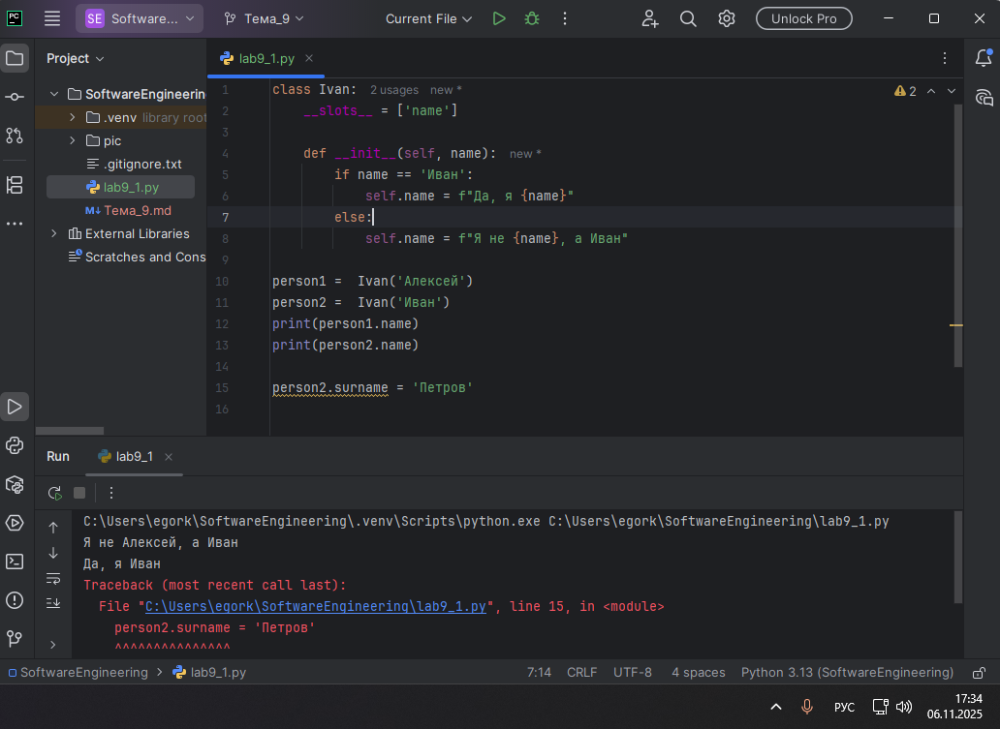
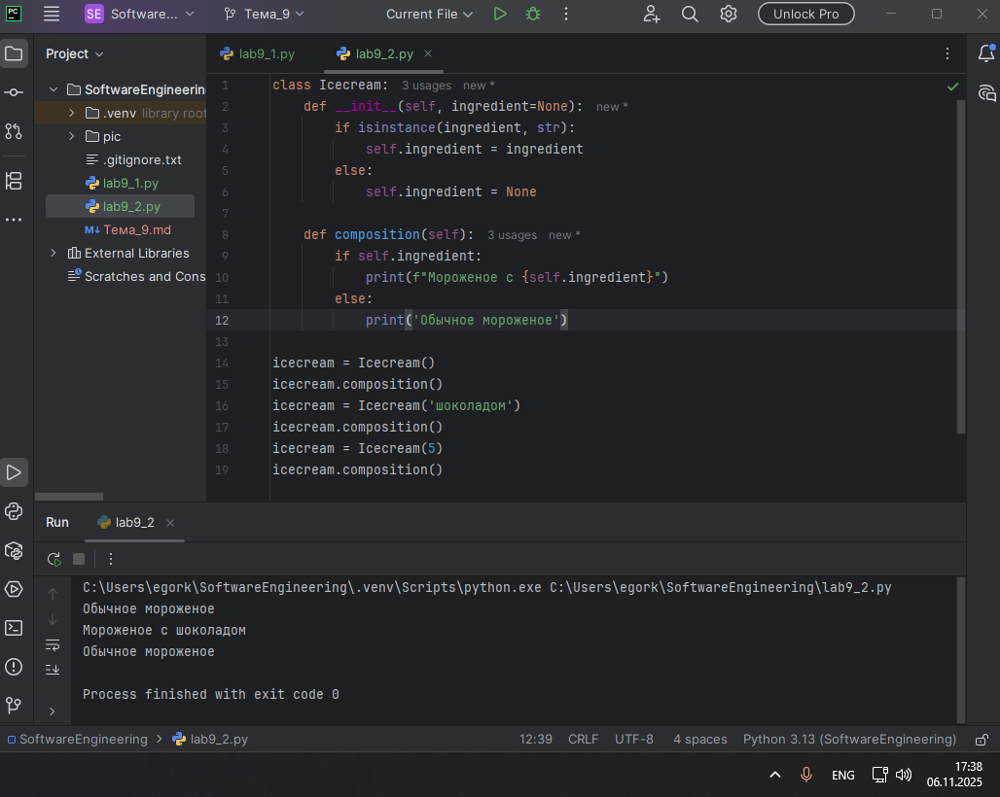
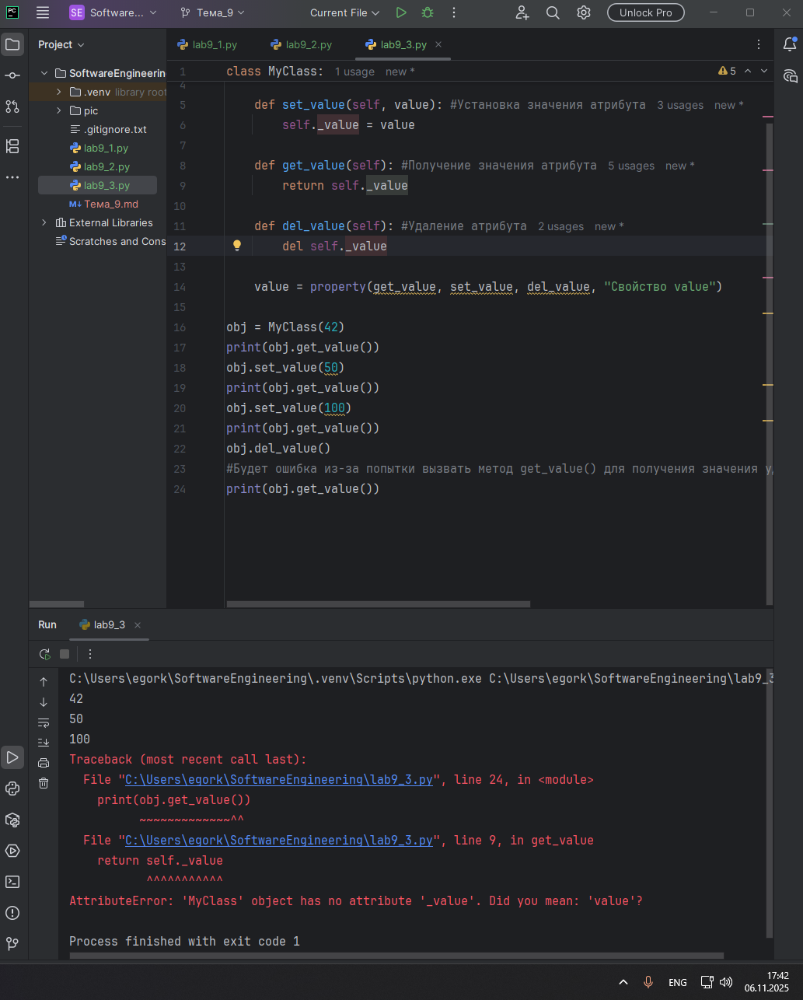
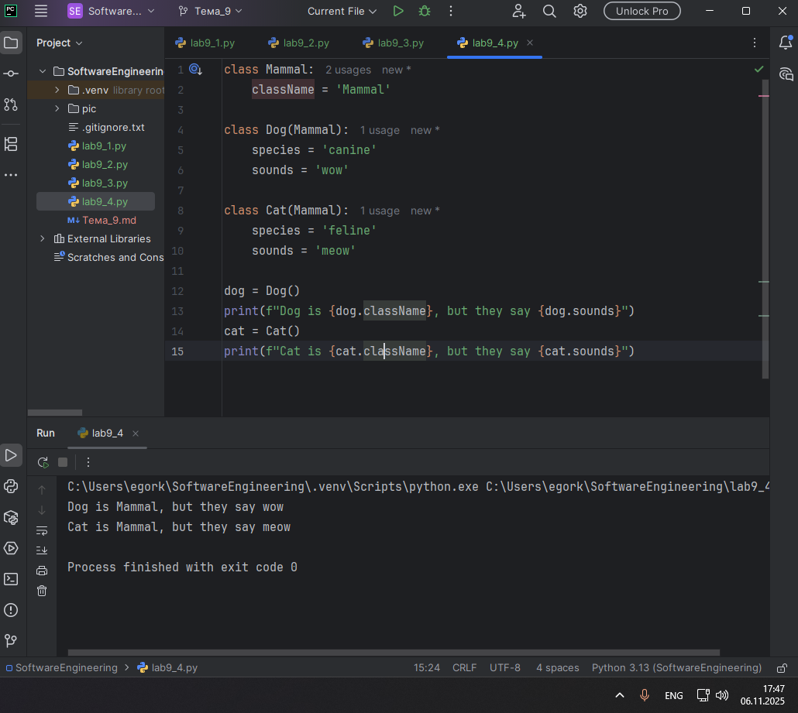
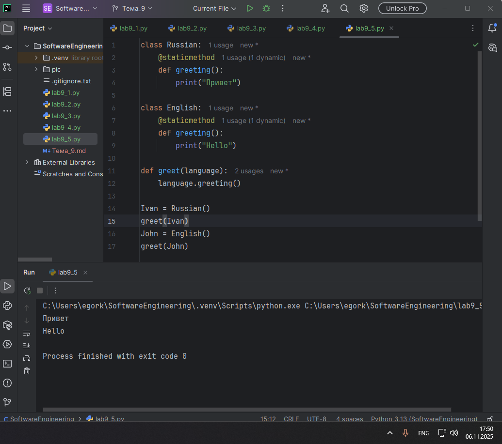
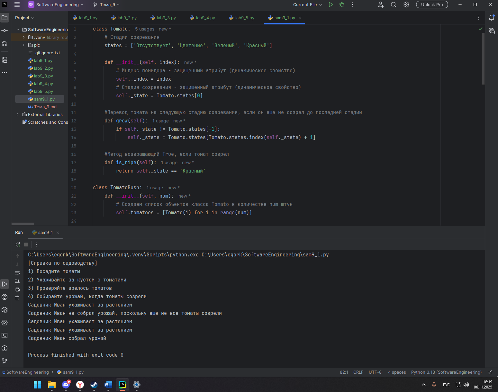

# Тема 9. ООП на Python: концепции, принципы и примеры реализации
Отчет по Теме #9 выполнил(а):
- Королев Егор Александрович
- ИВТ-23-2

| Задание | Лаб_раб | Сам_раб |
| ------ | ------ | ------ |
| Задание 1 | + | + |
| Задание 2 | + |  |
| Задание 3 | + |  |
| Задание 4 | + |  |
| Задание 5 | + |  |

знак "+" - задание выполнено; знак "-" - задание не выполнено;

Работу проверили:
- к.э.н., доцент Панов М.А.

## Лабораторная работа №1
### Допустим, что вы решили оригинально и немного странно познакомится с человеком. Для этого у вас должен быть написан свой класс на Python, который будет проверять угадал ваше имя человек или нет. Для этого создайте класс, указав в свойствах только имя. Дальше создайте функцию __init__(), а в ней сделайте проверку на то угадал человек ваше имя или нет. Также можете проверить что будет, если в этой функции указав атрибут, который не указан в вашем классе, например, попробуйте вызвать фамилию.

```python
class Ivan:
    __slots__ = ['name']

    def __init__(self, name):
        if name == 'Иван':
            self.name = f"Да, я {name}"
        else:
            self.name = f"Я не {name}, а Иван"

person1 =  Ivan('Алексей')
person2 =  Ivan('Иван')
print(person1.name)
print(person2.name)

person2.surname = 'Петров'
```
### Результат.


## Выводы

Класс Ivan использует механизм __slots__ для ограничения доступных атрибутов только свойством name. В конструкторе выполняется проверка переданного имени и формируется соответствующее сообщение. При попытке создать атрибут surname возникает ошибка AttributeError, так как класс не поддерживает этот атрибут из-за ограничений __slots__.

## Лабораторная работа №2
### Вам дали важное задание, написать продавцу мороженого программу, которая будет писать добавили ли топпинг в мороженое и цену после возможного изменения. Для этого вам нужно написать класс, в котором будет определяться изменили ли состав мороженого или нет. В этом классе  реализуйте  метод,  выводящий  на  печать  «Мороженое  с {ТОППИНГ}» в случае наличия добавки, а иначе отобразится следующая фраза: «Обычное мороженое». При этом программа должна воспринимать как топпинг только атрибуты типа string.

```python
class Icecream:
    def __init__(self, ingredient=None):
        if isinstance(ingredient, str):
            self.ingredient = ingredient
        else:
            self.ingredient = None

    def composition(self):
        if self.ingredient:
            print(f"Мороженое с {self.ingredient}")
        else:
            print('Обычное мороженое')

icecream = Icecream()
icecream.composition()
icecream = Icecream('шоколадом')
icecream.composition()
icecream = Icecream(5)
icecream.composition()
```
### Результат.


## Выводы

Класс Icecream проверяет тип переданного ингредиента в конструкторе, устанавливая свойство ingredient только для строковых значений. Метод composition() анализирует наличие ингредиента и выводит соответствующее сообщение. При передаче числового значения ингредиент не устанавливается, что демонстрирует обработку неверного типа данных.

## Лабораторная работа №3
### Петя – начинающий программист и на занятиях ему сказали реализовать икапсу…что-то. А вы хороший друг Пети и ко всему прочему прекрасно знаете, что икапсу…что-то – это инкапсуляция, поэтому решаете помочь вашему другу с написанием класса с инкапсуляцией. Ваш класс будет не просто инкапсуляцией, а классом с сеттером, геттером и деструктором. После написания класса вам необходимо продемонстрировать что все написанные вами функции работают. Также вам необходимо объяснить Пете почему на скриншоте ниже в консоли выводится ошибка.

```python
class MyClass:
    def __init__(self, value):
        self._value = value

    def set_value(self, value): #Установка значения атрибута
        self._value = value

    def get_value(self): #Получение значения атрибута
        return self._value

    def del_value(self): #Удаление атрибута
        del self._value

    value = property(get_value, set_value, del_value, "Свойство value")

obj = MyClass(42)
print(obj.get_value())
obj.set_value(50)
print(obj.get_value())
obj.set_value(100)
print(obj.get_value())
obj.del_value()
#Будет ошибка из-за попытки вызвать метод get_value() для получения значения удаленного выше атрибута, которого теперь не существует
print(obj.get_value())
```
### Результат.


## Выводы

Класс MyClass демонстрирует принципы инкапсуляции через методы доступа к защищенному атрибуту _value. Использование функции property() создает свойство с автоматическим вызовом соответствующих методов. Ошибка в конце программы возникает из-за попытки обращения к удаленному атрибуту через метод get_value() после вызова del_value().

## Лабораторная работа №4
### Вам прекрасно известно, что кошки и собаки являются млекопитающими, но компьютер этого не понимает, поэтому вам нужно написать три класса: Кошки, Собаки, Млекопитающие. И при помощи “наследования” объяснить компьютеру что кошки и собаки – это млекопитающие. Также добавьте какой-нибудь свой атрибут для кошек и собак, чтобы показать, что они чем-то отличаются друг от друга.

```python
class Mammal:
    className = 'Mammal'

class Dog(Mammal):
    species = 'canine'
    sounds = 'wow'

class Cat(Mammal):
    species = 'feline'
    sounds = 'meow'

dog = Dog()
print(f"Dog is {dog.className}, but they say {dog.sounds}")
cat = Cat()
print(f"Cat is {cat.className}, but they say {cat.sounds}")
```
### Результат.


## Выводы

Классы Dog и Cat наследуют общее свойство className от родительского класса Mammal, демонстрируя принцип наследования. Уникальные атрибуты species и sounds в дочерних классах подчеркивают их различия. Вывод в консоли подтверждает, что оба объекта имеют общую характеристику млекопитающих, но отличаются звуками, которые издают.

## Лабораторная работа №5
### На разных языках здороваются по-разному, но суть остается одинаковой, люди друг с другом здороваются. Давайте вместе с вами реализуем программу с полиморфизмом, которая будет описывать всю суть первого предложения задачи. Для этого мы можем выбрать два языка, например, русский и английский и написать для них отдельные классы, в которых будет в виде атрибута слово, которым здороваются на этих языках. А также напишем функцию, которая будет выводить информацию о том, как на этих языках здороваются. Заметьте, что для решения поставленной задачи мы использовали декоратор @staticmethod, поскольку нам не нужны обязательные параметры-ссылки вроде self.

```python
class Russian:
    @staticmethod
    def greeting():
        print("Привет")

class English:
    @staticmethod
    def greeting():
        print("Hello")

def greet(language):
    language.greeting()

Ivan = Russian()
greet(Ivan)
John = English()
greet(John)
```
### Результат.


## Выводы

Классы Russian и English содержат статические методы greeting(), что позволяет вызывать их без создания экземпляров класса. Функция greet() демонстрирует полиморфизм - она может работать с любым объектом, имеющим метод greeting(), независимо от его конкретного типа. Это позволяет единообразно обрабатывать объекты разных классов с одинаковым интерфейсом.

## Самостоятельная работа №1
### Задание Садовник и помидоры.

Классовая структура:

Есть Помидор со следующими характеристиками:

•	Индекс

•	Стадия созревания (стадии: отсутствует, цветение, зеленый, красный)

Помидор может:

•	Расти (переходить на следующую стадию созревания)

•	Предоставлять информацию о своей зрелости

Есть Куст с помидорами, который:

•	Содержит список томатов, которые на нем растут

А также может:

•	Расти вместе с томатами

•	Предоставлять информацию о зрелости всех томатов

•	Предоставлять урожай

И также есть Садовник, который имеет:

•	Имя

•	Растение, за которым он ухаживает

Он может:

•	Ухаживать за растением

•	Собирать с него урожай

Задание:

Класс Tomato:
1)	Создайте класс Tomato
2)	Создайте статическое свойство states, которое будет содержать все стадии созревания помидора
3)	Создайте метод	init	(), внутри которого будут определены два динамических свойства: _index (передается параметром) и _state (принимает первое значение из словаря states). После написания этого блока кода в комментарии к нему укажите какими являются эти два свойства
4)	Создайте метод grow(), который будет переводить томат на следующую стадию созревания
5)	Создайте метод is_ripe(), который будет проверять, что томат созрел

Класс TomatoBush:
1)	Создайте класс TomatoBush
2)	Определите метод	init	(), который будет принимать в качестве параметра количество томатов и на его основе будет создавать список объектов класса Tomato. Данный список будет храниться внутри динамического свойства tomatoes
3)	Создайте метод grow_all(), который будет переводить все объекты из списка томатов на следующий этап созревания
4)	Создайте метод all_are_ripe(), который будет возвращать True, если все томаты из списка стали спелыми.
5)	Создайте метод give_away_all(), который будет чистить список томатов после сбора урожая

Класс Gardener:
1)	Создайте класс Gardener
2)	Создайте метод	init	(), внутри которого будут определены два динамических свойства: name (передается параметром, является публичным) и _plant (принимает объект класса TomatoBush). После написания этого блока кода в комментарии к нему укажите какими являются эти два свойства
3)	Создайте метод work(), который заставляет садовника работать, что позволяет растению становиться более зрелым
4)	Создайте метод harvest(), который проверяет, все ли плоды созрели. Если все, то садовник собирает урожай. Если нет, то метод печатает предупреждение
5)	Создайте статический метод knowledge_base(), который выведет в консоль справку по садоводству

Тесты:
1)	Вызовите справку по садоводству
2)	Создайте объекты классов TomatoBush и Gardener
3)	Используя объект класса Gardener, поухаживайте за кустом с помидорами
4)	Попробуйте собрать урожай, когда томаты еще не дозрели. Продолжайте ухаживать за ними 
5)	Соберите урожай

Результатом работы вашей программы будет листинг кода с подробными комментариями и скриншоты выполенния всех тестов.

```python
class Tomato:
    # Стадии созревания
    states = ['Отсутствует', 'Цветение', 'Зеленый', 'Красный']

    def __init__(self, index):
        # Индекс помидора - защищенный атрибут (динамическое свойство)
        self._index = index
        # Стадия созревания - защищенный атрибут (динамическое свойство)
        self._state = Tomato.states[0]

    #Перевод томата на следующую стадию созревания, если он еще не созрел до последней стадии
    def grow(self):
        if self._state != Tomato.states[-1]:
            self._state = Tomato.states[Tomato.states.index(self._state) + 1]

    #Метод возвращающий True, если томат созрел
    def is_ripe(self):
        return self._state == 'Красный'

class TomatoBush:
    def __init__(self, num):
        # Создаем список объектов класса Tomato в количестве num штук
        self.tomatoes = [Tomato(i) for i in range(num)]

    #Перевод объектов из списка томатов на следующий этап
    def grow_all(self):
        for tomato in self.tomatoes:
            tomato.grow()

    #Метод, возвращающий True, если все томаты из списка созрели до последней стадии
    def all_are_ripe(self):
        return all(tomato.is_ripe() for tomato in self.tomatoes)

    #Метод, очищающий список томатов после сбора урожая
    def give_away_all(self):
        self.tomatoes.clear()

class Gardener:
    def __init__(self, name, plant):
        # Имя садовника - публичный атрибут (динамическое свойство)
        self.name = name
        # Растение, за которым ухаживает садовник - защищенный атрибут (динамическое свойство)
        self._plant = plant

    #Метод, заставляющий садовника работать, из-за чего растение становится более зрелым
    def work(self):
        print(f"Садовник {self.name} ухаживает за растением")
        self._plant.grow_all()

    #Метод, позволяющий собрать урожай, если все созрели
    def harvest(self):
        if self._plant.all_are_ripe():
            self._plant.give_away_all()
            print(f"Садовник {self.name} собрал урожай")
        else:
            print(f"Садовник {self.name} не собрал урожай, поскольку еще не все томаты созрели")

    #Статический метод, выводящий в консоль справку
    @staticmethod
    def knowledge_base():
        print("[Справка по садоводству]")
        print("1) Посадите томаты")
        print("2) Ухаживайте за кустом с томатами")
        print("3) Проверяйте зрелось томатов")
        print("4) Собирайте урожай, когда томаты созрели")


#1) Вызов справки по садоводству
Gardener.knowledge_base()

#2) Создаем объекты классов TomatoBush и Gardener
tomato_bush1 = TomatoBush(5)
gardener1 = Gardener("Иван", tomato_bush1)

#3) Ухаживаем за кустом с помидорами
gardener1.work()

#4) Пробуем собрать урожай, когда томаты еще не дозрели. Продолжаем ухаживать за ними
gardener1.harvest()
gardener1.work()
gardener1.work()

#5) Собираем урожай
gardener1.harvest()```
### Результат.


## Выводы

Реализована система управления выращиванием томатов с использованием принципов ООП. Класс Tomato моделирует отдельный помидор с его стадиями созревания. TomatoBush представляет куст томатов, управляя коллекцией объектов Tomato. Gardener инкапсулирует логику ухода за растениями и сбора урожая. Статический метод knowledge_base() предоставляет общую информацию без привязки к конкретному экземпляру. Тестовая последовательность демонстрирует полный жизненный цикл: от ухода за незрелыми растениями до успешного сбора урожая.

## Общие выводы по теме
Объектно-ориентированное программирование в Python предоставляет мощные инструменты для структурирования кода. Ключевые принципы ООП успешно продемонстрированы в работах:
-Наследование позволяет создавать иерархии классов, где дочерние элементы наследуют функциональность родительских, как в случае с млекопитающими и конкретными животными.
-Инкапсуляция обеспечивает контроль доступа к данным через механизмы свойств и методов, что показано в классе с сеттерами и геттерами, а также в системе управления томатами с защищенными атрибутами.
-Полиморфизм enables единообразную работу с объектами разных типов через общие интерфейсы, что иллюстрируется функцией приветствия на разных языках.
-Использование статических методов и свойств классов позволяет создавать функциональность, не зависящую от состояния конкретных экземпляров. Ограничение атрибутов через __slots__ оптимизирует использование памяти и предотвращает случайное создание нежелательных свойств.
-Грамотное применение ООП принципов в Python способствует созданию масштабируемого, поддерживаемого и повторно используемого кода, эффективно решающего сложные задачи через декомпозицию на логические объекты.